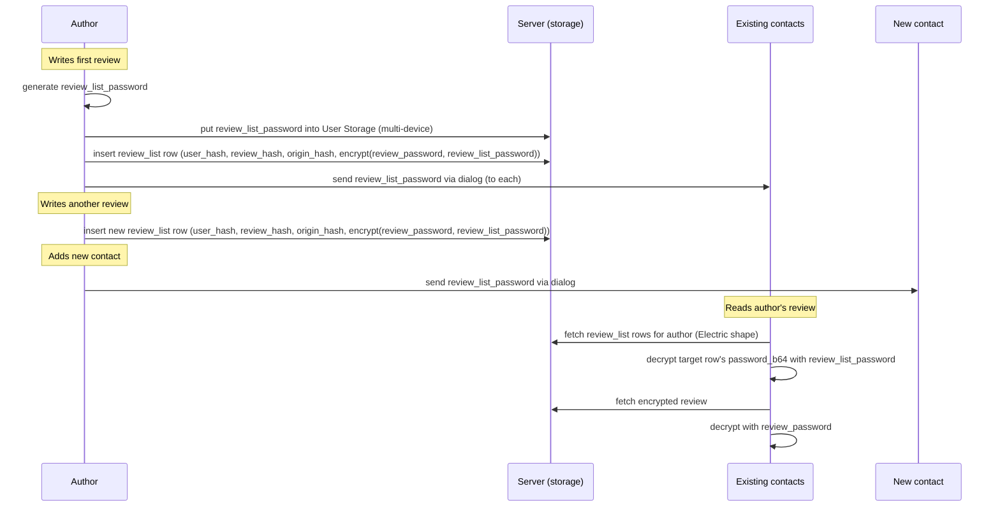
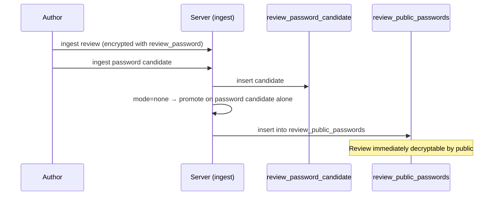
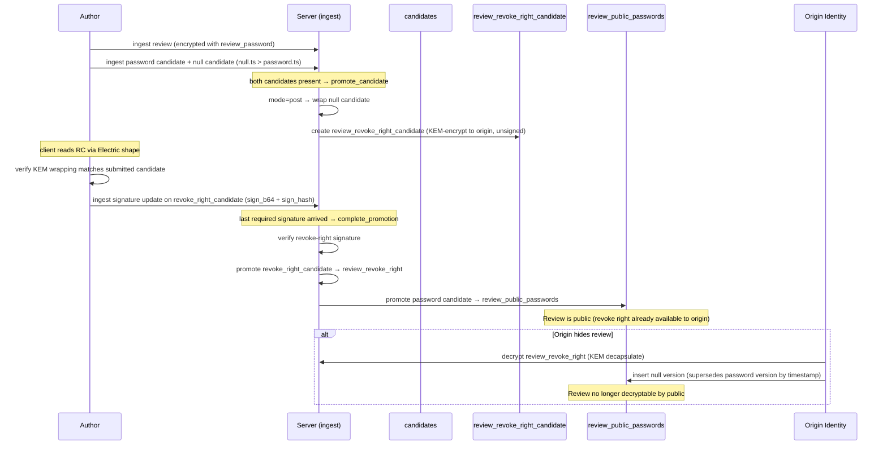
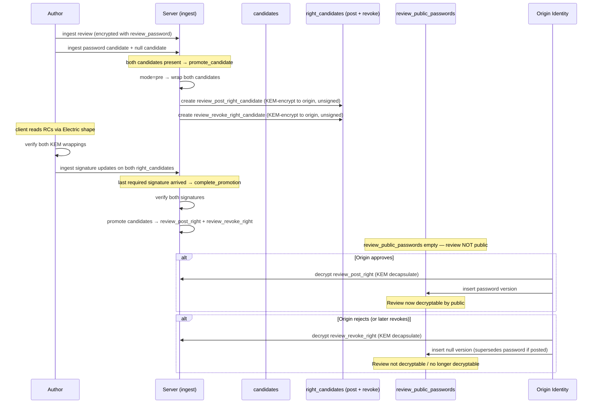

# Reviews Proposal

## Goal

Add a review system for origin entities (businesses, venues, etc.) with post-quantum cryptographic guarantees matching the rest of the platform.

A user should be able to:

- discover origins (coffee shops, venues, etc.)
- write a review with chosen visibility: to_public or to_origin
- comment on any review they can see
- trust that visibility guarantees are cryptographic, not server-enforced

An origin owner should be able to:

- register an origin with its own PQ identity
- choose a moderation mode for public reviews (pre, post, or none)

The origin identity (not the owner) should be able to:

- moderate public reviews (approve, reject, hide) — delegatable without exposing owner identity
- receive private feedback (to_origin reviews)

## Design decisions

- **Rating**: incorporate into a content model `[rating, placeholder, content]` — fill placeholder with random string to make rating-only and text reviews indistinguishable in ciphertext size. See [Content model](#content-model) for the full spec.
- **`to_origin` is not a feature**: because the origin is a `user_cards` identity, a `to_origin` review is a plain dialog message to the origin's `user_hash`. No schema, no shape, no validation, no moderation path — nothing to build beyond a UI entry point. See [to_origin](#to_origin).
- **Passwords vs reviews**: passwords as access layer. Prevent deletion as much as possible.
- **Ingest via candidates**: all *author-submitted* `review_public_passwords` entries flow through `review_password_candidate` — the server validates and promotes. The author cannot ingest into `review_public_passwords` directly. The origin identity can insert a row it decrypted from a right envelope (to publish or revoke) — see Moderation section.
- **Origin key management**: origin keypairs are independently generated on the client (not derived from owner keys), stored client-side in the owner's identity, same pattern as regular user keys (see `pq_user.md`). Multi-device access via User Storage (encrypted skeys stored server-side, decryptable by the owner).
- **Origin creation**: three-step flow — create owner `user_cards` (if not exists) → generate and insert origin `user_cards` row → insert `origin` row with `owner_cert` linking the two (see Origin creation section).

## Three entities

```
Origin (the coffee shop)
│  subaccount identity (user_cards row), owned by a user
│
└── Review (by any user)
    ├── to_public   — encrypted with review_password, signed by author
    │                 public when password in review_public_passwords table
    │                 contacts see via review_list_password (bypasses moderation)
    ├── to_origin  — plain dialog between author and origin identity (see pq_dialogs),
    │                 no review-specific machinery
    │
    └── Comment (by anyone who can see the parent review)
        └── inherits parent review's visibility envelope
```

## Origin

An origin is modeled as a **subaccount** — it gets its own `user_cards` row with a separate PQ identity.

An origin has:

- its own `user_cards` row (ML-DSA-87 signing keypair, ML-KEM-1024 encryption keypair)
- an owner (the user who created it)
- a moderation policy for public reviews
- public metadata (name, description — signed by origin identity)

The origin identity is separate from the owner's personal identity. One user can own multiple origins. Because it is a `user_cards` entry, the existing dialog infrastructure (see `pq_dialogs.md`) works directly for `to_origin` communication.

### Origin creation

Three-step flow following the same pattern as user creation (see `pq_user.md`):

1. **Owner exists** — the creating user already has their own `user_cards` row
2. **Generate origin identity** — client generates independent ML-DSA-87 + ML-KEM-1024 keypairs for the origin, inserts a new `user_cards` row (self-signed by the origin's own `sign_skey`)
3. **Create origin row** — insert `origin` table row signed by the origin identity, with `owner_cert` proving the owner created this identity

The `owner_cert` is `ML-DSA-87.sign(origin_sign_pkey, owner_sign_skey)` — the owner signs the origin's public signing key, binding the origin identity to the owner. Same pattern as `crypt_cert` binds encryption key to identity.

Origin secret keys (`sign_skey`, `crypt_skey`) are generated independently (not derived from owner keys) and stored client-side. For multi-device access, the owner encrypts origin keys into User Storage, decryptable by the owner's own keys on other devices.

Two levels of control:

- **Owner** (the creating user) — performs dangerous/irreversible operations: create origin, delete, change moderation mode. Ownership is immutable after creation. Owner identity is never exposed to the public.
- **Origin identity** — handles day-to-day operations: receive `to_origin` reviews, moderate public reviews. Can be delegated to an employee without exposing the owner's personal identity or granting irreversible powers.

> **Status (deferred to Phase 3).** The two-tier split is not yet enforced. Origin `update` operations — including
> `moderation_mode` changes and soft delete (`deleted_flag`) — are currently authorized by the **origin identity's**
> signature, so a delegated origin-identity holder could perform them. Requiring the **owner's** signature for these
> dangerous ops lands with the Phase 3 owner/moderation UI. `owner_cert` is still verified on origin creation.

### Why not a room

Rooms are conversation spaces. Origins are entities people review. They share crypto infrastructure but have different semantics:

- rooms have members who chat; origins have reviewers who evaluate
- room membership is about participation; origin visibility is about trust tiers
- rooms don't need moderation workflows; origins do
- the review/comment hierarchy doesn't map to room message threading

Keeping them separate avoids overloading the room model and allows independent evolution.

## Contacts

Each user has a review list (`review_hash`, `origin_hash`, `review_password`) whose passwords are
encrypted with a single per-author `review_list_password`. On review_list creation (first review) the
`review_list_password` is sent to all the contacts. On adding a new contact it is sent to that contact.

This way contacts are able to read reviews of their contacts (bypassing moderation).

There is **no contacts entity in the data layer** — no table, no shape. The contact list is client-side
state (`chat-frontend` keeps it in the user's own storage), so every "send the key" trigger lives in the
client. The server only ever sees `review_list` rows.



### Key lifetime — shared once, shared forever

The `review_list_password` is generated once per author and **never rotates**. Removing a contact
removes nothing: they already hold the key, and it also opens every review the author writes afterwards.
This is a deliberate trade-off — rotation would mean re-encrypting every `review_list` row and
re-delivering the key on each contact change, for a guarantee the model cannot honour anyway (the
removed contact could have copied every password already).

Consequences accepted with it:

- **No retraction.** `password_b64` is NOT NULL and DELETE is revoked at the role level, so pulling a
  review back from the contacts channel is `deleted_flag` only — advisory, since contacts have already
  synced the row.
- **Metadata is public.** `review_list` rows are publicly readable, so "user X reviewed something",
  the review count, and (via `origin_hash`) which origins they reviewed are visible to anyone. Only the
  content and the password stay encrypted.

The key lives in User Storage under a fixed key so every device of the author uses the same one. It needs
no recovery path: it was delivered as an ordinary dialog message, which a reinstalled contact re-syncs.

### Key delivery

The `review_list_password` travels as a dialog message to each contact — a new compound content type in
the [content polymorphism spec](../electric/pq_data_layer/07_content_polymorphism.md):

```json
{"review_list_key": ["<key_b64>"]}
```

Nothing new cryptographically: `pq_dialogs` already wraps every message with `sender_msg_key` +
ML-KEM-1024, so the key is protected exactly as any other dialog content. The receiving client stores it
as `peer_user_hash → review_list_password`.

### Reading a contact's reviews

`review_list` is a plain relation; readers query it through Electric shapes rather than any join
endpoint. Two rules keep it cheap:

**Trim the columns.** `sign_b64` is an ML-DSA-87 signature — ~4.6 KB per row, ~6.2 KB base64 on the
wire, against ~700 B for everything else. Sync with
`columns=user_hash,review_hash,origin_hash,password_b64` and a 50-contacts × 50-reviews list drops from
~17 MB to ~1.7 MB. Nothing is lost: every `review_list` row's signature is verified on ingestion
(both peer sync and HTTP paths call `UserValidation.validate_signature/1`), together with the
moderation-proof matrix — the server rejects any row whose author signature is invalid or whose
proof fields do not match promoted pipeline rows. This is the real guard: contact sharing cannot
happen until the review has entered the origin's moderation pipeline. Readers do not need to
re-verify `sign_b64` because the server has already enforced it, and a forged list row only yields a
password that fails the AES-GCM tag.

**Filter on an indexed column, not on a per-reader set.** `where user_hash = $1` (one shape per contact)
and `where origin_hash = $1` (one shape per origin) both produce a shape definition shared by every
client that asks for it, so Electric materializes each once. `where user_hash = ANY($1)` is unique per
reader's contact set and re-materializes whenever a contact is added — avoid it.

That gives two access paths:

- **Origin page** — the client already syncs `review where origin_hash = $1` (all reviews of that
  origin, approved or not). Matching contacts' list rows against it by `review_hash` is local work; no
  extra sync, no join.
- **A contact's reviews** — read distinct `origin_hash` values off their list, then reuse the same
  per-origin review shapes. This is why `review_list` carries `origin_hash`: without it the only route
  back to the review rows is `review where review_hash = ANY(...)`, a filter unique per contact that
  churns on every new review.

## Moderation

Public visibility of a review is controlled server-side via the `review_public_passwords` table — not by the author. The origin sets a moderation level that determines how review passwords flow into this table:

- **none** — server auto-promotes password from candidate to `review_public_passwords`; review is immediately public
- **post-moderation** — the author first grants a revoke right; the server then promotes the password; the origin identity can revoke later
- **pre-moderation** — the author grants both post and revoke rights; the server withholds the password until the origin identity posts

The public frontend checks whether a decryption password exists in `review_public_passwords` for a given review. The author cannot bypass moderation because the server controls the table, not the author.

### Candidate-only ingest

All author-submitted passwords route through `review_password_candidate` — the author's own identity cannot ingest into `review_public_passwords`, so a password can only enter the table through server-side promotion or through a moderation action. The origin identity (authenticated via its `sign_pkey` from `user_cards`) is the one exception: it may insert a row it decrypted from a right envelope — this is how the origin publishes a post right or revokes via a revoke right. Each such row is a new version keyed by `(review_hash, sign_hash)`; the ingest path validates that it carries the author's pre-signed signature (the origin never signs these entries itself) and that its timestamp ordering still holds.

Promotion is a **two-phase handshake** driven entirely through the normal `/ingest` endpoint — no separate HTTP routes. The server triggers each phase automatically when candidates arrive or are updated via ingest.

**Phase 1 — `promote_candidate` (triggered by candidate ingest).** When the server ingests `review_password_candidate` rows, it attempts promotion based on the origin's `moderation_mode`:

- **none** — promotes as soon as the password candidate arrives. The null candidate is not required (no revoke right exists in this mode). Single-phase; no rights, no phase 2.
- **post** — waits until both password and null candidates are present, then wraps the null version (KEM-encrypt to the origin) into `review_revoke_right_candidate`.
- **pre** — waits until both password and null candidates are present, then wraps the password version into `review_post_right_candidate` and the null version into `review_revoke_right_candidate`.

**Revoke-ordering invariant (enforced, post and pre only).** Because public visibility is Last-Write-Wins by `owner_timestamp` (latest row wins; `password_b64 = null` means revoked), the null (revoke) version's `owner_timestamp` must be **strictly greater** than the password version's — otherwise publishing the revoke would not supersede the password. `promote_candidate` enforces `null.ts > password.ts` in **post** and **pre** modes and rejects the promotion otherwise (it is not merely a client convention). In **pre** mode this also means the `review_revoke_right` can always override a posted `review_post_right`. This invariant does not apply to **none** mode (no null candidate, no revoke right). In all modes the server validates each submitted candidate's author signature and author/origin binding before minting or wrapping it.

The right *candidates* are Electric-synced staging tables. After phase 1 creates them, the author's client reads the unsigned right candidates via their Electric shape, verifies the KEM wrapping matches what they submitted, and ingests a signature update (`sign_b64` + `sign_hash`) on each right candidate.

**Phase 2 — `complete_promotion` (triggered by right candidate signature ingest).** When the server ingests a signature update on a right candidate, it checks whether all required right candidates for the review are now signed. Once the last signature arrives, the server verifies all signatures and, in one transaction, promotes each signed candidate into its real table (`review_post_right` / `review_revoke_right`) and — for **post** mode — promotes the password candidate into `review_public_passwords`. In **pre** mode nothing is promoted to `review_public_passwords`; the review stays private until the origin identity posts. The staging candidates are then cleared.

### No moderation flow



### Post-moderation flow



### Pre-moderation flow



## Review visibility tiers

### to_public

Content AES-256-GCM encrypted with a per-review `review_password` (random 32-byte key) and signed by the author (ML-DSA-87 over the `content_b64` ciphertext). Public visibility is determined by whether `review_password` is available in the `review_public_passwords` table — see the Moderation section.

Moderation controls only **public** visibility. Even when a review is hidden or not yet approved, the author's contacts can still see it via `review_list_password` (see Contacts section). The contacts channel is the author's property and cannot be affected by the origin identity's moderation decisions.

This means:

- **Password published**: visible to everyone (public + contacts)
- **Password withheld / revoked**: invisible to the general public, still visible to author's contacts
- The author's signature covers `content_b64` (ciphertext), verifiable by anyone holding the row

### to_origin

Because the origin is a subaccount with its own `user_cards` identity, `to_origin` is **nothing more than a regular dialog** between the review author and the origin identity — the standard `pq_dialogs` infrastructure, used as-is.

**There is nothing to build.** No table, no Electric shape, no validation module, no ingest path, no moderation. A `to_origin` review is a dialog message addressed to the origin's `user_hash`, encrypted and versioned exactly like any other dialog message. The only work is product-level: an entry point ("message this origin") that opens a dialog with the origin's `user_hash`.

Everything else follows for free from `pq_dialogs`:

- dialog encryption, key wrapping, edits and multi-device sync apply unchanged — including the `sender_msg_key` derivation and ML-KEM-1024 wrapping
- the owner reads `to_origin` reviews by decapsulating with the origin identity's `kem_skey` (which the owner holds)
- comments and follow-ups are just further messages in that dialog
- not subject to moderation — private feedback between author and origin, never touches `review_public_passwords`

## Content model

Review content follows the [content polymorphism spec](../electric/pq_data_layer/07_content_polymorphism.md) — the plaintext inside `content_b64` is a JSON array (composed message):

```json
[rating, placeholder, content]
```

| Position | Type   | Description |
|----------|--------|-------------|
| 0        | number | Rating (1–5) |
| 1        | string | Random padding — makes rating-only reviews indistinguishable from text reviews in ciphertext size |
| 2        | string | Review text (empty string when rating-only) |

When the review has text, the placeholder is empty. When the review is rating-only, the placeholder is a random string of random length (suggested range: 20–200 chars). This ensures the encrypted blob size does not reveal whether the author wrote text.

Examples:

```json
[4, "", "great coffee, friendly staff"]
[5, "kQ9xLm2pR7vN4wBtY8jD3sF6hA0cE5gI1oU", ""]
[2, "", "waited 30 minutes for a latte"]
[1, "aB3cD5eF7gH9iJ1kL3mN5oP7qR9sT1uV3wX5yZ7", ""]
```

Because the type lives inside the ciphertext, the database cannot distinguish review content from any other content type — only its size class is visible.

## Comments

Comments inherit the parent review's visibility envelope.
Comments likely become a room (own room type)

### On a public review

Encrypted with the parent review's `review_password` + ML-DSA-87 signed by commenter. Readable by anyone who can decrypt the review.

### On a to_origin review

Comments on `to_origin` reviews are just later messages in the author↔origin dialog. Standard `pq_dialogs` infrastructure — no separate comment schema, and nothing to build for this case.

## Data model

> **Signature field ordering.** `Chat.Data.Integrity.signature_payload/1` sorts signable fields **alphabetically by key** — client and server both use the same `Signable` implementation. The per-schema `Signable` impl is the canonical source for which fields are signed.

### origin

The origin identity lives in `user_cards` (its own `user_hash`, `sign_pkey`, `crypt_pkey`). The `origin` table holds origin-specific metadata that doesn't belong in `user_cards`.

```
origins                                              — DB table name
├── origin_hash           — TEXT PK, FK → user_cards(user_hash), the origin's user_hash
├── owner_hash            — TEXT NOT NULL, FK → user_cards(user_hash), user_hash of the owner
├── owner_cert            — BYTEA NOT NULL, ML-DSA-87.sign(origin_sign_pkey, owner_sign_skey)
├── name                  — TEXT NOT NULL, origin name (signed by origin identity)
├── moderation_mode       — TEXT NOT NULL DEFAULT 'none', enum: none / post / pre
├── deleted_flag          — BOOLEAN NOT NULL DEFAULT false, soft delete by owner
├── owner_timestamp       — BIGINT NOT NULL, causal ordering (LWW)
├── sign_b64              — BYTEA NOT NULL, origin identity's ML-DSA-87 signature over all fields
└── sign_hash             — TEXT NOT NULL, prefix "ors_" + hex(SHA3-512 of sign_b64)
```

Constraints: `origin_hash` and `owner_hash` match `^u_[a-f0-9]{128}$`, `sign_hash` matches `^ors_[a-f0-9]{128}$`, `moderation_mode` IN (`none`, `post`, `pre`). Index on `owner_hash`.

Note: `sign_pkey` and `crypt_pkey` are on the origin's `user_cards` row, not duplicated here. The origin's `user_cards` row is self-signed (origin signs its own card with `origin_sign_skey`). The `owner_cert` on the `origin` row binds the origin identity to the owner.

### review

Only `to_public` reviews live in this table. `to_origin` reviews never enter the review data model at all — they are ordinary dialog messages (see `pq_dialogs`) between the author and the origin identity.

```
review
├── review_hash           — generated unique ID ("rv_" prefix + hex(random_bytes(64)))
├── origin_hash           — which origin (origin's user_hash)
├── author_hash           — who wrote it
├── content_b64           — AES-256-GCM encrypted with review_password
├── deleted_flag           — soft delete by author
├── parent_sign_hash      — for edits (version chain, nil for first version)
├── owner_timestamp
├── sign_b64              — author's ML-DSA-87 signature (over content_b64 ciphertext)
└── sign_hash             — SHA3-512 of sign_b64 (version identifier)
```

Public visibility is controlled by the `review_public_passwords` table, not by fields on the review row — see the Moderation section. Author's contacts see the review via `review_list_password` regardless of moderation state.

### review_public_passwords

Controls public visibility. Append-only (DELETE revoked). Latest entry by `owner_timestamp` determines whether the review is publicly decryptable.

```
review_public_passwords
├── review_hash           — which review (PK part 1)
├── sign_hash             — SHA3-512 of sign_b64 (PK part 2)
├── origin_hash           — which origin (for shape sync)
├── password_b64          — review_password in cleartext (null = revoked)
├── author_hash           — review author (always signs the entry)
├── deleted_flag           — integrity triad
├── owner_timestamp       — ordering (latest by timestamp determines visibility)
└── sign_b64              — author's ML-DSA-87 signature
```

Author pre-signs both password and null versions. In moderation flows, the origin identity decrypts a right and ingests the pre-signed row as a new version — the origin never signs these entries itself. The shape accepts this insert only from the origin identity, authenticated via its `sign_pkey`; the author cannot ingest here at all.

On ingest the server verifies the row's signature and that its `author_hash` and `origin_hash` match the referenced review. A promotion record can only be minted for one's own review, so it is a trustworthy "proof of promotion" for `review_list`. (`sign_hash` is derived from `sign_b64` on ingest and is not part of the signed payload.)


### review_password_candidate

Server-internal table holding the author's submitted password versions before moderation decision. Not synced via Electric.

The only entrypoint for password ingest. review_password do not accept on ingest

```
review_password_candidate
├── review_hash           — which review (PK part 1)
├── sign_hash             — SHA3-512 of sign_b64 (PK part 2)
├── origin_hash           — which origin
├── password_b64          — review_password (or null for revoke version)
├── author_hash           — who submitted
├── owner_timestamp       — ordering
└── sign_b64              — author's ML-DSA-87 signature
```

### review_post_right_candidate / review_revoke_right_candidate

Electric-synced staging tables that hold the wrapped right during the promotion handshake. The server creates them unsigned after phase 1; the client reads them via Electric shape, verifies the KEM wrapping, and ingests a signature update. Same shape as their `review_post_right` / `review_revoke_right` targets, plus an `inserted_at` used to garbage-collect candidates that were never signed.

```
review_{post,revoke}_right_candidate
├── review_hash           — which review (PK)
├── origin_hash           — which origin (KEM recipient = origin's crypt_pkey)
├── author_hash           — who submitted
├── kem_ciphertext_b64    — ML-KEM-1024 ciphertext (encapsulated to origin's crypt_pkey)
├── wrapped_row_b64       — wrapped review_public_passwords row, AES-256-GCM under KEM-derived key
├── deleted_flag
├── owner_timestamp
├── inserted_at           — for stale-candidate GC (ReviewRightCandidate.delete_stale_candidates/1)
├── sign_b64              — author's ML-DSA-87 signature (added between phase 1 and phase 2)
└── sign_hash             — SHA3-512 of sign_b64
```

`complete_promotion` copies a fully-signed candidate into its real table and deletes the staging rows.

### review_post_right

KEM-encrypted envelope containing a complete, author-signed `review_public_passwords` row with the password. The origin identity decrypts it and ingests the pre-signed row, making the review publicly decryptable. Created during pre-moderation. Append-only (DELETE revoked).

```
review_post_right
├── review_hash           — which review (PK)
├── origin_hash           — which origin (KEM recipient = origin's crypt_pkey)
├── kem_ciphertext_b64    — ML-KEM-1024 ciphertext (encapsulated to origin's crypt_pkey)
├── wrapped_row_b64       — complete author-signed review_public_passwords row, AES-256-GCM encrypted with KEM-derived key
├── deleted_flag           — integrity triad
├── owner_timestamp
├── sign_b64              — author's ML-DSA-87 signature (carried over from the signed candidate)
└── sign_hash             — SHA3-512 of sign_b64
```

Flow: created via the two-phase ingest handshake — when password candidates are ingested, the server wraps the author's password candidate into `review_post_right_candidate` (unsigned); the author reads it via Electric shape, verifies the KEM wrapping, and ingests a signature update; when the last required signature arrives, `complete_promotion` verifies the signatures and promotes the candidate into this table. On ingest the server binds the right to an existing review with matching `author_hash` and `origin_hash` (the insert is unsigned, so the cross-table binding is the guard; the same applies to `review_revoke_right`).

### review_revoke_right

KEM-encrypted envelope containing a complete, author-signed `review_public_passwords` row with null password. The origin identity decrypts it and ingests the pre-signed null row, revoking public visibility. Created during post-moderation and pre-moderation. Append-only (DELETE revoked).

```
review_revoke_right
├── review_hash           — which review (PK)
├── origin_hash           — which origin (KEM recipient = origin's crypt_pkey)
├── kem_ciphertext_b64    — ML-KEM-1024 ciphertext (encapsulated to origin's crypt_pkey)
├── wrapped_row_b64       — complete author-signed review_public_passwords row (password=null), AES-256-GCM encrypted with KEM-derived key
├── deleted_flag           — integrity triad
├── owner_timestamp
├── sign_b64              — author's ML-DSA-87 signature (carried over from the signed candidate)
└── sign_hash             — SHA3-512 of sign_b64
```

### review_list

Per-user encrypted list of `(review_hash, review_password)` pairs. Own table. Contacts decrypt this with `review_list_password` to access the author's reviews regardless of moderation state.

Includes moderation pipeline proof fields — the author must demonstrate that the review was submitted through the origin's moderation pipeline before sharing it with contacts. The server validates these references on ingest, preventing contacts-only reviews that bypass moderation.

```
review_list
├── user_hash             — whose review list (PK part 1)
├── review_hash           — which review (PK part 2)
├── origin_hash           — which origin (mirrors the review's origin; lets a reader reuse the per-origin review shape)
├── password_b64          — review_password, AES-256-GCM encrypted with review_list_password
├── review_password_sign_hash    — TEXT, sign_hash of the review_public_passwords row (proof of promotion)
├── post_right_sign_hash  — TEXT, sign_hash of review_post_right row
├── revoke_right_sign_hash — TEXT, sign_hash of review_revoke_right row
├── deleted_flag           — integrity triad
├── owner_timestamp       — LWW
├── sign_b64              — user's ML-DSA-87 signature
└── sign_hash             — SHA3-512 of sign_b64
```

One row per review. New review = new row (no need to re-encrypt an entire blob).

`origin_hash` is immutable — it is set on insert, covered by the author's signature, and rejected if it
does not match the referenced review's origin. Indexed, so `where origin_hash = $1` is a usable shape
filter.

#### Moderation proof requirements by mode

| Mode | `review_password_sign_hash` | `post_right_sign_hash` | `revoke_right_sign_hash` |
|------|---------------------|----------------------|------------------------|
| **none** | required | null | null |
| **post** | required | null | required |
| **pre** | optional (null until approved, then the promotion row) | required | required |

- **none** — `review_password_sign_hash` proves the candidate was promoted to `review_public_passwords` (auto-promotion). No rights exist.
- **post** — `review_password_sign_hash` proves promotion happened. `revoke_right_sign_hash` proves the author gave the origin revoke capability before promotion.
- **pre** — `review_password_sign_hash` is null at submission time because the review is not yet promoted. Both rights must exist, proving the author gave the origin the ability to post or revoke. When the origin approves and the password row appears, the author updates their `review_list` row to fill in `review_password_sign_hash`.

#### Server validation on review_list ingest

1. Reject if the referenced review — or its origin — does not exist (a `review_list` entry cannot prove a pipeline it never entered).
2. Look up the origin's `moderation_mode`.
3. Reject if the row's `origin_hash` is not the referenced review's `origin_hash`, so a reader can trust the field it navigates by.
4. Enforce the proof matrix above for that mode: every `required` field must be present, and every `null` field must be absent.
5. For each present proof field, verify the referenced row exists **and its `sign_hash` matches the supplied value**:
   - `review_password_sign_hash` → a `review_public_passwords` row keyed by `(review_hash, sign_hash)`
   - `post_right_sign_hash` → the `review_post_right` row's `sign_hash`
   - `revoke_right_sign_hash` → the `review_revoke_right` row's `sign_hash`
6. The same checks run on **update**, so proof fields cannot be forged or blanked after the initial insert (the update path re-validates the effective post-merge values). `origin_hash` is not updatable, so it cannot be rewritten after insert.

### comment (deferred)

Comments will be designed separately — likely as a room-like structure (own room type). See the Comments section above for the visibility model.

## Electric shapes

### origin shape

Synced to everyone — public directory of origins.

Access control: only the origin identity (authenticated via its `sign_pkey` from `user_cards`) can write or update.

### review shape

Synced by `origin_hash` — client requests reviews for a specific origin. Client decrypts what it can based on visibility and available keys.

Access control: author authenticated via `sign_pkey`.

### review_list shape

Synced by `user_hash` (one contact's list) or by `origin_hash` (all list entries for one origin) — both
are indexed and both yield a shape definition shared across clients. Readers should request
`columns=user_hash,review_hash,origin_hash,password_b64,deleted_flag`, reject rows where
`deleted_flag` is set, and leave `sign_b64` behind; see
[Reading a contact's reviews](#reading-a-contacts-reviews).

Access control: list owner authenticated via `sign_pkey`, and the row must pass the moderation-proof
matrix. Reads are public — the rows carry only ciphertext.

### comment shape (deferred)

Will be designed with the comment schema.

## Row immutability

Content tables (`review`, `review_public_passwords`, `review_post_right`, `review_revoke_right`, `review_list`) are append-only — DELETE is revoked at the PostgreSQL role level (see `pg_constraints.md` §5). This prevents a rogue origin from removing reviews or moderation records from the database, and prevents the server from deleting a user's review list.

Visibility is controlled exclusively through the `review_public_passwords` versioning mechanism (publish / revoke via timestamps), not through row deletion.

## Security properties

### Signature verification model

All signatures are verified **on ingestion** — every peer-sync and HTTP ingest path calls
`UserValidation.validate_signature/1` (→ `Integrity.verify_signature/1`) before the row enters the
database. Readers do not re-verify signatures because the database contains only server-validated
rows. This is why `sign_b64` can be safely trimmed from read-path shapes (see
[Reading a contact's reviews](#reading-a-contacts-reviews)): the ingestion guard has already run.

For `review_list` specifically, ingestion-time verification enforces that contact sharing can only
happen **after** the review has entered the origin's moderation pipeline — the moderation-proof
matrix is validated alongside the signature (see [Moderation bypass prevention](#moderation-bypass-prevention)).

### Non-repudiation

All reviews and comments are ML-DSA-87 signed. Authors cannot deny having written a review. Owners cannot deny having approved or hidden one.

### Visibility guarantees

- **to_origin**: fully cryptographic — server stores ciphertext and cannot read content
- **to_public**: content is encrypted; the server controls public visibility via the `review_public_passwords` table (whether the decryption password is available), but cannot read the content itself
- **contacts**: cryptographic — contacts access `review_password` via the author's encrypted `review_list`, independent of server-controlled `review_public_passwords`

### Moderation bypass prevention

The `review_list` requires proof that the review was submitted through the origin's moderation pipeline (sign_hash references to `review_public_passwords`, `review_post_right`, `review_revoke_right` — per moderation mode). The server validates these references on ingest — the referenced review and origin must exist, the per-mode proof matrix must hold exactly (required present, forbidden absent), and each referenced `sign_hash` must match the stored row — preventing authors from creating contacts-only reviews that bypass the origin's moderation. The same validation runs on update, so proofs cannot be forged after insert.

### Ownership binding

An origin's `owner_cert` is `ML-DSA-87.sign(origin_sign_pkey, owner_sign_skey)`. On ingest the server verifies the cert against the owner's current signing key, so a forged cert cannot claim ownership of an origin.

### Moderation transparency

Moderation rights (`review_post_right`, `review_revoke_right`) carry the author's ML-DSA-87 signature, creating an auditable trail. The `review_public_passwords` table provides a public record of publication and revocation.

### Forward secrecy

Same as the rest of the system: none. Key compromise enables retroactive decryption. This is a known trade-off for deterministic multi-device sync.

## Open questions

### 1. Origin discovery

How are origins discovered? Options:

- global directory (all origins listed, like public rooms)
- location-based discovery (requires geolocation metadata on origins)
- search/category browsing
- shared via links

### 2. Origin metadata

What metadata should an origin carry beyond name? Address, hours, category, images — these are product decisions that don't affect the crypto architecture but need schema space.

### 3. Rating system — resolved

Settled by the [Content model](#content-model): the rating is position 0 of the encrypted content
array, so it follows the review's visibility and is not separately aggregatable. Implemented in
`ReviewSandboxLive.ApiClient` (write) and read back by `OriginReviewsLive`,
`ContactsReaderLive.ReviewReader`, and `ModerationSandboxLive.Entries`.

### 4. Comment threading

Flat comments (all top-level) or threaded (via `parent_comment_hash`)? Flat is simpler. Threading adds depth but complexity.

### 5. Review editing

The `parent_sign_hash` field supports edit chains (like dialog messages). Should edits be:

- visible as a chain (all versions readable)
- latest-only (old versions hidden but cryptographically preserved)
- disallowed (reviews are immutable once posted)

### 6. SaaS model

How does the SaaS aspect work? Possible angles:

- origin creation requires a subscription
- moderation features are premium
- analytics/aggregation is the paid tier
- the review infrastructure itself is the product

## Future: to_contacts visibility

`to_public` reviews are already visible to author's contacts regardless of moderation status. A standalone `to_contacts` tier (reviews visible only to contacts, never submitted for public moderation) is a future extension.

Crypto approach: author generates a symmetric `contacts_key`, wraps it for each dialog partner using existing dialog `sender_msg_key`. All contacts-only reviews use this key. Key rotates when contacts change.

This is a separate concern involving the broader contacts/trust model and will be designed independently.

## Sandboxes

Four sandboxes plus a public viewer, split by persona — each operates under a distinct identity context:

### Origin owner sandbox

The user who creates and owns the origin. Exercises:

- generate origin ML-DSA-87 + ML-KEM-1024 keypairs (independent of owner keys)
- insert origin `user_cards` row (self-signed)
- create `origin` row with `owner_cert` (owner signs origin's `sign_pkey`)
- set/change moderation mode
- delete (soft delete via `deleted_flag`)
- export origin identity (for admin/moderator sandbox)

### Origin admin/moderator sandbox

Authenticates as the origin identity (not the owner's personal identity). Exercises:

- import the origin identity export and prove it against the origin's `user_cards` row (signature + KEM round-trip)
- read the origin's reviews, password rows and right envelopes via Electric shapes
- pre-moderation: decrypt `review_post_right` (KEM decapsulate) — this is also how the moderator reads a review *before* approving it — then ingest the pre-signed password row
- post-moderation: decrypt `review_revoke_right` (KEM decapsulate), ingest the pre-signed null row
- moderation round-trip with the author sandbox

`to_origin` reviews are not exercised here — they are plain dialogs with the origin identity, covered by the existing dialog infrastructure and its own sandbox.

### Review visitor/author sandbox

A regular user browsing and writing reviews. Exercises:

- browse origins (public directory)
- view public reviews (decrypt with `review_password` from `review_public_passwords`)
- view contacts' reviews (decrypt via `review_list_password` from `review_list`)
- write `to_public` review: generate `review_password`, AES-256-GCM encrypt, ML-DSA-87 sign `content_b64`, submit password candidate
- write `to_origin` review: plain dialog message to the origin's `user_hash` — no review-specific path
- moderation pipeline participation: ingest candidates (server triggers promotion), read right candidates via Electric shape, verify KEM wrapping, ingest signature updates (server triggers completion)

### Public reviews viewer

No identity required — a read-only view simulating the public frontend. Exercises:

- browse origin directory (list all origins with moderation mode)
- select an origin to view its public reviews
- decrypt `content_b64` using `password_b64` from `review_public_passwords` (AES-256-GCM)
- render decoded content model: star rating (1–5), review text
- display reviews pending moderation or hidden by moderation as distinct states

### Contacts reader sandbox

A user reading their contacts' reviews. Imports an identity, then derives the contact set from dialogs rather than a persisted contact list. Exercises:

- import identity and verify against `user_cards`
- scan dialogs for `review_list_key` messages to discover contacts who shared their list password
- read own and contacts' `review_list` rows (trimmed `columns=`), decrypt `password_b64`
- fetch per-origin reviews for each discovered contact, decrypt content
- cross-reference `review_public_passwords` to badge each review as public, hidden, or contacts-only

(`ContactsReaderLive`: `Index`, `KeyScanner`, `ReviewReader`, `Render`)

## Implementation phases

> **Status snapshot — 2026-07-31 (branch `review_contact_side`).**
>
> | Layer | State |
> |-------|-------|
> | Data model (schemas, migrations, publication) | complete — 11 migrations, 8 shapes registered |
> | Validation + moderation pipeline (all three modes) | complete and green |
> | Electric shapes + HTTP ingest | complete |
> | Sandbox LiveViews (5 personas + 6 directory views) | complete |
> | **Main-app UI (`MainLive`, `chat-frontend`)** | **not started — zero references to origins or reviews** |
> | Comments | not started (deferred by design) |
>
> 210 review/origin tests pass — 111 in `test/chat/data/{review*,origin_validation_test}`, 99 in
> `test/chat_web/controllers/electric_controller_{review,candidate_ingest,review_list_update}*` and
> the review/moderation sandbox tests. Server-side line coverage 55–98 %; the sandbox LiveViews are
> mostly 0 % (see [Known gaps and defects](#known-gaps-and-defects)).

### Phase 1 — Origin entity — data layer ✓, UI ✗

- [x] `origins` Ecto schema and migration (`Chat.Data.Schemas.Origin`, `20260715144320_create_origins`)
- [x] Electric publication (`20260715144321_add_origins_to_electric_publication`)
- [x] `origin` Electric shape with owner access control (`Chat.Data.Shapes.Origin`)
  - sync validation: signature verification, owner cert verification, timestamp ordering
  - HTTP ingest: challenge-based auth, insert + update operations
- [x] Origin data context with upsert (LWW by `owner_timestamp`) (`Chat.Data.Origin`)
- [x] Origin validation module — signature, owner cert, peer sync + HTTP ingest paths (`Chat.Data.Origin.Validation`)
- [x] `OriginSignHash` type with `ors_` prefix (`Chat.Data.Types.OriginSignHash`)
- [x] `PrefixedHash` macro — extracted common hash type logic, refactored `UserHash` and all dialog hash types to use it (`Chat.Data.Types.PrefixedHash`)
- [x] Origin sandbox LiveView — interactive testing of create/update via Electric API (`OriginSandboxLive`)
- [x] Origins directory LiveView — real-time Electric stream listing (`OriginsLive`)
- [ ] Origin creation in main app UI (name, moderation mode)
- [ ] Origin directory / listing in main app UI
- [ ] Origin metadata beyond `name` (open question 2) — the `origins` table carries only `name`
- [ ] Origin discovery beyond "list everything" (open question 1)

### Phase 2 — Public reviews and moderation pipeline — data layer ✓, UI ✗

- [x] Hash types: `ReviewHash`, `ReviewSignHash`, `ReviewPasswordSignHash`, `ReviewPostRightSignHash`, `ReviewRevokeRightSignHash`, `ReviewListSignHash` with prefixes in `Consts`
- [x] `review` Ecto schema and migration (`Chat.Data.Schemas.Review`, `20260718100000_create_review`)
- [x] `review_public_passwords` schema and migration (`Chat.Data.Schemas.ReviewPublicPassword`, `20260718100001_create_review_passwords`)
- [x] `review_password_candidate` schema and migration — server-internal, not Electric-published (`20260718100002`)
- [x] `review_post_right` schema and migration (`20260718100003`)
- [x] `review_revoke_right` schema and migration (`20260718100004`)
- [x] `review_list` schema and migration (`20260718100005`)
- [x] `review_post_right_candidate` / `review_revoke_right_candidate` staging schemas and migration (`20260718100007`)
- [x] Electric publication for review, review_public_passwords, review_post_right, review_revoke_right, review_list (`20260718100006`)
- [x] `REVOKE DELETE` on the five content tables (`20260718100008_revoke_delete_on_review_tables`) — see the caveat in [Known gaps](#known-gaps-and-defects)
- [x] Right-envelope HKDF context shared by wrapper and every unwrapper (`Chat.Data.ReviewRightEnvelope`)
- [x] Data contexts with LWW upsert: `Chat.Data.Review`, `ReviewPublicPassword`, `ReviewPasswordCandidate`, `ReviewRightCandidate`, `ReviewPostRight`, `ReviewRevokeRight`, `ReviewList`
- [x] Validation modules — peer sync + HTTP ingestion, enforcing moderation-proof, author/origin binding, owner-cert, and right cross-table binding: `Review.Validation`, `ReviewPublicPassword.Validation`, `ReviewPostRight.Validation`, `ReviewRevokeRight.Validation`, `ReviewList.Validation`, `Origin.Validation`
- [x] Electric shapes: `Review`, `ReviewPublicPasswords`, `ReviewPostRight`, `ReviewRevokeRight`, `ReviewList` — registered in `Chat.Data.Shapes`
- [x] Two-phase candidate promotion for all moderation modes (`ReviewPasswordCandidate.Promotion`: `promote_candidate` + `complete_promotion`)
- [x] Tests (241 passing): `review_moderation_test`, `review_moderation_concurrency_test`,
      `review_list_validation_test`, `review_list_access_test`, `review_public_password_validation_test`,
      `review_validation_test`, `origin_validation_test`, `review_right_validation_test`,
      `review_shapes_test`, `electric_controller_review_test`, `electric_controller_candidate_ingest_test`,
      `electric_controller_review_list_update_test`, plus sandbox unit tests
      (`review_sandbox_live/{proofs,render_review_list}_test`, `moderation_sandbox_live/{entries,identity,render}_test`)
- [x] Review sandbox LiveView — interactive testing (`ReviewSandboxLive`)
- [x] Reviews directory LiveView — real-time Electric stream listing (`ReviewsLive`)
- [x] Origin reviews public viewer — browse origins and read decrypted public reviews (`OriginReviewsLive`)
- [x] Ingest-triggered promotion — `promote_candidate` fires on candidate ingest when both password+null arrive; `complete_promotion` fires on right candidate signature ingest when all required signatures are present
- [x] Electric shapes for right candidates — `review_post_right_candidate` / `review_revoke_right_candidate` synced to author so client can read, verify, and sign
- [x] Origin moderation sandbox — origin-identity import + verification, moderation queue, approve/reject/revoke (`ModerationSandboxLive`: `Index`, `Identity`, `Queue`, `Entries`, `ApiClient`, `Render`)
  - identity import proves the exported keys against the origin's `user_cards` row (signature + KEM round-trip) before any action
  - queue classifies each review as pending / public / hidden, and marks an action unavailable when its envelope timestamp would not supersede the current row (LWW no-op)
  - moderator reads pending reviews through the unpublished post right, and keeps reading revoked ones through the superseded password row
  - verified end-to-end against a live server in all three modes (none / post / pre)
- [x] `origin_hash` on `review_list` — immutable, signed, bound to the review's origin on ingest (`20260727100000_add_origin_hash_to_review_list`); makes the contacts reader reuse the per-origin review shape
- [x] Review author sandbox step 5 — assemble the moderation proofs, ingest the `review_list` row, and (pre mode) fill `review_password_sign_hash` in by update after the origin publishes (`ReviewSandboxLive.ReviewList` + `.ReviewList.Proofs`, `RenderReviewList`)
  - the author's own sign_hashes are the source of truth: the server copies a candidate's `sign_hash` verbatim on promotion, pre mode deletes the candidates, and ML-DSA-87 signing is randomized, so they are captured at steps 3-4 and cannot be recomputed
  - shape reads of `review_public_passwords` / `review_post_right` / `review_revoke_right` are a probe, not a gate — Electric lags the Postgres commit the server validates against, so absence never blocks; only a promoted row that differs from what the author signed does
- [x] Shared `ElectricLive.ShapeReader` and `ElectricLive.RequestLog` — one shape-read implementation and one request-log component instead of per-sandbox copies
- [x] Author-side KEM-wrapping verification before signing a right candidate (`ReviewSandboxLive.Verification`, `.RenderVerification`)
- [ ] Review creation in main app UI
- [ ] Review listing in main app UI
- [ ] Moderation UI for origin identity in main app UI (approve/reject/revoke)
- [ ] Review edit chain semantics (open question 5) — `parent_sign_hash` is stored and the
      update path works, but nothing validates that a version chain is well-formed, and no
      client writes edits

### Phase 3 — Contacts channel and owner controls

`to_origin` carries no implementation work: it is a plain dialog with the origin identity, already fully supported by `pq_dialogs` (see the [to_origin](#to_origin) section). All that remains is the UI entry point.

The contacts channel is a client-side feature — the server half (`review_list`, its proof gate, its
shape) shipped in Phase 2. Design decisions are settled: no key rotation, no retraction, public metadata
accepted (see [Contacts](#contacts)).

- [x] `review_list_password` — generate once per author, store in User Storage under a fixed key so every device shares it (`ReviewSandboxLive.ListPassword`, write-once slot)
- [x] `{"review_list_key": [...]}` dialog content type in `07_content_polymorphism.md` + send from the author sandbox to chosen peers (`ReviewSandboxLive.Contacts`); the sandbox has no contact list of its own, so "contacts" is whoever the author picks out of the `user_cards` directory
- [ ] send automatically on first review (to all contacts) and on adding a contact — needs a real client-side contact list
- [ ] receive side — store `peer_user_hash → review_list_password` in the client's contact record (the dialog sandbox decodes and displays the key, but does not persist it)
- [x] contacts reader sandbox — import identity, scan dialogs for `review_list_key`, read own + contacts' `review_list` with `columns=` trimmed, decrypt `password_b64`, fetch per-origin reviews, decrypt content, cross-reference `review_public_passwords` for public/hidden/contacts-only badges (`ContactsReaderLive`: `Index`, `KeyScanner`, `ReviewReader`, `Render`)
- [ ] contacts reader in main app UI
- [ ] contacts-visible hidden reviews in the UI (author's contacts see moderation-hidden reviews, marked as such)
- [ ] "message this origin" entry point in the origin UI — opens a standard dialog with the origin's `user_hash`
- [ ] owner-signed authorization for dangerous origin ops (moderation mode, soft delete) — see the Status note under Origin creation
- [ ] origin keys in User Storage for multi-device access — the Origin creation section specifies it,
      but `OriginSandboxLive` only exports/imports a key file. `ReviewSandboxLive.ListPassword` is the
      pattern to copy (write-once slot, AES-GCM under a key derived from the owner's `crypt_skey`)

### Phase 4 — `to_contacts` visibility tier (future)

Distinct from the Phase 3 contacts channel: that one shares `to_public` reviews with contacts, this one
is a review tier that never enters public moderation at all (see [Future: to_contacts visibility](#future-to_contacts-visibility)).

- [ ] contacts key infrastructure
- [ ] contacts-only review encryption/decryption
- [ ] depends on broader contacts/trust model design

### Phase 5 — Operational hardening

- [ ] Stale-candidate GC — schedule periodic cleanup via `ReviewRightCandidate.delete_stale_candidates/1` (exists but never called; unsigned right candidates accumulate indefinitely without it)
- [ ] Stale *password* candidate GC — `review_password_candidate` has no cleanup at all.
      `Promotion.delete_password_candidates/1` runs only inside `complete_promotion`, so a
      post/pre-mode review whose author never signs leaves its candidates forever, as does any
      candidate rejected at promotion time
- [ ] Clean rejection instead of a 500 for stale HTTP updates — see [Known gaps](#known-gaps-and-defects)
- [ ] Connect the app as a limited (non-superuser) Postgres role so `REVOKE DELETE` takes effect

## Known gaps and defects

Behaviour that diverges from this document, pinned by tests where a failing assertion exists.

### Stale HTTP updates raise instead of being rejected

`validate_timestamp_newer_than_existing/1` marks the changeset `action: :ignore`, which
`Phoenix.Sync.Writer` then hands to `Ecto.Multi.update/4` — which refuses it, so the client gets a
500 rather than a clean 4xx. The peer-sync path handles `:ignore` explicitly
(`Shapes.ReviewList.apply_changeset/2`); the HTTP path does not. Affects `review_list`, `review`,
`origin`, and every other ingestable table. Pinned by
`electric_controller_review_list_update_test.exs` ("a backwards timestamp raises instead of being
ignored (known defect)").

### Equal-timestamp updates diverge between node and peers

`validate_timestamp_newer_than_existing/1` reads `get_change/2`, which is `nil` when the cast value
equals the stored one — so an equal timestamp passes locally, while the upsert query's
`owner_timestamp < EXCLUDED` guard makes every peer reject it. `owner_timestamp` is unix seconds, so
two clicks in the same second reach this. `ReviewSandboxLive.ReviewList.fill_password_proof/4` works
around it with `max(previous + 1, now)`. Pinned by the same test file.

### Password candidates are not signature-checked at ingest

`ReviewPasswordCandidate.Validation.candidate_validate/3` checks the changeset and the
review/author binding, but not `sign_b64`. The signature *is* verified before anything is minted or
wrapped (`Promotion.Candidates.validate_candidate/1`), so nothing forged ever reaches
`review_public_passwords` — but in post/pre mode a lone badly-signed candidate is stored and returns
`{:ok, :pending}`, and nothing ever removes it. Ingest-time verification would reject it at the door
and is cheaper than the GC job it currently requires.

### Two-tier owner/origin split is not enforced

Origin `update` — including `moderation_mode` and `deleted_flag` — is authorized by the *origin
identity's* signature, so a delegated moderator can change moderation mode or soft-delete the
origin. See the Status note under [Origin creation](#origin-creation).

