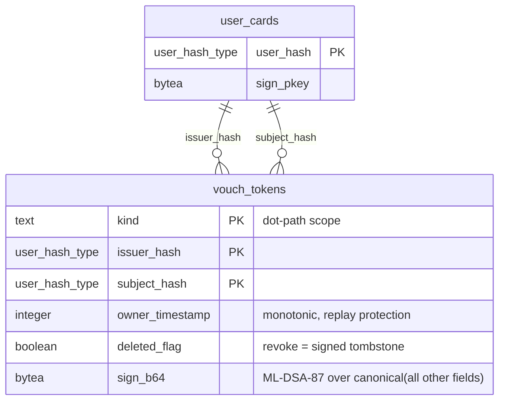

# Post-Quantum Vouch Tokens

A vouch token is a signed attestation that one user (`issuer`) trusts another user (`subject`) within a specific capability scope. Vouch tokens are ordinary signed PQ rows — they use the same integrity triad as every other signable table, travel via Electric sync, and require no new verification machinery.

## Goals

- **Decentralized trust** — any approved user can vouch for any other user within scopes they hold authority over.
- **Self-authenticating** — a vouch token is verifiable by any peer using only the issuer's `sign_pkey` from `user_cards`. No central authority, no online lookup.
- **Revocable** — revoking a vouch is a signed tombstone (`deleted_flag: true`), same as every other soft-delete in the system.
- **Scope-aware** — vouches are scoped to a dot-path resource namespace. A vouch for `device.<sn>.storage.write` does not imply a vouch for `origins.<hash>.reviews.write`.

---

## Resource Forest

The `kind` field names the **resource** a vouch grants access to — not how trust was established. Provenance (optical handshake, manual approval, transitive vouch) is inferred from the issuer and context, never encoded into `kind`.

Scopes use a left-to-right dot-path notation. Each step right narrows authority:

```
device.<device_id>
├── storage
│   ├── read                            ← Electric shape streaming
│   └── write                           ← HTTP ingest
└── admin                               ← device management

origins.<origin_hash>
└── reviews
    └── write                           ← review write tokens
        └── <nonce>                     ← per-invitation narrowing
```

The core forest is defined in `Chat.Data.VouchToken.resource_forest/0`. It has two independent roots — `device` and `origins`. Each root is a different kind of entity with its own facility subtree. Parametric segments (`:device_id`, `:origin_hash`) are filled at runtime. Leaf markers indicate the subsystem that consumes the scope: `:shape` for `storage.read`/`storage.write`, `:review_token` for `origins.*.reviews.write`.

A vouch for `device.<id>.storage.write` grants full write access to all shapes; `device.<id>.storage.write.dialog_messages` narrows to just that shape. Likewise `device.<id>.storage.read` grants read access to all shapes; `device.<id>.storage.read.user_cards` narrows to one. Prefix containment governs attenuation — wider scope covers all narrower leaves under it, but never crosses into a sibling tree.

Future extensions (`device.*.sync`, `device.*.admin.firmware/settings/network`, `origins.*.admin`, `rooms.*`) will be added to `resource_forest/0` when their consuming subsystems are implemented.

### Vocabulary Layers

| Layer | Source | Mutable? |
|-------|--------|----------|
| **Core** | Compiled into the application. Covers the resource roots and their first-level facilities — the minimum for the access gate to function. | No |
| **Device-local** | Owner defines additional scopes via admin UI (e.g., domain-specific sensor claims). Extends leaves only — cannot redefine compiled prefixes. | Yes, owner only |
| **Discovered** | Learned from peer devices during sync. Unknown scopes are stored and forwarded but treated as **deny** (closed-world assumption) until the vocabulary is merged. | Yes, append-only |

Core scopes are defined as module attributes, enabling compile-time pattern matching and exhaustive guards. Device-local and discovered scopes are runtime strings validated by prefix rules.

---

## Schema

The `vouch_tokens` table follows the standard integrity triad from [02_integrity.md](../invariants/02_integrity.md).



**Primary key:** `(kind, issuer_hash, subject_hash)` — one issuer, one vouch per scope per subject. Natural composite, no synthetic id.

**No `sig_alg`** — the system is ML-DSA-87. Algorithm migration is a system-wide event, not per-token negotiation.

**No `value`** — a vouch is a boolean attestation: "I attest this scope for this subject." Claim payloads (e.g., firmware version numbers) are future scope; the column can be added when a use case demands it.

**No `pub_key`** — the approval list and `user_cards` already map `user_hash → sign_pkey`. Duplicating the key per token wastes ~2.5KB per row at PQ key sizes.

**No `expires_at`** — vouches do not expire. Revocation is explicit via `deleted_flag`.

### Canonical Serialization

Same rules as every signable row — concatenation of string representations of all fields (except `sign_b64`), sorted lexicographically by column name. `kind` encodes as raw UTF-8, hash fields as prefixed hex. Handled by the existing `Chat.Data.Integrity.signature_payload/1` via the `Signable` protocol.

---

## Verification

No new verification code. The vouch token implements the `Signable` protocol and plugs into the existing pipeline:

1. Fetch issuer's `sign_pkey` from `user_cards`.
2. `Integrity.verify_signature/1` — same function, same path as every other signed row.
3. Check `owner_timestamp` monotonicity — reject replays.
4. Check `deleted_flag` — a `true` with higher `owner_timestamp` revokes the vouch.

Ingest validation follows the same `Chat.Data.Shapes.Shape` behaviour — a `vouch_token_validate/3` function passed to `Phoenix.Sync.Writer.allow/4`.

---

## Scope Attenuation

```elixir
def attenuates?(parent, child) do
  parent_parts = String.split(parent, ".")
  child_parts = String.split(child, ".")
  List.starts_with?(child_parts, parent_parts)
end
```

A vouch for `device.<sn>.storage.write` attenuates to cover `device.<sn>.storage.write.dialog_messages`. A vouch for `device.<sn>.admin` does not cover `origins.<hash>.reviews`. Attenuation is checked at gate evaluation time, not at ingest.

---

## Permission Resolution

When the trust graph contains multiple paths or conflicting signals for a subject, three rules determine the outcome, applied in order:

1. **Shortest chain wins.** If multiple paths reach a subject, the path with the fewest edges sets `chain_distance`. This is already expressed by `MIN(distance)` in the recursive CTE — shortest path means strongest signal, highest trust weight.

2. **Wider scope wins (on subject end).** When resolving a subject's permission at scope `S`, a vouch granted at a wider (parent) scope takes precedence over a narrower one. A vouch for `device.<sn>.storage.write` is stronger than one for `device.<sn>.storage.write.dialog_messages` — the broader grant already covers the narrower scope via prefix containment, and carries more authority because the issuer trusted the subject with the entire subtree.

3. **Tombstone wins over grant.** A tombstoned vouch (`deleted_flag: true`) at any `(kind, issuer_hash, subject_hash)` tuple is authoritative — it is never overridden by a grant from a different issuer or a longer alternative path. Concretely:
   - If the **owner** tombstones a direct vouch for a subject at scope `S`, that subject loses access at `S` regardless of transitive paths through other users.
   - If **any edge** in a chain is tombstoned, that chain is broken. If no un-tombstoned chain remains, the subject has no path.
   - A tombstone at a parent scope (e.g. `device.<sn>.storage.write`) attenuates downward — it blocks `device.<sn>.storage.write.dialog_messages` and all other write sub-scopes via the same prefix-containment rule.

These rules make revocation decisive: an owner can sever trust to any user with a single tombstone, even if the graph offers alternative paths. Re-granting requires a new vouch with a higher `owner_timestamp`.

---

## Optimization — Resolved Chain Cache

Walking the trust graph on every access check is unnecessary when the vouch set changes infrequently. A runtime cache stores resolved chain results for up to **30 minutes**.

**Cache key:** `{scope_prefix, subject_hash}` — the pair that identifies a single permission question (e.g. "does this user have access to `device.BK-001.storage.write`?").

**Cache value:** `{chain_distance, vouch_scopes, resolved_at}` — the result of the recursive CTE or BFS walk. `resolved_at` is **OS monotonic time** (`:erlang.monotonic_time(:second)`) — immune to NTP jumps and wall-clock drift on embedded devices.

**Invalidation:**
- **On vouch insert/revoke** — any write to `vouch_tokens` within the scope prefix invalidates all cache entries under that prefix. This is coarse but simple; the vouch table changes rarely relative to access checks.
- **TTL expiry** — entries older than 30 minutes are evicted regardless. Guards against missed invalidation signals (e.g. sync lag from a peer device).
- **On demand** — the owner can force a full cache flush via admin UI (useful after bulk vouch changes).

**Implementation:** ETS table owned by the trust-score computation process. Reads are concurrent; writes (invalidation) are serialized through the owning process. If vouch tokens are cached in CubDB, the same cache sits in front of the BFS walk.

**No negative caching.** A cache miss always triggers a fresh walk. This prevents a stale "denied" result from blocking a user who was just vouched for.

---

## Relationship to Access Gating

This table is the approval substrate for [access gating](pq_access_gating.in_progress.md). The system has three modes — `open` (no gating), `guarded` (writes chain-gated, reads open), and `trust` (all access chain-gated). In `guarded` and `trust` modes, a user is allowed through when their chain distance from the owner is within the configured max depth.

All approval mechanisms produce vouch tokens with the same resource `kind`. What differs is the issuer and context — provenance is inferred, not encoded:

| Mechanism | Issuer | Typical vouch `kind` | Chain distance |
|-----------|--------|----------------------|----------------|
| Optical handshake | owner | `device.<sn>.storage.write` + `device.<sn>.storage.read` | 1 |
| Manual owner approval | owner | configurable: `storage.write`, `storage.read`, or both | 1 |
| User-to-user vouch | non-owner user | attenuated from voucher's own scope | +1 from voucher |

Provenance inference: if `issuer_hash` = owner → direct trust (optical handshake or manual, indistinguishable at the token level). If `issuer_hash` ≠ owner → transitive vouch.

- **Chain distance** is derived by walking `issuer_hash → subject_hash` links from the owner outward via the recursive CTE below.
- The access gate does not query this table directly — it queries the resolved chain cache. Vouch tokens are the source of truth; the cache is rebuilt on vouch insert/revoke.

### Graph Traversal via Recursive CTE

Chain distance is computed by walking `vouch_tokens` edges (`issuer_hash → subject_hash`) with `WITH RECURSIVE` and built-in `CYCLE` detection (PG 14+). The walk filters by `kind` prefix and respects revocation (`deleted_flag`) and replay protection (`owner_timestamp`).

```sql
WITH RECURSIVE trust_chain AS (
  -- Base: users the owner directly vouched for
  SELECT
    vt.subject_hash AS user_hash,
    1               AS distance
  FROM vouch_tokens vt
  WHERE vt.issuer_hash  = $owner_hash
    AND (vt.kind LIKE $scope_prefix || '%' OR $scope_prefix LIKE vt.kind || '.%')
    AND vt.deleted_flag = false
    AND NOT EXISTS (
      SELECT 1 FROM vouch_tokens t
      WHERE t.issuer_hash  = vt.issuer_hash
        AND t.subject_hash = vt.subject_hash
        AND t.deleted_flag = true
        AND vt.kind LIKE t.kind || '%'
    )

  UNION ALL

  -- Walk outward: each subject's own vouches
  SELECT
    vt.subject_hash,
    tc.distance + 1
  FROM vouch_tokens vt
  JOIN trust_chain tc ON vt.issuer_hash = tc.user_hash
  WHERE (vt.kind LIKE $scope_prefix || '%' OR $scope_prefix LIKE vt.kind || '.%')
    AND vt.deleted_flag = false
    AND tc.distance     < $max_depth
    AND NOT EXISTS (
      SELECT 1 FROM vouch_tokens t
      WHERE t.issuer_hash  = vt.issuer_hash
        AND t.subject_hash = vt.subject_hash
        AND t.deleted_flag = true
        AND vt.kind LIKE t.kind || '%'
    )
)
CYCLE user_hash SET is_cycle USING path

SELECT MIN(distance) AS chain_distance
FROM trust_chain
WHERE NOT is_cycle
  AND user_hash = $subject_hash
  AND NOT EXISTS (
    SELECT 1 FROM vouch_tokens t
    WHERE t.issuer_hash  = $owner_hash
      AND t.subject_hash = $subject_hash
      AND t.deleted_flag = true
      AND ($scope_prefix LIKE t.kind || '%')
  )
```

**Resource-scoped.** The `$scope_prefix` parameter (e.g. `'device.BK-001.storage.write'`) restricts the walk to vouches granting access to a specific resource subtree. Cross-tree walks (e.g. device + origins) require a separate pass per root or a broader prefix.

**Bidirectional scope matching.** The condition `(vt.kind LIKE $scope_prefix || '%' OR $scope_prefix LIKE vt.kind || '.%')` implements attenuation in both directions: a vouch at a narrower scope (e.g. `storage.write.dialog_messages`) matches a query for its parent (`storage.write`), and a vouch at a wider scope (e.g. `storage`) covers a query for a child (`storage.write`). This mirrors the `attenuates?/2` containment rule without requiring a separate check.

**Tombstone sub-selects.** Each CTE leg includes `NOT EXISTS` to exclude rows where a tombstoned vouch at a parent scope blocks the grant for the same `(issuer_hash, subject_hash)` pair. The final `SELECT` adds a direct-tombstone check: if the owner has tombstoned the subject at the queried scope (or a parent), the result is empty regardless of transitive paths.

**Notes:**

- **`CYCLE … SET … USING path`** — prevents infinite loops in mutual-vouch or ring topologies. No manual visited-set.
- **`$max_depth`** — caps traversal. Default: **7**.
- **Single-user lookup** — the query targets a specific `$subject_hash` and returns `MIN(distance)` for that user only. A full-graph dump (all reachable users) uses the same CTE but groups by `user_hash` without the final `WHERE user_hash = $subject_hash` filter.
- **Revocation** — `deleted_flag = false` plus the `NOT EXISTS` tombstone checks exclude revoked vouches and their attenuated children. A tombstoned vouch at a parent scope blocks all sub-scopes for that edge.
- **Replay safety** — `owner_timestamp` monotonicity is enforced at ingest (§ Verification), so the query sees only the latest version of each `(kind, issuer_hash, subject_hash)` tuple.
If vouch tokens are cached in CubDB, the equivalent traversal runs in Elixir (BFS with a `MapSet` visited guard, filtering on `kind` prefix and `deleted_flag`).

---

## Relationship to Review Write Tokens

The `origins.<origin_hash>.reviews.write.<write_token>` scope path is consumed by the [review write tokens](reviews/pq_review_write_tokens.proposed.md) system — one-time invite links that lead a user to writing a review for an origin.

The vouch delegation chain for write tokens:

1. **Origin → bot:** The origin owner vouches for a server-side bot with `origins.<origin_hash>.reviews.write` — a per-origin "enable review invitations" step in the origin admin UI.
2. **Bot → reviewer:** On invite link consumption, the bot sub-delegates `origins.<origin_hash>.reviews.write.<nonce>` to the reviewer — a narrower scope per invitation, attenuated from the origin's grant.

The origin's `review_access` mode (`open` / `invite_only`) determines whether a vouch in `reviews.write.*` is required at review ingest or is recorded as provenance only.

---

## Electric Sync

Vouch tokens sync as an Electric shape like any other PQ table. Shape reads are open (all synced data is encrypted or self-authenticating — leaking vouch graph structure is acceptable since it reveals only `user_hash` relationships, not identities).

The shape module implements `Chat.Data.Shapes.Shape` with standard `ingest_configure_writer/2`.

---

## Open Questions

1. **Should vouching require a minimum chain distance?** Should only users within a certain distance from the owner (e.g., direct contacts only) be allowed to vouch for others? This is a gate-level policy, not a schema concern, but it affects which vouch tokens are meaningful.

2. **Transitive vouch display.** When the UI shows "why is this user trusted?", should it show the full vouch chain or just the direct vouches? Chain display requires walking the graph; direct-only is a simple query.

3. **Device identifier format.** Partially resolved. `Chat.DeviceId` behaviour with `Chat.DeviceId.Default` fallback: HTTPS domain (`Server_<host>`) when configured, otherwise localhost MAC address (`Localhost_<hex>`). Platform can supply a device-specific implementation via `:device_id_module` app env. Remaining question: should the platform target use the USB drive serial number instead?

4. **Scope vocabulary storage.** Device-local and discovered scopes need persistence. Options: a separate `scope_vocabulary` table (PG, synced), or CubDB (AdminDB, local-only). The core layer is compiled and needs no storage.

---

## Status

In Progress. Schema, migration, Ecto changeset, `Signable` protocol, shape behaviour, validation (insert/update/ingest), data access with recursive CTE, and Electric sync are implemented. Resolved chain cache, `attenuates?/2` helper, and scope vocabulary storage are pending.

## References

- [02_integrity.md](../invariants/02_integrity.md) — integrity triad: `sign_b64`, `owner_timestamp`, `deleted_flag`
- [pq_access_gating](pq_access_gating.in_progress.md) — open/guarded/trust modes, bootstrap, gate mechanics
- [pq_review_write_tokens](reviews/pq_review_write_tokens.proposed.md) — one-time invite links, bot delegation via `reviews.write.<nonce>` scope
