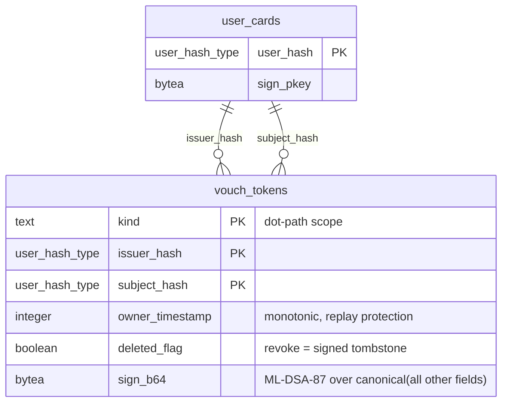

# Post-Quantum Vouch Tokens

A vouch token is a signed attestation that one user (`issuer`) trusts another user (`subject`) within a specific capability scope. Vouch tokens are ordinary signed PQ rows — they use the same integrity triad as every other signable table, travel via Electric sync, and require no new verification machinery.

## Goals

- **Decentralized trust** — any approved user can vouch for any other user within scopes they hold authority over.
- **Self-authenticating** — a vouch token is verifiable by any peer using only the issuer's `sign_pkey` from `user_cards`. No central authority, no online lookup.
- **Revocable** — revoking a vouch is a signed tombstone (`deleted_flag: true`), same as every other soft-delete in the system.
- **Scope-aware** — vouches are scoped to a dot-path capability namespace. A vouch for `user.trust` does not imply a vouch for `device.firmware`.

---

## Scope Vocabulary

Scopes use a DNS-like left-to-right dot-path notation. Reading left to right narrows authority:

```
user.trust.identity.optical-handshake
user.trust.identity.manual-approval
user.trust.vouch.direct
user.trust.vouch.transitive
user.trust.behavioral.tenure
user.trust.behavioral.interaction-consistency

device.firmware.version
device.firmware.signature-valid
device.hardware.sensor-calibrated
device.hardware.storage-healthy
device.network.connectivity-verified
```

Attenuation is prefix containment — a vouch for `user.trust` covers `user.trust.vouch.direct` but not `device.firmware`.

### Vocabulary Layers

| Layer | Source | Mutable? |
|-------|--------|----------|
| **Core** | Compiled into the application. Covers identity, vouching, revocation — the minimum for the access gate to function. | No |
| **Device-local** | Owner defines additional scopes via admin UI (e.g., domain-specific sensor claims). Extends leaves only — cannot redefine compiled prefixes. | Yes, owner only |
| **Discovered** | Learned from peer devices during sync. Unknown scopes are stored and forwarded but treated as **deny** (closed-world assumption) until the vocabulary is merged. | Yes, append-only |

Core scopes are defined as module attributes, enabling compile-time pattern matching and exhaustive guards. Device-local and discovered scopes are runtime strings validated by prefix rules.

---

## Schema

The `vouch_tokens` table follows the standard integrity triad from [02_integrity.md](../invariants/02_integrity.md).



**Primary key:** `(kind, issuer_hash, subject_hash)` — one issuer, one vouch per scope per subject. Natural composite, no synthetic id.

**No `sig_alg`** — the system is ML-DSA-87. Algorithm migration is a system-wide event, not per-token negotiation.

**No `value`** — a vouch is a boolean attestation: "I attest this scope for this subject." Claim payloads (e.g., firmware version numbers) are future scope; the column can be added when a use case demands it.

**No `pub_key`** — the approval list and `user_cards` already map `user_hash → sign_pkey`. Duplicating the key per token wastes ~2.5KB per row at PQ key sizes.

**No `expires_at`** — vouches do not expire. Revocation is explicit via `deleted_flag`.

### Canonical Serialization

Same rules as every signable row — concatenation of string representations of all fields (except `sign_b64`), sorted lexicographically by column name. `kind` encodes as raw UTF-8, hash fields as prefixed hex. Handled by the existing `Chat.Data.Integrity.signature_payload/1` via the `Signable` protocol.

---

## Verification

No new verification code. The vouch token implements the `Signable` protocol and plugs into the existing pipeline:

1. Fetch issuer's `sign_pkey` from `user_cards`.
2. `Integrity.verify_signature/1` — same function, same path as every other signed row.
3. Check `owner_timestamp` monotonicity — reject replays.
4. Check `deleted_flag` — a `true` with higher `owner_timestamp` revokes the vouch.

Ingest validation follows the same `Chat.Data.Shapes.Shape` behaviour — a `vouch_token_validate/3` function passed to `Phoenix.Sync.Writer.allow/4`.

---

## Scope Attenuation

```elixir
def attenuates?(parent, child) do
  parent_parts = String.split(parent, ".")
  child_parts = String.split(child, ".")
  List.starts_with?(child_parts, parent_parts)
end
```

A vouch for `user.trust` attenuates to cover `user.trust.vouch.direct`. A vouch for `device.firmware` does not cover `user.trust`. Attenuation is checked at gate evaluation time, not at ingest.

---

## Relationship to Access Gating

This table is the storage substrate for the `trust` mode defined in [pq_access_gating](pq_access_gating.proposed.md):

- **Trust score computation** queries vouch tokens to build the trust graph — who vouched for whom, in which scopes, and whether those vouches are still live (not tombstoned).
- **Chain distance** is derived by walking `issuer_hash → subject_hash` links from the owner outward.
- **EigenTrust-style weighting** uses the issuer's own trust score (itself derived from vouches received) to weight each vouch's contribution.
- The access gate does not query this table directly — it queries a computed trust score cache. Vouch tokens are the source of truth; the cache is rebuilt on vouch insert/revoke.

## Relationship to Trust Metric Discovery

The scope vocabulary structure defined here implements the requirements from [trust_metric_discovery](trust_metric_discovery.proposed.md):

- The `kind` column carries the dot-path scope from §1 (Claim Vocabulary Structure).
- Core/device-local/discovered layers from §2 map to the three vocabulary layers above.
- Self-describing tokens from §4 are satisfied by the row itself — `kind` is the scope path, the row is the attestation, and unknown scopes are passthrough-stored per §3.

---

## Electric Sync

Vouch tokens sync as an Electric shape like any other PQ table. Shape reads are open (all synced data is encrypted or self-authenticating — leaking vouch graph structure is acceptable since it reveals only `user_hash` relationships, not identities).

The shape module implements `Chat.Data.Shapes.Shape` with standard `ingest_configure_writer/2`.

---

## Open Questions

1. **Should vouching require a minimum trust score?** The access gating doc proposes a `vouch_threshold` — only users with `trust_score ≥ vouch_threshold` can vouch. This is a gate-level policy, not a schema concern, but it affects which vouch tokens are meaningful.

2. **Transitive vouch display.** When the UI shows "why is this user trusted?", should it show the full vouch chain or just the direct vouches? Chain display requires walking the graph; direct-only is a simple query.

3. **Scope vocabulary storage.** Device-local and discovered scopes need persistence. Options: a separate `scope_vocabulary` table (PG, synced), or CubDB (AdminDB, local-only). The core layer is compiled and needs no storage.

---

## Status

Proposed.

## References

- [02_integrity.md](../invariants/02_integrity.md) — integrity triad: `sign_b64`, `owner_timestamp`, `deleted_flag`
- [pq_access_gating](pq_access_gating.proposed.md) — trust mode, approval list, gate mechanics
- [trust_metric_discovery](trust_metric_discovery.proposed.md) — scope vocabulary structure, discovery protocol
- [Vouchsafe ZI-CG](https://arxiv.org/abs/2601.02254) — zero-infrastructure capability graph, scope attenuation model
