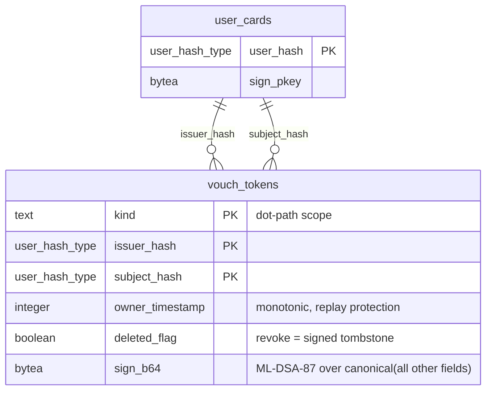

# Post-Quantum Vouch Tokens

A vouch token is a signed attestation that one user (`issuer`) trusts another user (`subject`) within a specific capability scope. Vouch tokens are ordinary signed PQ rows — they use the same integrity triad as every other signable table, travel via Electric sync, and require no new verification machinery.

## Goals

- **Decentralized trust** — any approved user can vouch for any other user within scopes they hold authority over.
- **Self-authenticating** — a vouch token is verifiable by any peer using only the issuer's `sign_pkey` from `user_cards`. No central authority, no online lookup.
- **Revocable** — revoking a vouch is a signed tombstone (`deleted_flag: true`), same as every other soft-delete in the system.
- **Scope-aware** — vouches are scoped to a dot-path capability namespace. A vouch for `user.trust` does not imply a vouch for `device.firmware`.

---

## Scope Vocabulary

Scopes use a DNS-like left-to-right dot-path notation. Reading left to right narrows authority:

```
devices.*.permissions
devices.*.permissions.user_permissions
devices.*.permissions.user_permissions.storage
devices.*.permissions.user_permissions.storage.full
devices.*.permissions.user_permissions.storage.full.read
devices.*.permissions.user_permissions.storage.full.read.<entity>
devices.*.permissions.user_permissions.storage.full.write
devices.*.permissions.network_permissions
devices.*.firmware
devices.*.firmware.version
devices.*.firmware.signature-valid
devices.*.hardware
devices.*.hardware.sensor-calibrated
devices.*.hardware.storage-healthy
devices.*.network
devices.*.network.connectivity-verified

origins.*.identity
origins.*.identity.optical-handshake
origins.*.identity.manual-approval
origins.*.vouch
origins.*.vouch.direct
origins.*.vouch.transitive
origins.*.behavioral
origins.*.behavioral.tenure
origins.*.behavioral.interaction-consistency
origins.*.reviews
origins.*.reviews.write
origins.*.reviews.write.<write_token>
```

Attenuation is prefix containment — a vouch for `origins.<origin_hash>.reviews.write` covers `origins.<origin_hash>.reviews.write.<write_token>` but not `devices.*.firmware`. An origin grants a bot `origins.<origin_hash>.reviews.write`; the bot can then delegate `origins.<origin_hash>.reviews.write.<write_token>` to individual users — each step right narrows the scope.

### Vocabulary Layers

| Layer | Source | Mutable? |
|-------|--------|----------|
| **Core** | Compiled into the application. Covers identity, vouching, revocation — the minimum for the access gate to function. | No |
| **Device-local** | Owner defines additional scopes via admin UI (e.g., domain-specific sensor claims). Extends leaves only — cannot redefine compiled prefixes. | Yes, owner only |
| **Discovered** | Learned from peer devices during sync. Unknown scopes are stored and forwarded but treated as **deny** (closed-world assumption) until the vocabulary is merged. | Yes, append-only |

Core scopes are defined as module attributes, enabling compile-time pattern matching and exhaustive guards. Device-local and discovered scopes are runtime strings validated by prefix rules.

---

## Schema

The `vouch_tokens` table follows the standard integrity triad from [02_integrity.md](../invariants/02_integrity.md).



**Primary key:** `(kind, issuer_hash, subject_hash)` — one issuer, one vouch per scope per subject. Natural composite, no synthetic id.

**No `sig_alg`** — the system is ML-DSA-87. Algorithm migration is a system-wide event, not per-token negotiation.

**No `value`** — a vouch is a boolean attestation: "I attest this scope for this subject." Claim payloads (e.g., firmware version numbers) are future scope; the column can be added when a use case demands it.

**No `pub_key`** — the approval list and `user_cards` already map `user_hash → sign_pkey`. Duplicating the key per token wastes ~2.5KB per row at PQ key sizes.

**No `expires_at`** — vouches do not expire. Revocation is explicit via `deleted_flag`.

### Canonical Serialization

Same rules as every signable row — concatenation of string representations of all fields (except `sign_b64`), sorted lexicographically by column name. `kind` encodes as raw UTF-8, hash fields as prefixed hex. Handled by the existing `Chat.Data.Integrity.signature_payload/1` via the `Signable` protocol.

---

## Verification

No new verification code. The vouch token implements the `Signable` protocol and plugs into the existing pipeline:

1. Fetch issuer's `sign_pkey` from `user_cards`.
2. `Integrity.verify_signature/1` — same function, same path as every other signed row.
3. Check `owner_timestamp` monotonicity — reject replays.
4. Check `deleted_flag` — a `true` with higher `owner_timestamp` revokes the vouch.

Ingest validation follows the same `Chat.Data.Shapes.Shape` behaviour — a `vouch_token_validate/3` function passed to `Phoenix.Sync.Writer.allow/4`.

---

## Scope Attenuation

```elixir
def attenuates?(parent, child) do
  parent_parts = String.split(parent, ".")
  child_parts = String.split(child, ".")
  List.starts_with?(child_parts, parent_parts)
end
```

A vouch for `origins.*` attenuates to cover `origins.<origin_hash>.vouch.direct`. A vouch for `devices.*.firmware` does not cover `origins.*`. Attenuation is checked at gate evaluation time, not at ingest.

---

## Permission Resolution

When the trust graph contains multiple paths or conflicting signals for a subject, three rules determine the outcome, applied in order:

1. **Shortest chain wins.** If multiple paths reach a subject, the path with the fewest edges sets `chain_distance`. This is already expressed by `MIN(distance)` in the recursive CTE — shortest path means strongest signal, highest trust weight.

2. **Wider scope wins (on subject end).** When resolving a subject's permission at scope `S`, a vouch granted at a wider (parent) scope takes precedence over a narrower one. A vouch for `origins.<hash>.vouch` is stronger than one for `origins.<hash>.vouch.direct` — the broader grant already covers the narrower scope via prefix containment, and carries more authority because the issuer trusted the subject with the entire subtree.

3. **Tombstone wins over grant.** A tombstoned vouch (`deleted_flag: true`) at any `(kind, issuer_hash, subject_hash)` tuple is authoritative — it is never overridden by a grant from a different issuer or a longer alternative path. Concretely:
   - If the **owner** tombstones a direct vouch for a subject at scope `S`, that subject loses access at `S` regardless of transitive paths through other users.
   - If **any edge** in a chain is tombstoned, that chain is broken. If no un-tombstoned chain remains, the subject has no path.
   - A tombstone at a parent scope (e.g. `origins.<hash>.vouch`) attenuates downward — it blocks `origins.<hash>.vouch.direct` and `origins.<hash>.vouch.transitive` via the same prefix-containment rule.

These rules make revocation decisive: an owner can sever trust to any user with a single tombstone, even if the graph offers alternative paths. Re-granting requires a new vouch with a higher `owner_timestamp`.

---

## Optimization — Resolved Chain Cache

Walking the trust graph on every access check is unnecessary when the vouch set changes infrequently. A runtime cache stores resolved chain results for up to **30 minutes**.

**Cache key:** `{origin_hash, subject_hash, scope_prefix}` — the triple that identifies a single permission question.

**Cache value:** `{chain_distance, vouch_scopes, resolved_at}` — the result of the recursive CTE or BFS walk. `resolved_at` is **OS monotonic time** (`:erlang.monotonic_time(:second)`) — immune to NTP jumps and wall-clock drift on embedded devices.

**Invalidation:**
- **On vouch insert/revoke** — any write to `vouch_tokens` within the origin prefix invalidates all cache entries for that origin. This is coarse but simple; the vouch table changes rarely relative to access checks.
- **TTL expiry** — entries older than 30 minutes are evicted regardless. Guards against missed invalidation signals (e.g. sync lag from a peer device).
- **On demand** — the owner can force a full cache flush via admin UI (useful after bulk vouch changes).

**Implementation:** ETS table owned by the trust-score computation process. Reads are concurrent; writes (invalidation) are serialized through the owning process. If vouch tokens are cached in CubDB, the same cache sits in front of the BFS walk.

**No negative caching.** A cache miss always triggers a fresh walk. This prevents a stale "denied" result from blocking a user who was just vouched for.

---

## Relationship to Access Gating

This table is the approval substrate for [access gating](pq_access_gating.proposed.md). The system has two modes — `open` (no gating) and `trust` (vouch-token-driven). In `trust` mode, a user is approved when their chain distance from the owner is within the configured max depth.

All approval mechanisms are vouch tokens with different scopes:

| Mechanism | Vouch scope | Chain distance effect |
|-----------|-------------|----------------------|
| Optical handshake | `origins.<origin_hash>.identity.optical-handshake` | 1 (direct from owner) |
| Manual owner approval | `origins.<origin_hash>.identity.manual-approval` | 1 (direct from owner) |
| User-to-user vouch | `origins.<origin_hash>.vouch.direct` | +1 from voucher |
| Transitive (chain walk) | `origins.<origin_hash>.vouch.transitive` | Computed by CTE |

- **Chain distance** is derived by walking `issuer_hash → subject_hash` links from the owner outward via the recursive CTE below.
- The access gate does not query this table directly — it queries the resolved chain cache. Vouch tokens are the source of truth; the cache is rebuilt on vouch insert/revoke.

### Graph Traversal via Recursive CTE

Chain distance is computed by walking `vouch_tokens` edges (`issuer_hash → subject_hash`) with `WITH RECURSIVE` and built-in `CYCLE` detection (PG 14+). The walk filters by the composite PK prefix `(kind, issuer_hash)` and respects revocation (`deleted_flag`) and replay protection (`owner_timestamp`).

```sql
WITH RECURSIVE trust_chain AS (
  -- Base: users the owner directly vouched for
  SELECT
    vt.subject_hash  AS user_hash,
    vt.kind,
    1                AS distance
  FROM vouch_tokens vt
  WHERE vt.issuer_hash   = $owner_hash
    AND vt.kind          LIKE $origin_prefix || '.vouch.%'  -- e.g. 'origins.<origin_hash>.vouch.%'
    AND vt.deleted_flag  = false

  UNION ALL

  -- Walk outward: each subject's own vouches
  SELECT
    vt.subject_hash,
    vt.kind,
    tc.distance + 1
  FROM vouch_tokens vt
  JOIN trust_chain tc ON vt.issuer_hash = tc.user_hash
  WHERE vt.kind          LIKE $origin_prefix || '.vouch.%'
    AND vt.deleted_flag  = false
    AND tc.distance      < $max_depth
)
CYCLE user_hash SET is_cycle USING path

SELECT
  user_hash,
  MIN(distance)                       AS chain_distance,
  array_agg(DISTINCT kind)            AS vouch_scopes
FROM trust_chain
WHERE NOT is_cycle
GROUP BY user_hash;
```

**Origin-scoped.** The `$origin_prefix` parameter (e.g. `'origins.u_a1b2c3'`) restricts the walk to vouches within a single origin — matching the scope vocabulary's `origins.<origin_hash>.vouch.direct` / `origins.<origin_hash>.vouch.transitive` paths. Cross-origin trust walks require a separate pass per origin or a broader prefix.

**Scope attenuation alignment.** The `LIKE prefix || '.vouch.%'` filter mirrors the `attenuates?/2` containment rule — it selects all vouch sub-scopes under the origin without crossing into sibling namespaces (`identity`, `behavioral`).

**Notes:**

- **`CYCLE … SET … USING path`** — prevents infinite loops in mutual-vouch or ring topologies. No manual visited-set.
- **`$max_depth`** — caps traversal. Suggested default: **4** (owner → contact → contact-of-contact → one more hop).
- **`MIN(distance)`** — shortest path becomes the `chain_distance` used by the access gate.
- **`vouch_scopes`** — collects the distinct `kind` values along the chain, so the caller knows whether the path is `vouch.direct`, `vouch.transitive`, or a mix.
- **Revocation** — `deleted_flag = false` excludes tombstoned vouches. A revoked vouch breaks the chain at that edge; downstream users lose the path through the revoker.
- **Replay safety** — `owner_timestamp` monotonicity is enforced at ingest (§ Verification), so the query sees only the latest version of each `(kind, issuer_hash, subject_hash)` tuple.
If vouch tokens are cached in CubDB, the equivalent traversal runs in Elixir (BFS with a `MapSet` visited guard, filtering on `kind` prefix and `deleted_flag`).

---

## Relationship to Review Write Tokens

The `origins.<origin_hash>.reviews.write.<write_token>` scope path is consumed by the [review write tokens](reviews/pq_review_write_tokens.proposed.md) system — one-time invite links that lead a user to writing a review for an origin.

The vouch delegation chain for write tokens:

1. **Origin → bot:** The origin owner vouches for a server-side bot with `origins.<origin_hash>.reviews.write` — a per-origin "enable review invitations" step in the origin admin UI.
2. **Bot → reviewer:** On invite link consumption, the bot sub-delegates `origins.<origin_hash>.reviews.write.<nonce>` to the reviewer — a narrower scope per invitation, attenuated from the origin's grant.

The origin's `review_access` mode (`open` / `invite_only`) determines whether a vouch in `reviews.write.*` is required at review ingest or is recorded as provenance only.

---

## Electric Sync

Vouch tokens sync as an Electric shape like any other PQ table. Shape reads are open (all synced data is encrypted or self-authenticating — leaking vouch graph structure is acceptable since it reveals only `user_hash` relationships, not identities).

The shape module implements `Chat.Data.Shapes.Shape` with standard `ingest_configure_writer/2`.

---

## Open Questions

1. **Should vouching require a minimum chain distance?** Should only users within a certain distance from the owner (e.g., direct contacts only) be allowed to vouch for others? This is a gate-level policy, not a schema concern, but it affects which vouch tokens are meaningful.

2. **Transitive vouch display.** When the UI shows "why is this user trusted?", should it show the full vouch chain or just the direct vouches? Chain display requires walking the graph; direct-only is a simple query.

3. **Scope vocabulary storage.** Device-local and discovered scopes need persistence. Options: a separate `scope_vocabulary` table (PG, synced), or CubDB (AdminDB, local-only). The core layer is compiled and needs no storage.

---

## Status

Proposed.

## References

- [02_integrity.md](../invariants/02_integrity.md) — integrity triad: `sign_b64`, `owner_timestamp`, `deleted_flag`
- [pq_access_gating](pq_access_gating.proposed.md) — open/trust modes, bootstrap, gate mechanics
- [pq_review_write_tokens](reviews/pq_review_write_tokens.proposed.md) — one-time invite links, bot delegation via `reviews.write.<nonce>` scope
