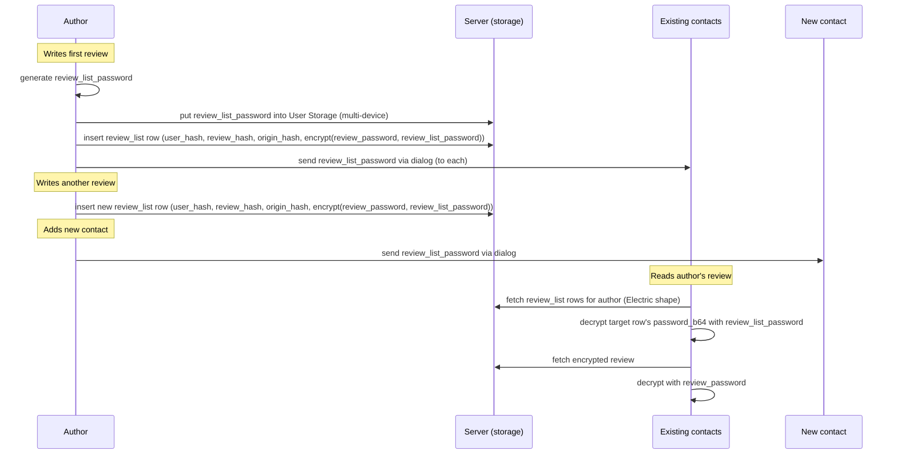

# PQ Review Contacts

Contacts channel — how an author shares review access with their contacts, bypassing moderation.

## Contacts

Each user has a review list (`review_hash`, `origin_hash`, `review_password`) whose passwords are
encrypted with a single per-author `review_list_password`. On review_list creation (first review) the
`review_list_password` is sent to all the contacts. On adding a new contact it is sent to that contact.

This way contacts are able to read reviews of their contacts (bypassing moderation).

There is **no contacts entity in the data layer** — no table, no shape. The contact list is client-side
state (`chat-frontend` keeps it in the user's own storage), so every "send the key" trigger lives in the
client. The server only ever sees `review_list` rows.



### Key lifetime — shared once, shared forever

The `review_list_password` is generated once per author and **never rotates**. Removing a contact
removes nothing: they already hold the key, and it also opens every review the author writes afterwards.
This is a deliberate trade-off — rotation would mean re-encrypting every `review_list` row and
re-delivering the key on each contact change, for a guarantee the model cannot honour anyway (the
removed contact could have copied every password already).

Consequences accepted with it:

- **No retraction.** `password_b64` is NOT NULL and DELETE is revoked at the role level, so pulling a
  review back from the contacts channel is `deleted_flag` only — advisory, since contacts have already
  synced the row.
- **Metadata is public.** `review_list` rows are publicly readable, so "user X reviewed something",
  the review count, and (via `origin_hash`) which origins they reviewed are visible to anyone. Only the
  content and the password stay encrypted.

The key lives in User Storage under a fixed key so every device of the author uses the same one. It needs
no recovery path: it was delivered as an ordinary dialog message, which a reinstalled contact re-syncs.

### Key delivery

The `review_list_password` travels as a dialog message to each contact — a new compound content type in
the [content polymorphism spec](../../invariants/07_content_polymorphism.md):

```json
{"review_list_key": ["<key_b64>"]}
```

Nothing new cryptographically: `pq_dialogs` already wraps every message with `sender_msg_key` +
ML-KEM-1024, so the key is protected exactly as any other dialog content. The receiving client stores it
as `peer_user_hash → review_list_password`.

### Reading a contact's reviews

`review_list` is a plain relation; readers query it through Electric shapes rather than any join
endpoint. Two rules keep it cheap:

**Trim the columns.** `sign_b64` is an ML-DSA-87 signature — ~4.6 KB per row, ~6.2 KB base64 on the
wire, against ~700 B for everything else. Sync with
`columns=user_hash,review_hash,origin_hash,password_b64` and a 50-contacts × 50-reviews list drops from
~17 MB to ~1.7 MB. Nothing is lost: every `review_list` row's signature is verified on ingestion
(both peer sync and HTTP paths call `UserValidation.validate_signature/1`), together with the
moderation-proof matrix — the server rejects any row whose author signature is invalid or whose
proof fields do not match promoted pipeline rows. This is the real guard: contact sharing cannot
happen until the review has entered the origin's moderation pipeline. Readers do not need to
re-verify `sign_b64` because the server has already enforced it, and a forged list row only yields a
password that fails the AES-GCM tag.

**Filter on an indexed column, not on a per-reader set.** `where user_hash = $1` (one shape per contact)
and `where origin_hash = $1` (one shape per origin) both produce a shape definition shared by every
client that asks for it, so Electric materializes each once. `where user_hash = ANY($1)` is unique per
reader's contact set and re-materializes whenever a contact is added — avoid it.

That gives two access paths:

- **Origin page** — the client already syncs `review where origin_hash = $1` (all reviews of that
  origin, approved or not). Matching contacts' list rows against it by `review_hash` is local work; no
  extra sync, no join.
- **A contact's reviews** — read distinct `origin_hash` values off their list, then reuse the same
  per-origin review shapes. This is why `review_list` carries `origin_hash`: without it the only route
  back to the review rows is `review where review_hash = ANY(...)`, a filter unique per contact that
  churns on every new review.

## Data model

### review_list

Per-user encrypted list of `(review_hash, review_password)` pairs. Own table. Contacts decrypt this with `review_list_password` to access the author's reviews regardless of moderation state.

Includes moderation pipeline proof fields — the author must demonstrate that the review was submitted through the origin's moderation pipeline before sharing it with contacts. The server validates these references on ingest, preventing contacts-only reviews that bypass moderation.

Schema: [`Chat.Data.Schemas.ReviewList`](../../../../lib/chat/data/schemas/review_list.ex). Migration: [`20260718100005`](../../../../priv/repo/migrations/20260718100005_create_review_list.exs), origin_hash addition: [`20260727100000`](../../../../priv/repo/migrations/20260727100000_add_origin_hash_to_review_list.exs).

```
review_list
├── user_hash             — whose review list (PK part 1)
├── review_hash           — which review (PK part 2)
├── origin_hash           — which origin (mirrors the review's origin; lets a reader reuse the per-origin review shape)
├── password_b64          — review_password, AES-256-GCM encrypted with review_list_password
├── review_password_sign_hash    — TEXT, sign_hash of the review_public_passwords row (proof of promotion)
├── post_right_sign_hash  — TEXT, sign_hash of review_post_right row
├── revoke_right_sign_hash — TEXT, sign_hash of review_revoke_right row
├── deleted_flag           — integrity triad
├── owner_timestamp       — LWW
├── sign_b64              — user's ML-DSA-87 signature
└── sign_hash             — SHA3-512 of sign_b64
```

One row per review. New review = new row (no need to re-encrypt an entire blob).

`origin_hash` is immutable — it is set on insert, covered by the author's signature, and rejected if it
does not match the referenced review's origin. Indexed, so `where origin_hash = $1` is a usable shape
filter.

#### Moderation proof requirements by mode

| Mode | `review_password_sign_hash` | `post_right_sign_hash` | `revoke_right_sign_hash` |
|------|---------------------|----------------------|------------------------|
| **none** | required | null | null |
| **post** | required | null | required |
| **pre** | optional (null until approved, then the promotion row) | required | required |

- **none** — `review_password_sign_hash` proves the candidate was promoted to `review_public_passwords` (auto-promotion). No rights exist.
- **post** — `review_password_sign_hash` proves promotion happened. `revoke_right_sign_hash` proves the author gave the origin revoke capability before promotion.
- **pre** — `review_password_sign_hash` is null at submission time because the review is not yet promoted. Both rights must exist, proving the author gave the origin the ability to post or revoke. When the origin approves and the password row appears, the author updates their `review_list` row to fill in `review_password_sign_hash`.

#### Server validation on review_list ingest

Implemented in [`Chat.Data.ReviewList.Validation`](../../../../lib/chat/data/review_list/validation.ex).

1. Reject if the referenced review — or its origin — does not exist (a `review_list` entry cannot prove a pipeline it never entered).
2. Look up the origin's `moderation_mode`.
3. Reject if the row's `origin_hash` is not the referenced review's `origin_hash`, so a reader can trust the field it navigates by.
4. Enforce the proof matrix above for that mode: every `required` field must be present, and every `null` field must be absent.
5. For each present proof field, verify the referenced row exists **and its `sign_hash` matches the supplied value**:
   - `review_password_sign_hash` → a `review_public_passwords` row keyed by `(review_hash, sign_hash)`
   - `post_right_sign_hash` → the `review_post_right` row's `sign_hash`
   - `revoke_right_sign_hash` → the `review_revoke_right` row's `sign_hash`
6. The same checks run on **update**, so proof fields cannot be forged or blanked after the initial insert (the update path re-validates the effective post-merge values). `origin_hash` is not updatable, so it cannot be rewritten after insert.

## Electric shape

### review_list shape

Shape: [`Chat.Data.Shapes.ReviewList`](../../../../lib/chat/data/shapes/review_list.ex). Synced by `user_hash` (one contact's list) or by `origin_hash` (all list entries for one origin) — both
are indexed and both yield a shape definition shared across clients. Readers should request
`columns=user_hash,review_hash,origin_hash,password_b64,deleted_flag`, reject rows where
`deleted_flag` is set, and leave `sign_b64` behind; see
[Reading a contact's reviews](#reading-a-contacts-reviews).

Access control: list owner authenticated via `sign_pkey`, and the row must pass the moderation-proof
matrix. Reads are public — the rows carry only ciphertext.

## Source modules

| Layer | Module | Source |
|-------|--------|--------|
| Schema | `Chat.Data.Schemas.ReviewList` | [`schemas/review_list.ex`](../../../../lib/chat/data/schemas/review_list.ex) |
| Validation | `Chat.Data.ReviewList.Validation` | [`review_list/validation.ex`](../../../../lib/chat/data/review_list/validation.ex) |
| Data context | `Chat.Data.ReviewList` | [`review_list.ex`](../../../../lib/chat/data/review_list.ex) |
| Types | `ReviewListSignHash` | [`types/review_list_sign_hash.ex`](../../../../lib/chat/data/types/review_list_sign_hash.ex) |
