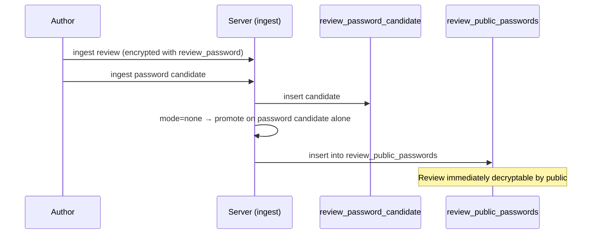
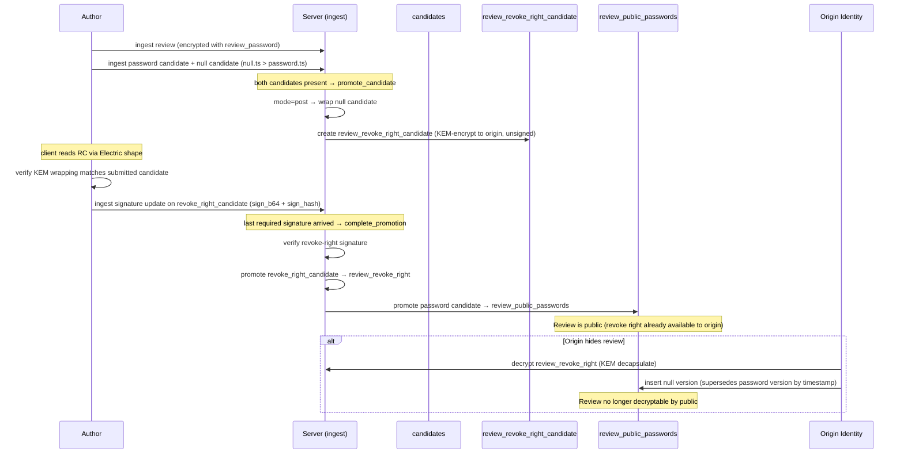
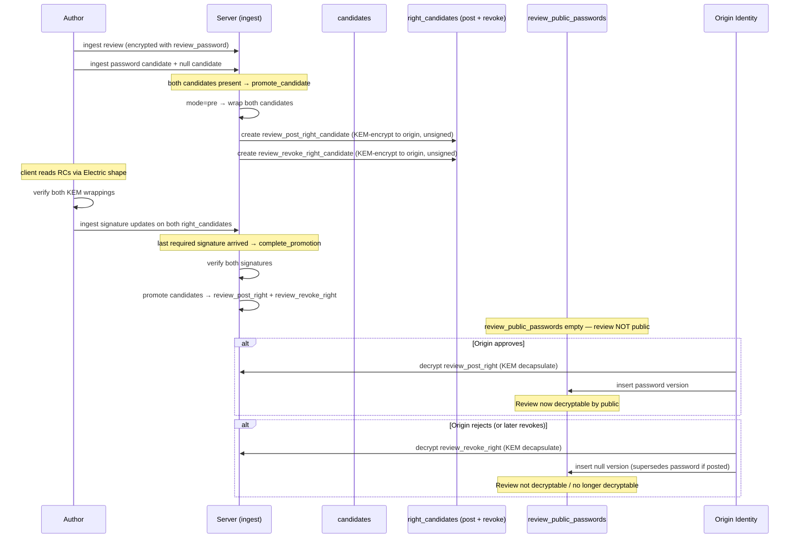

# PQ Review Moderation

Crypto, moderation pipeline, visibility tiers, and security properties for public reviews.

> **Signature field ordering.** [`Chat.Data.Integrity.signature_payload/1`](../../../../lib/chat/data/integrity.ex) sorts signable fields **alphabetically by key** — client and server both use the same `Signable` implementation. The per-schema `Signable` impl is the canonical source for which fields are signed.

> **Schema macros.** The `review_post_right` and `review_revoke_right` schemas are generated by [`Chat.Data.Schemas.ReviewRight`](../../../../lib/chat/data/schemas/review_right.ex) (`use Chat.Data.Schemas.ReviewRight, kind: :post`). Similarly, their validation modules use [`Chat.Data.ReviewRight.Validation`](../../../../lib/chat/data/review_right/validation.ex) macro. This avoids duplicating identical field lists across the two right types.

## Moderation

Public visibility of a review is controlled server-side via the `review_public_passwords` table — not by the author. The origin sets a moderation level that determines how review passwords flow into this table:

- **none** — server auto-promotes password from candidate to `review_public_passwords`; review is immediately public
- **post-moderation** — the author first grants a revoke right; the server then promotes the password; the origin identity can revoke later
- **pre-moderation** — the author grants both post and revoke rights; the server withholds the password until the origin identity posts

The public frontend checks whether a decryption password exists in `review_public_passwords` for a given review. The author cannot bypass moderation because the server controls the table, not the author.

### Candidate-only ingest

All author-submitted passwords route through [`review_password_candidate`](../../../../lib/chat/data/schemas/review_password_candidate.ex) — the author's own identity cannot ingest into `review_public_passwords`, so a password can only enter the table through server-side promotion or through a moderation action. The origin identity (authenticated via its `sign_pkey` from `user_cards`) is the one exception: it may insert a row it decrypted from a right envelope — this is how the origin publishes a post right or revokes via a revoke right. Each such row is a new version keyed by `(review_hash, sign_hash)`; the ingest path validates that it carries the author's pre-signed signature (the origin never signs these entries itself) and that its timestamp ordering still holds.

Promotion is a **two-phase handshake** driven entirely through the normal `/ingest` endpoint — no separate HTTP routes. The server triggers each phase automatically when candidates arrive or are updated via ingest. Implementation: [`ReviewPasswordCandidate.Promotion`](../../../../lib/chat/data/review_password_candidate/promotion.ex) (`promote_candidate` + `complete_promotion`), with candidate preparation in [`Promotion.Candidates`](../../../../lib/chat/data/review_password_candidate/promotion/candidates.ex).

**Phase 1 — `promote_candidate` (triggered by candidate ingest).** When the server ingests `review_password_candidate` rows, it attempts promotion based on the origin's `moderation_mode`:

- **none** — promotes as soon as the password candidate arrives. The null candidate is not required (no revoke right exists in this mode). Single-phase; no rights, no phase 2.
- **post** — waits until both password and null candidates are present, then wraps the null version (KEM-encrypt to the origin) into `review_revoke_right_candidate`.
- **pre** — waits until both password and null candidates are present, then wraps the password version into `review_post_right_candidate` and the null version into `review_revoke_right_candidate`.

**Revoke-ordering invariant (enforced, post and pre only).** Because public visibility is Last-Write-Wins by `owner_timestamp` (latest row wins; `password_b64 = null` means revoked), the null (revoke) version's `owner_timestamp` must be **strictly greater** than the password version's — otherwise publishing the revoke would not supersede the password. [`Promotion.Candidates.revoke_supersedes?/2`](../../../../lib/chat/data/review_password_candidate/promotion/candidates.ex) enforces `null.ts > password.ts` in **post** and **pre** modes and rejects the promotion otherwise (it is not merely a client convention). In **pre** mode this also means the `review_revoke_right` can always override a posted `review_post_right`. This invariant does not apply to **none** mode (no null candidate, no revoke right). In all modes the server validates each submitted candidate's author signature and author/origin binding before minting or wrapping it.

The right *candidates* are Electric-synced staging tables. After phase 1 creates them, the author's client reads the unsigned right candidates via their Electric shape, verifies the KEM wrapping matches what they submitted, and ingests a signature update (`sign_b64` + `sign_hash`) on each right candidate.

**Phase 2 — `complete_promotion` (triggered by right candidate signature ingest).** When the server ingests a signature update on a right candidate, it checks whether all required right candidates for the review are now signed. Once the last signature arrives, the server verifies all signatures and, in one transaction, promotes each signed candidate into its real table (`review_post_right` / `review_revoke_right`) and — for **post** mode — promotes the password candidate into `review_public_passwords`. In **pre** mode nothing is promoted to `review_public_passwords`; the review stays private until the origin identity posts. The staging candidates are then cleared.

### Right-envelope key derivation

KEM wrapping of right candidates uses [`Chat.Data.ReviewRightEnvelope`](../../../../lib/chat/data/review_right_envelope.ex) — the shared HKDF context `"buckitup/review-right/v1"` with label `"wrap"` ensures the wrapping side (promotion) and every unwrapping side (author verification, origin moderation, test fixtures) derive the same AES-GCM key from the KEM shared secret.

### No moderation flow



### Post-moderation flow



### Pre-moderation flow



## Review visibility tiers

### to_public

Content AES-256-GCM encrypted with a per-review `review_password` (random 32-byte key) and signed by the author (ML-DSA-87 over the `content_b64` ciphertext). Public visibility is determined by whether `review_password` is available in the `review_public_passwords` table — see the Moderation section.

Moderation controls only **public** visibility. Even when a review is hidden or not yet approved, the author's contacts can still see it via `review_list_password` (see [Contacts](pq_review_contacts.done.md)). The contacts channel is the author's property and cannot be affected by the origin identity's moderation decisions.

This means:

- **Password published**: visible to everyone (public + contacts)
- **Password withheld / revoked**: invisible to the general public, still visible to author's contacts
- The author's signature covers `content_b64` (ciphertext), verifiable by anyone holding the row

### to_origin

Because the origin is a subaccount with its own `user_cards` identity, `to_origin` is **nothing more than a regular dialog** between the review author and the origin identity — the standard `pq_dialogs` infrastructure, used as-is.

**There is nothing to build.** No table, no Electric shape, no validation module, no ingest path, no moderation. A `to_origin` review is a dialog message addressed to the origin's `user_hash`, encrypted and versioned exactly like any other dialog message. The only work is product-level: an entry point ("message this origin") that opens a dialog with the origin's `user_hash`.

Everything else follows for free from `pq_dialogs`:

- dialog encryption, key wrapping, edits and multi-device sync apply unchanged — including the `sender_msg_key` derivation and ML-KEM-1024 wrapping
- the owner reads `to_origin` reviews by decapsulating with the origin identity's `kem_skey` (which the owner holds)
- comments and follow-ups are just further messages in that dialog
- not subject to moderation — private feedback between author and origin, never touches `review_public_passwords`

## Content model

Review content follows the [content polymorphism spec](../../invariants/07_content_polymorphism.md) — the plaintext inside `content_b64` is a JSON array (composed message):

```json
[rating, placeholder, content]
```

| Position | Type   | Description |
|----------|--------|-------------|
| 0        | number | Rating (1–5) |
| 1        | string | Random padding — makes rating-only reviews indistinguishable from text reviews in ciphertext size |
| 2        | string | Review text (empty string when rating-only) |

When the review has text, the placeholder is empty. When the review is rating-only, the placeholder is a random string of random length (suggested range: 20–200 chars). This ensures the encrypted blob size does not reveal whether the author wrote text.

Examples:

```json
[4, "", "great coffee, friendly staff"]
[5, "kQ9xLm2pR7vN4wBtY8jD3sF6hA0cE5gI1oU", ""]
[2, "", "waited 30 minutes for a latte"]
[1, "aB3cD5eF7gH9iJ1kL3mN5oP7qR9sT1uV3wX5yZ7", ""]
```

Because the type lives inside the ciphertext, the database cannot distinguish review content from any other content type — only its size class is visible.

## Comments

Comments inherit the parent review's visibility envelope.
Comments likely become a room (own room type)

### On a public review

Encrypted with the parent review's `review_password` + ML-DSA-87 signed by commenter. Readable by anyone who can decrypt the review.

### On a to_origin review

Comments on `to_origin` reviews are just later messages in the author↔origin dialog. Standard `pq_dialogs` infrastructure — no separate comment schema, and nothing to build for this case.

## Data model

### review

Only `to_public` reviews live in this table. `to_origin` reviews never enter the review data model at all — they are ordinary dialog messages (see [pq_dialogs.done.md](../pq_dialogs.done.md)) between the author and the origin identity.

Schema: [`Chat.Data.Schemas.Review`](../../../../lib/chat/data/schemas/review.ex). Migration: [`20260718100000_create_review`](../../../../priv/repo/migrations/20260718100000_create_review.exs).

```
review
├── review_hash           — generated unique ID ("rv_" prefix + hex(random_bytes(64)))
├── origin_hash           — which origin (origin's user_hash)
├── author_hash           — who wrote it
├── content_b64           — AES-256-GCM encrypted with review_password
├── deleted_flag           — soft delete by author
├── parent_sign_hash      — FK → review_versions(sign_hash), nil for first version (see [Review versioning](pq_review_versioning.in_progress.md))
├── owner_timestamp
├── sign_b64              — author's ML-DSA-87 signature (over content_b64 ciphertext)
└── sign_hash             — SHA3-512 of sign_b64 (version identifier)
```

Public visibility is controlled by the `review_public_passwords` table, not by fields on the review row. Author's contacts see the review via `review_list_password` regardless of moderation state.

### review_public_passwords

Controls public visibility. Append-only (DELETE revoked). Latest entry by `owner_timestamp` determines whether the review is publicly decryptable.

Schema: [`Chat.Data.Schemas.ReviewPublicPassword`](../../../../lib/chat/data/schemas/review_public_password.ex). Migration: [`20260718100001`](../../../../priv/repo/migrations/20260718100001_create_review_passwords.exs).

```
review_public_passwords
├── review_hash           — which review (PK part 1)
├── sign_hash             — SHA3-512 of sign_b64 (PK part 2)
├── origin_hash           — which origin (for shape sync)
├── password_b64          — review_password in cleartext (null = revoked)
├── author_hash           — review author (always signs the entry)
├── deleted_flag           — integrity triad
├── owner_timestamp       — ordering (latest by timestamp determines visibility)
└── sign_b64              — author's ML-DSA-87 signature
```

Author pre-signs both password and null versions. In moderation flows, the origin identity decrypts a right and ingests the pre-signed row as a new version — the origin never signs these entries itself. The shape accepts this insert only from the origin identity, authenticated via its `sign_pkey`; the author cannot ingest here at all.

On ingest the server verifies the row's signature and that its `author_hash` and `origin_hash` match the referenced review. A promotion record can only be minted for one's own review, so it is a trustworthy "proof of promotion" for `review_list`. (`sign_hash` is derived from `sign_b64` on ingest and is not part of the signed payload.)

### review_password_candidate

Server-internal table holding the author's submitted password versions before moderation decision. Not synced via Electric (in [`@not_syncable`](../../../../lib/chat/data/shapes.ex):26); HTTP-ingest-only via [`Shapes.ReviewPasswordCandidate`](../../../../lib/chat/data/shapes/review_password_candidate.ex).

The only entrypoint for password ingest — `review_public_passwords` does not accept direct author ingest.

Schema: [`Chat.Data.Schemas.ReviewPasswordCandidate`](../../../../lib/chat/data/schemas/review_password_candidate.ex). Migration: [`20260718100002`](../../../../priv/repo/migrations/20260718100002_create_review_password_candidate.exs).

```
review_password_candidate
├── review_hash           — which review (PK part 1)
├── sign_hash             — SHA3-512 of sign_b64 (PK part 2)
├── origin_hash           — which origin
├── password_b64          — review_password (or null for revoke version)
├── author_hash           — who submitted
├── owner_timestamp       — ordering
└── sign_b64              — author's ML-DSA-87 signature
```

**Signature projection.** Candidates sign over the target `review_public_passwords` payload (with `deleted_flag: false`), not the candidate row itself. [`ReviewPasswordCandidate.to_public_password/1`](../../../../lib/chat/data/schemas/review_password_candidate.ex):57 performs this projection; it is used for signature verification both at promotion time ([`Promotion.Candidates.validate_candidate/1`](../../../../lib/chat/data/review_password_candidate/promotion/candidates.ex)) and via the `Signable` protocol implementation on the candidate schema.

### review_post_right_candidate / review_revoke_right_candidate

Electric-synced staging tables that hold the wrapped right during the promotion handshake. The server creates them unsigned after phase 1; the client reads them via Electric shape, verifies the KEM wrapping, and ingests a signature update. Same fields as their `review_post_right` / `review_revoke_right` targets, plus an `inserted_at` used to garbage-collect candidates that were never signed.

Schemas: [`Chat.Data.Schemas.ReviewPostRightCandidate`](../../../../lib/chat/data/schemas/review_right_candidate.ex):1 and [`ReviewRevokeRightCandidate`](../../../../lib/chat/data/schemas/review_right_candidate.ex):66. Migration: [`20260718100007`](../../../../priv/repo/migrations/20260718100007_create_review_right_candidate.exs). Shapes: [`ReviewPostRightCandidate`](../../../../lib/chat/data/shapes/review_post_right_candidate.ex), [`ReviewRevokeRightCandidate`](../../../../lib/chat/data/shapes/review_revoke_right_candidate.ex) — HTTP-ingest-only (in [`@not_syncable`](../../../../lib/chat/data/shapes.ex):26), accept `:update` only (signature update).

```
review_{post,revoke}_right_candidate
├── review_hash           — which review (PK)
├── origin_hash           — which origin (KEM recipient = origin's crypt_pkey)
├── author_hash           — who submitted
├── kem_ciphertext_b64    — ML-KEM-1024 ciphertext (encapsulated to origin's crypt_pkey)
├── wrapped_row_b64       — wrapped review_public_passwords row, AES-256-GCM under KEM-derived key
├── deleted_flag
├── owner_timestamp
├── inserted_at           — for stale-candidate GC (ReviewRightCandidate.delete_stale_candidates/1)
├── sign_b64              — author's ML-DSA-87 signature (NULL until phase 2 signature update)
└── sign_hash             — SHA3-512 of sign_b64 (NULL until phase 2 signature update)
```

`complete_promotion` copies a fully-signed candidate into its real table and deletes the staging rows.

### review_post_right

KEM-encrypted envelope containing a complete, author-signed `review_public_passwords` row with the password. The origin identity decrypts it and ingests the pre-signed row, making the review publicly decryptable. Created during pre-moderation. Append-only (DELETE revoked).

Schema: generated by [`Chat.Data.Schemas.ReviewRight`](../../../../lib/chat/data/schemas/review_right.ex) macro — [`ReviewPostRight`](../../../../lib/chat/data/schemas/review_post_right.ex) is `use Chat.Data.Schemas.ReviewRight, kind: :post`. Migration: [`20260718100003`](../../../../priv/repo/migrations/20260718100003_create_review_post_right.exs).

```
review_post_right
├── review_hash           — which review (PK)
├── origin_hash           — which origin (KEM recipient = origin's crypt_pkey)
├── author_hash           — TEXT NOT NULL, FK → user_cards(user_hash), review author
├── kem_ciphertext_b64    — ML-KEM-1024 ciphertext (encapsulated to origin's crypt_pkey)
├── wrapped_row_b64       — complete author-signed review_public_passwords row, AES-256-GCM encrypted with KEM-derived key
├── deleted_flag           — integrity triad
├── owner_timestamp
├── sign_b64              — author's ML-DSA-87 signature (nullable — NULL when created via promotion before author signs)
└── sign_hash             — SHA3-512 of sign_b64 (nullable — NULL when created via promotion before author signs)
```

Flow: created via the two-phase ingest handshake — when password candidates are ingested, the server wraps the author's password candidate into `review_post_right_candidate` (unsigned); the author reads it via Electric shape, verifies the KEM wrapping, and ingests a signature update; when the last required signature arrives, `complete_promotion` verifies the signatures and promotes the candidate into this table. On ingest the server binds the right to an existing review with matching `author_hash` and `origin_hash` (the insert is unsigned, so the cross-table binding is the guard; the same applies to `review_revoke_right`).

### review_revoke_right

KEM-encrypted envelope containing a complete, author-signed `review_public_passwords` row with null password. The origin identity decrypts it and ingests the pre-signed null row, revoking public visibility. Created during post-moderation and pre-moderation. Append-only (DELETE revoked).

Schema: generated by [`Chat.Data.Schemas.ReviewRight`](../../../../lib/chat/data/schemas/review_right.ex) macro — [`ReviewRevokeRight`](../../../../lib/chat/data/schemas/review_revoke_right.ex) is `use Chat.Data.Schemas.ReviewRight, kind: :revoke`. Migration: [`20260718100004`](../../../../priv/repo/migrations/20260718100004_create_review_revoke_right.exs).

```
review_revoke_right
├── review_hash           — which review (PK)
├── origin_hash           — which origin (KEM recipient = origin's crypt_pkey)
├── author_hash           — TEXT NOT NULL, FK → user_cards(user_hash), review author
├── kem_ciphertext_b64    — ML-KEM-1024 ciphertext (encapsulated to origin's crypt_pkey)
├── wrapped_row_b64       — complete author-signed review_public_passwords row (password=null), AES-256-GCM encrypted with KEM-derived key
├── deleted_flag           — integrity triad
├── owner_timestamp
├── sign_b64              — author's ML-DSA-87 signature (nullable — NULL when created via promotion before author signs)
└── sign_hash             — SHA3-512 of sign_b64 (nullable — NULL when created via promotion before author signs)
```

### comment (deferred)

Comments will be designed separately — likely as a room-like structure (own room type). See the Comments section above for the visibility model.

## Electric shapes

All shapes are registered in [`Chat.Data.Shapes`](../../../../lib/chat/data/shapes.ex). Candidate shapes (`ReviewPasswordCandidate`, `ReviewPostRightCandidate`, `ReviewRevokeRightCandidate`) are in `@not_syncable` — they are HTTP-ingest-only and are not replicated via peer sync.

### review shape

Shape: [`Chat.Data.Shapes.Review`](../../../../lib/chat/data/shapes/review.ex). Synced by `origin_hash` — client requests reviews for a specific origin. Client decrypts what it can based on visibility and available keys. Implements `versions_schema/0 → ReviewVersion`.

Access control: author authenticated via `sign_pkey`. Update path checks edit-allowed rules (pre-mode lock) and archives outgoing tip via `Review.Versioning`.

### review_public_passwords shape

Shape: [`Chat.Data.Shapes.ReviewPublicPasswords`](../../../../lib/chat/data/shapes/review_public_passwords.ex). `sign_hash` is derived from `sign_b64` on ingest via `sync_derive_fields/1`.

Access control: insert by origin identity only (moderation action).

### review_post_right / review_revoke_right shapes

Shapes: [`ReviewPostRight`](../../../../lib/chat/data/shapes/review_post_right.ex), [`ReviewRevokeRight`](../../../../lib/chat/data/shapes/review_revoke_right.ex). Cross-table binding validation on insert (author/origin must match review).

### review_password_candidate shape

Shape: [`ReviewPasswordCandidate`](../../../../lib/chat/data/shapes/review_password_candidate.ex). HTTP-ingest-only (`@not_syncable`), accepts `:insert` only. Post-apply triggers [`candidate_post_apply_promote`](../../../../lib/chat/data/review_password_candidate/validation.ex) which fires `promote_candidate`.

### review_post_right_candidate / review_revoke_right_candidate shapes

Shapes: [`ReviewPostRightCandidate`](../../../../lib/chat/data/shapes/review_post_right_candidate.ex), [`ReviewRevokeRightCandidate`](../../../../lib/chat/data/shapes/review_revoke_right_candidate.ex). HTTP-ingest-only (`@not_syncable`), accept `:update` only (signature update). Post-apply triggers [`right_candidate_post_apply_complete`](../../../../lib/chat/data/review_right_candidate/validation.ex) which fires `complete_promotion`.

## Row immutability

Content tables (`review`, `review_versions`, `review_public_passwords`, `review_post_right`, `review_revoke_right`) are append-only — DELETE is revoked at the PostgreSQL role level (see [pg_constraints.md](../pg_constraints.md) §5). Migration: [`20260718100008_revoke_delete_on_review_tables`](../../../../priv/repo/migrations/20260718100008_revoke_delete_on_review_tables.exs). `review_versions` is covered by its own migration's REVOKE DELETE.

Visibility is controlled exclusively through the `review_public_passwords` versioning mechanism (publish / revoke via timestamps), not through row deletion.

## Security properties

### Signature verification model

All signatures are verified **on ingestion** — every peer-sync and HTTP ingest path calls
`UserValidation.validate_signature/1` (→ `Integrity.verify_signature/1`) before the row enters the
database. Readers do not re-verify signatures because the database contains only server-validated
rows. This is why `sign_b64` can be safely trimmed from read-path shapes (see
[Reading a contact's reviews](pq_review_contacts.done.md#reading-a-contacts-reviews)): the ingestion guard has already run.

For `review_list` specifically, ingestion-time verification enforces that contact sharing can only
happen **after** the review has entered the origin's moderation pipeline — the moderation-proof
matrix is validated alongside the signature (see [Moderation bypass prevention](#moderation-bypass-prevention)).

### Non-repudiation

All reviews and comments are ML-DSA-87 signed. Authors cannot deny having written a review. Owners cannot deny having approved or hidden one.

### Visibility guarantees

- **to_origin**: fully cryptographic — server stores ciphertext and cannot read content
- **to_public**: content is encrypted; the server controls public visibility via the `review_public_passwords` table (whether the decryption password is available), but cannot read the content itself
- **contacts**: cryptographic — contacts access `review_password` via the author's encrypted `review_list`, independent of server-controlled `review_public_passwords`

### Moderation bypass prevention

The `review_list` requires proof that the review was submitted through the origin's moderation pipeline (sign_hash references to `review_public_passwords`, `review_post_right`, `review_revoke_right` — per moderation mode). The server validates these references on ingest — the referenced review and origin must exist, the per-mode proof matrix must hold exactly (required present, forbidden absent), and each referenced `sign_hash` must match the stored row — preventing authors from creating contacts-only reviews that bypass the origin's moderation. The same validation runs on update, so proofs cannot be forged after insert.

### Ownership binding

An origin's `owner_cert` is `ML-DSA-87.sign(origin_sign_pkey, owner_sign_skey)`. On ingest the server verifies the cert against the owner's current signing key, so a forged cert cannot claim ownership of an origin.

### Moderation transparency

Moderation rights (`review_post_right`, `review_revoke_right`) carry the author's ML-DSA-87 signature, creating an auditable trail. The `review_public_passwords` table provides a public record of publication and revocation.

### Forward secrecy

Same as the rest of the system: none. Key compromise enables retroactive decryption. This is a known trade-off for deterministic multi-device sync.

## Source modules

| Layer | Module | Source |
|-------|--------|--------|
| Schema | `Chat.Data.Schemas.Review` | [`schemas/review.ex`](../../../../lib/chat/data/schemas/review.ex) |
| Schema | `Chat.Data.Schemas.ReviewPublicPassword` | [`schemas/review_public_password.ex`](../../../../lib/chat/data/schemas/review_public_password.ex) |
| Schema | `Chat.Data.Schemas.ReviewPasswordCandidate` | [`schemas/review_password_candidate.ex`](../../../../lib/chat/data/schemas/review_password_candidate.ex) |
| Schema (macro) | `Chat.Data.Schemas.ReviewRight` | [`schemas/review_right.ex`](../../../../lib/chat/data/schemas/review_right.ex) |
| Schema | `Chat.Data.Schemas.ReviewPostRight` | [`schemas/review_post_right.ex`](../../../../lib/chat/data/schemas/review_post_right.ex) |
| Schema | `Chat.Data.Schemas.ReviewRevokeRight` | [`schemas/review_revoke_right.ex`](../../../../lib/chat/data/schemas/review_revoke_right.ex) |
| Schema | `ReviewPostRightCandidate` / `ReviewRevokeRightCandidate` | [`schemas/review_right_candidate.ex`](../../../../lib/chat/data/schemas/review_right_candidate.ex) |
| Validation | `Chat.Data.Review.Validation` | [`review/validation.ex`](../../../../lib/chat/data/review/validation.ex) |
| Validation | `Chat.Data.ReviewPublicPassword.Validation` | [`review_public_password/validation.ex`](../../../../lib/chat/data/review_public_password/validation.ex) |
| Validation | `Chat.Data.ReviewPasswordCandidate.Validation` | [`review_password_candidate/validation.ex`](../../../../lib/chat/data/review_password_candidate/validation.ex) |
| Validation (macro) | `Chat.Data.ReviewRight.Validation` | [`review_right/validation.ex`](../../../../lib/chat/data/review_right/validation.ex) |
| Validation | `Chat.Data.ReviewRightCandidate.Validation` | [`review_right_candidate/validation.ex`](../../../../lib/chat/data/review_right_candidate/validation.ex) |
| Data context | `Chat.Data.Review` | [`review.ex`](../../../../lib/chat/data/review.ex) |
| Data context | `Chat.Data.ReviewPublicPassword` | [`review_public_password.ex`](../../../../lib/chat/data/review_public_password.ex) |
| Data context | `Chat.Data.ReviewPasswordCandidate` | [`review_password_candidate.ex`](../../../../lib/chat/data/review_password_candidate.ex) |
| Data context | `Chat.Data.ReviewRightCandidate` | [`review_right_candidate.ex`](../../../../lib/chat/data/review_right_candidate.ex) |
| Data context | `Chat.Data.ReviewPostRight` | [`review_post_right.ex`](../../../../lib/chat/data/review_post_right.ex) |
| Data context | `Chat.Data.ReviewRevokeRight` | [`review_revoke_right.ex`](../../../../lib/chat/data/review_revoke_right.ex) |
| Promotion | `Chat.Data.ReviewPasswordCandidate.Promotion` | [`promotion.ex`](../../../../lib/chat/data/review_password_candidate/promotion.ex) |
| Promotion | `Promotion.Candidates` | [`promotion/candidates.ex`](../../../../lib/chat/data/review_password_candidate/promotion/candidates.ex) |
| Crypto | `Chat.Data.ReviewRightEnvelope` | [`review_right_envelope.ex`](../../../../lib/chat/data/review_right_envelope.ex) |
| Types | `ReviewHash`, `ReviewSignHash`, `ReviewPasswordSignHash`, etc. | [`types/`](../../../../lib/chat/data/types/) |
