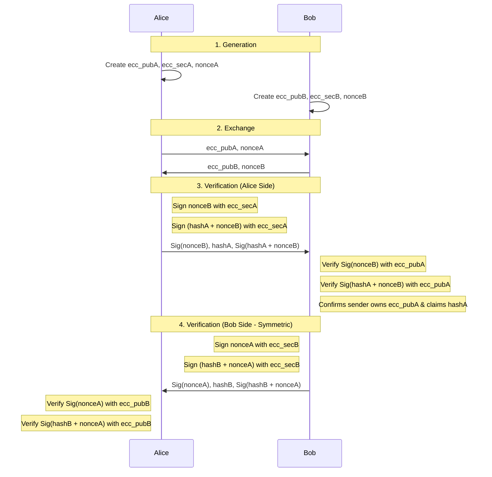
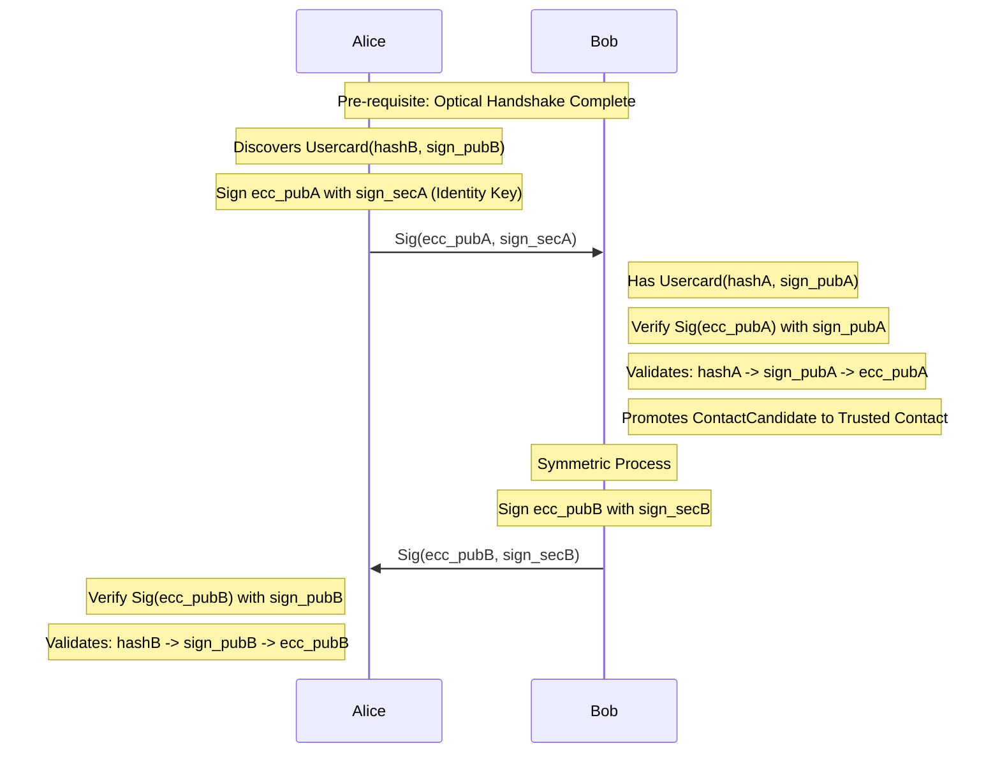

# Post-Quantum Optical Handshake

## Given
Alice has PQ sign keypair (sign_pubA, sign_secA), PQ encrypt keypair (enc_pubA, enc_secA) and userhash hashA.
Bob has PQ sign keypair (sign_pubB, sign_secB), PQ encrypt keypair (enc_pubB, enc_secB) and userhash hashB.

## Optical Handshake 
Alice creates ephemeral ECC keypair (ecc_pubA, ecc_secA) and random nonceA.
Bob creates ephemeral ECC keypair (ecc_pubB, ecc_secB) and random nonceB.

Alice and Bob exchange public ECC keys and random nonces.

Alice signs nonceB with secret key and sends it to Bob. Alice also sends hashA and signs of hashA + nonceB with Alice's secret key.
Bob verifies nonceB with Alice's public key.
-> Confirms Alice has ECC key she claims.
Bob recieves unencrypted hashA and verifies the signature of hashA + nonceB with Alice's public key. 
-> Confirms Alice claims her user hash is hashA and it was singed right now with Bob nonce and Alice secret key.

Bob does the same symmetrically.

## ContactCandidate

Alice saves hashB and ecc_pubB. Also signs ecc_pubA with her secret key(sign_secA).
When Alice discovers Usercard that has hashB, she sends ecc_pubA she signed to Bob.
Bob verifies the signature of ecc_pubA with Alice's public key. confirms that optical handshake he did to hashA is valid to sign_pubA and optically handshaked with ecc_pubA.
ContactCandidate becomes (trusted?) Contact

Bob does the same symmetrically.

## Note
Ephemeral keys are not stored and one time per handshake.