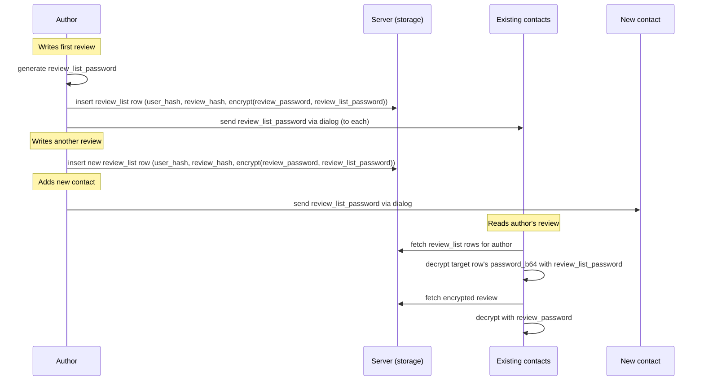
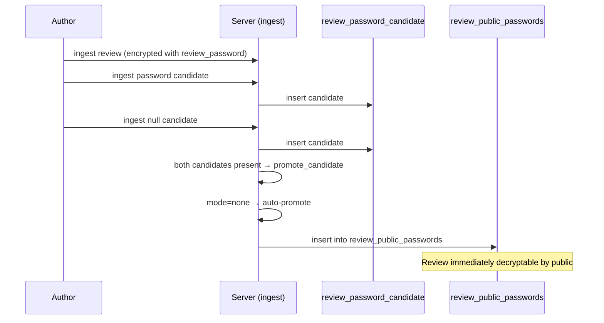
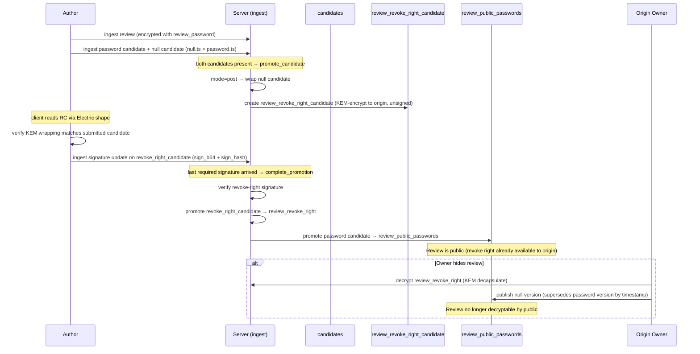
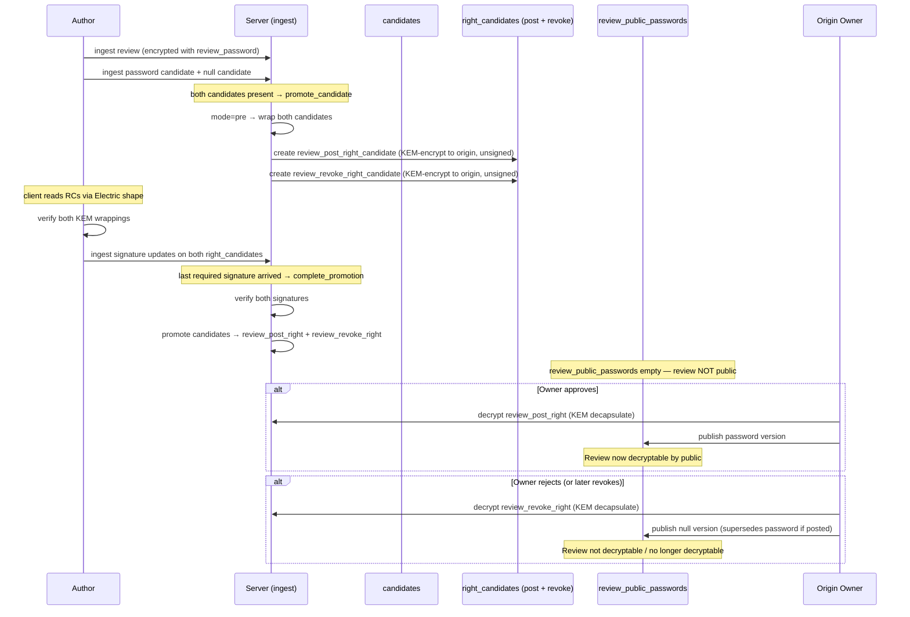

# Reviews Proposal

## Goal

Add a review system for origin entities (businesses, venues, etc.) with post-quantum cryptographic guarantees matching the rest of the platform.

A user should be able to:

- discover origins (coffee shops, venues, etc.)
- write a review with chosen visibility: to_public or to_origin
- comment on any review they can see
- trust that visibility guarantees are cryptographic, not server-enforced

An origin owner should be able to:

- register an origin with its own PQ identity
- choose a moderation mode for public reviews (pre, post, or none)
- moderate public reviews (approve, reject, hide)
- receive private feedback (to_origin reviews)

## Design decisions

- **Rating**: incorporate into a content model `[rating, placeholder, content]` — fill placeholder with random string to make rating-only and text reviews indistinguishable in ciphertext size.
- **Passwords vs reviews**: passwords as access layer. Prevent deletion as much as possible.
- **Ingest via candidates**: all `review_public_passwords` entries flow through `review_password_candidate` — the server validates and promotes. Direct ingest into `review_public_passwords` is not allowed (see Moderation section).
- **Origin key management**: origin keypairs are independently generated on the client (not derived from owner keys), stored client-side in the owner's identity, same pattern as regular user keys (see `pq_user.md`). Multi-device access via User Storage (encrypted skeys stored server-side, decryptable by the owner).
- **Origin creation**: three-step flow — create owner `user_cards` (if not exists) → generate and insert origin `user_cards` row → insert `origin` row with `owner_cert` linking the two (see Origin creation section).

## Three entities

```
Origin (the coffee shop)
│  subaccount identity (user_cards row), owned by a user
│
└── Review (by any user)
    ├── to_public   — encrypted with review_password, signed by author
    │                 public when password in review_public_passwords table
    │                 contacts see via review_list_password (bypasses moderation)
    ├── to_origin  — dialog between author and origin identity (see pq_dialogs)
    │
    └── Comment (by anyone who can see the parent review)
        └── inherits parent review's visibility envelope
```

## Origin

An origin is modeled as a **subaccount** — it gets its own `user_cards` row with a separate PQ identity.

An origin has:

- its own `user_cards` row (ML-DSA-87 signing keypair, ML-KEM-1024 encryption keypair)
- an owner (the user who created it)
- a moderation policy for public reviews
- public metadata (name, description — signed by origin identity)

The origin identity is separate from the owner's personal identity. One user can own multiple origins. Because it is a `user_cards` entry, the existing dialog infrastructure (see `pq_dialogs.md`) works directly for `to_origin` communication.

### Origin creation

Three-step flow following the same pattern as user creation (see `pq_user.md`):

1. **Owner exists** — the creating user already has their own `user_cards` row
2. **Generate origin identity** — client generates independent ML-DSA-87 + ML-KEM-1024 keypairs for the origin, inserts a new `user_cards` row (self-signed by the origin's own `sign_skey`)
3. **Create origin row** — insert `origin` table row signed by the origin identity, with `owner_cert` proving the owner created this identity

The `owner_cert` is `ML-DSA-87.sign(origin_sign_pkey, owner_sign_skey)` — the owner signs the origin's public signing key, binding the origin identity to the owner. Same pattern as `crypt_cert` binds encryption key to identity.

Origin secret keys (`sign_skey`, `crypt_skey`) are generated independently (not derived from owner keys) and stored client-side. For multi-device access, the owner encrypts origin keys into User Storage, decryptable by the owner's own keys on other devices.

Two levels of control:

- **Owner** (the creating user) — performs dangerous/irreversible operations: create origin, delete, change moderation mode. Ownership is immutable after creation. Owner identity is never exposed to the public.
- **Origin identity** — handles day-to-day operations: receive `to_origin` reviews, moderate public reviews. Can be delegated to an employee without exposing the owner's personal identity or granting irreversible powers.

> **Status (deferred to Phase 3).** The two-tier split is not yet enforced. Origin `update` operations — including
> `moderation_mode` changes and soft delete (`deleted_flag`) — are currently authorized by the **origin identity's**
> signature, so a delegated origin-identity holder could perform them. Requiring the **owner's** signature for these
> dangerous ops lands with the Phase 3 owner/moderation UI. `owner_cert` is still verified on origin creation.

### Why not a room

Rooms are conversation spaces. Origins are entities people review. They share crypto infrastructure but have different semantics:

- rooms have members who chat; origins have reviewers who evaluate
- room membership is about participation; origin visibility is about trust tiers
- rooms don't need moderation workflows; origins do
- the review/comment hierarchy doesn't map to room message threading

Keeping them separate avoids overloading the room model and allows independent evolution.

## Contacts

Each user has a review list (review_id, review_password) that is encrypted with review_list_password.
On review_list creation (first review) review_list_password is sent to all the contacts.
On adding a new contact review_list_password is sent to new contact.

This way contacts are able to read review of their contacts (bypassing moderation).



## Moderation

Public visibility of a review is controlled server-side via the `review_public_passwords` table — not by the author. The origin sets a moderation level that determines how review passwords flow into this table:

- **none** — server auto-promotes password from candidate to `review_public_passwords`; review is immediately public
- **post-moderation** — the author first grants a revoke right; the server then promotes the password; the origin owner can revoke later
- **pre-moderation** — the author grants both post and revoke rights; the server withholds the password until the origin owner posts

The public frontend checks whether a decryption password exists in `review_public_passwords` for a given review. The author cannot bypass moderation because the server controls the table, not the author.

### Candidate-only ingest

All moderation modes route through `review_password_candidate`. Direct ingest into `review_public_passwords` is not allowed — the shape refuses writes to that table, so a password can only become public through server-side promotion.

Promotion is a **two-phase handshake** driven entirely through the normal `/ingest` endpoint — no separate HTTP routes. The server triggers each phase automatically when candidates arrive or are updated via ingest.

**Phase 1 — `promote_candidate` (triggered by candidate ingest).** When the server ingests `review_password_candidate` rows, it checks whether both the password and null candidates are present for the review. Once both arrive, the server looks up the review's origin and its `moderation_mode`, then:

- **none** — promotes the password candidate straight into `review_public_passwords`. Single-phase; no rights, no phase 2.
- **post** — wraps the null version (KEM-encrypt to the origin) into `review_revoke_right_candidate`.
- **pre** — wraps the password version into `review_post_right_candidate` and the null version into `review_revoke_right_candidate`.

**Revoke-ordering invariant (enforced).** Because public visibility is Last-Write-Wins by `owner_timestamp` (latest row wins; `password_b64 = null` means revoked), the null (revoke) version's `owner_timestamp` must be **strictly greater** than the password version's — otherwise publishing the revoke would not supersede the password. `promote_candidate` enforces `null.ts > password.ts` in **post** and **pre** modes and rejects the promotion otherwise (it is not merely a client convention). In **pre** mode this also means the `review_revoke_right` can always override a posted `review_post_right`. In every mode the server also validates each submitted candidate's author signature and author/origin binding before minting or wrapping it.

The right *candidates* are Electric-synced staging tables. After phase 1 creates them, the author's client reads the unsigned right candidates via their Electric shape, verifies the KEM wrapping matches what they submitted, and ingests a signature update (`sign_b64` + `sign_hash`) on each right candidate.

**Phase 2 — `complete_promotion` (triggered by right candidate signature ingest).** When the server ingests a signature update on a right candidate, it checks whether all required right candidates for the review are now signed. Once the last signature arrives, the server verifies all signatures and, in one transaction, promotes each signed candidate into its real table (`review_post_right` / `review_revoke_right`) and — for **post** mode — promotes the password candidate into `review_public_passwords`. In **pre** mode nothing is promoted to `review_public_passwords`; the review stays private until the origin owner posts. The staging candidates are then cleared.

### No moderation flow



### Post-moderation flow



### Pre-moderation flow



## Review visibility tiers

### to_public

Content AES-256-GCM encrypted with a per-review `review_password` (random 32-byte key) and signed by the author (ML-DSA-87 over the `content_b64` ciphertext). Public visibility is determined by whether `review_password` is available in the `review_public_passwords` table — see the Moderation section.

Moderation controls only **public** visibility. Even when a review is hidden or not yet approved, the author's contacts can still see it via `review_list_password` (see Contacts section). The contacts channel is the author's property and cannot be affected by the origin owner's moderation decisions.

This means:

- **Password published**: visible to everyone (public + contacts)
- **Password withheld / revoked**: invisible to the general public, still visible to author's contacts
- The author's signature covers `content_b64` (ciphertext), verifiable by anyone holding the row

### to_origin

Because the origin is a subaccount with its own `user_cards` identity, `to_origin` is simply a **dialog** between the review author and the origin identity — using the standard `pq_dialogs` infrastructure.

The author and origin identity each derive a `sender_msg_key` per the dialog key derivation spec. Messages (reviews, comments, follow-ups) are encrypted exactly like dialog messages: AES-256-GCM under the sender's `sender_msg_key`, with the key wrapped for the peer via ML-KEM-1024.

This means:

- No new crypto machinery needed — reuses dialog encryption, key wrapping, and versioning
- The origin owner reads `to_origin` reviews by decapsulating with the origin identity's `kem_skey`
- Multi-device works: any owner device re-derives the origin's keys from the owner's private material
- Not subject to moderation (private feedback between author and origin)

## Comments

Comments inherit the parent review's visibility envelope.
Comments likely become a room (own room type)

### On a public review

Encrypted with the parent review's `review_password` + ML-DSA-87 signed by commenter. Readable by anyone who can decrypt the review.

### On a to_origin review

Comments on `to_origin` reviews are dialog messages in the author↔origin dialog. They use the standard `pq_dialogs` infrastructure — no separate comment schema needed for this case.

## Data model

### origin

The origin identity lives in `user_cards` (its own `user_hash`, `sign_pkey`, `crypt_pkey`). The `origin` table holds origin-specific metadata that doesn't belong in `user_cards`.

```
origins                                              — DB table name
├── origin_hash           — TEXT PK, FK → user_cards(user_hash), the origin's user_hash
├── owner_hash            — TEXT NOT NULL, FK → user_cards(user_hash), user_hash of the owner
├── owner_cert            — BYTEA NOT NULL, ML-DSA-87.sign(origin_sign_pkey, owner_sign_skey)
├── name                  — TEXT NOT NULL, origin name (signed by origin identity)
├── moderation_mode       — TEXT NOT NULL DEFAULT 'none', enum: none / post / pre
├── deleted_flag          — BOOLEAN NOT NULL DEFAULT false, soft delete by owner
├── owner_timestamp       — BIGINT NOT NULL, causal ordering (LWW)
├── sign_b64              — BYTEA NOT NULL, origin identity's ML-DSA-87 signature over all fields
└── sign_hash             — TEXT NOT NULL, prefix "ors_" + hex(SHA3-512 of sign_b64)
```

Constraints: `origin_hash` and `owner_hash` match `^u_[a-f0-9]{128}$`, `sign_hash` matches `^ors_[a-f0-9]{128}$`, `moderation_mode` IN (`none`, `post`, `pre`). Index on `owner_hash`.

Note: `sign_pkey` and `crypt_pkey` are on the origin's `user_cards` row, not duplicated here. The origin's `user_cards` row is self-signed (origin signs its own card with `origin_sign_skey`). The `owner_cert` on the `origin` row binds the origin identity to the owner.

### review

Only `to_public` reviews live in this table. `to_origin` reviews are standard dialog messages (see `pq_dialogs`) between the author and the origin identity — no separate schema needed.

```
review
├── review_hash           — generated unique ID ("rv_" prefix + hex(random_bytes(64)))
├── origin_hash           — which origin (origin's user_hash)
├── author_hash           — who wrote it
├── content_b64           — AES-256-GCM encrypted with review_password
├── deleted_flag           — soft delete by author
├── parent_sign_hash      — for edits (version chain, nil for first version)
├── owner_timestamp
├── sign_b64              — author's ML-DSA-87 signature (over content_b64 ciphertext)
└── sign_hash             — SHA3-512 of sign_b64 (version identifier)
```

Public visibility is controlled by the `review_public_passwords` table, not by fields on the review row — see the Moderation section. Author's contacts see the review via `review_list_password` regardless of moderation state.

### review_public_passwords

Controls public visibility. Append-only (DELETE revoked). Latest entry by `owner_timestamp` determines whether the review is publicly decryptable.

```
review_public_passwords
├── review_hash           — which review (PK part 1)
├── sign_hash             — SHA3-512 of sign_b64 (PK part 2)
├── origin_hash           — which origin (for shape sync)
├── password_b64          — review_password in cleartext (null = revoked)
├── author_hash           — review author (always signs the entry)
├── deleted_flag           — integrity triad
├── owner_timestamp       — ordering (latest by timestamp determines visibility)
└── sign_b64              — author's ML-DSA-87 signature
```

Author pre-signs both password and null versions. In moderation flows, the origin decrypts a right and inserts the pre-signed row — the origin never signs `review_public_passwords` entries.

On ingest the server verifies the row's signature and that its `author_hash` and `origin_hash` match the referenced review. A promotion record can only be minted for one's own review, so it is a trustworthy "proof of promotion" for `review_list`. (`sign_hash` is derived from `sign_b64` on ingest and is not part of the signed payload.)


### review_password_candidate

Server-internal table holding the author's submitted password versions before moderation decision. Not synced via Electric.

The only entrypoint for password ingest. review_password do not accept on ingest

```
review_password_candidate
├── review_hash           — which review (PK part 1)
├── sign_hash             — SHA3-512 of sign_b64 (PK part 2)
├── origin_hash           — which origin
├── password_b64          — review_password (or null for revoke version)
├── author_hash           — who submitted
├── owner_timestamp       — ordering
└── sign_b64              — author's ML-DSA-87 signature
```

### review_post_right_candidate / review_revoke_right_candidate

Electric-synced staging tables that hold the wrapped right during the promotion handshake. The server creates them unsigned after phase 1; the client reads them via Electric shape, verifies the KEM wrapping, and ingests a signature update. Same shape as their `review_post_right` / `review_revoke_right` targets, plus an `inserted_at` used to garbage-collect candidates that were never signed.

```
review_{post,revoke}_right_candidate
├── review_hash           — which review (PK)
├── origin_hash           — which origin (KEM recipient = origin's crypt_pkey)
├── author_hash           — who submitted
├── kem_ciphertext_b64    — ML-KEM-1024 ciphertext (encapsulated to origin's crypt_pkey)
├── wrapped_row_b64       — wrapped review_public_passwords row, AES-256-GCM under KEM-derived key
├── deleted_flag
├── owner_timestamp
├── inserted_at           — for stale-candidate GC (ReviewRightCandidate.delete_stale_candidates/1)
├── sign_b64              — author's ML-DSA-87 signature (added between phase 1 and phase 2)
└── sign_hash             — SHA3-512 of sign_b64
```

`complete_promotion` copies a fully-signed candidate into its real table and deletes the staging rows.

### review_post_right

KEM-encrypted envelope containing a complete, author-signed `review_public_passwords` row with the password. The origin decrypts and inserts the row as-is. Created during pre-moderation. Append-only (DELETE revoked).

```
review_post_right
├── review_hash           — which review (PK)
├── origin_hash           — which origin (KEM recipient = origin's crypt_pkey)
├── kem_ciphertext_b64    — ML-KEM-1024 ciphertext (encapsulated to origin's crypt_pkey)
├── wrapped_row_b64       — complete author-signed review_public_passwords row, AES-256-GCM encrypted with KEM-derived key
├── deleted_flag           — integrity triad
├── owner_timestamp
├── sign_b64              — author's ML-DSA-87 signature (carried over from the signed candidate)
└── sign_hash             — SHA3-512 of sign_b64
```

Flow: created via the two-phase handshake — the server wraps the author's password candidate into `review_post_right_candidate` (unsigned) and returns the KEM `shared_secret`; the author verifies the wrapping and signs the candidate; `complete_promotion` verifies the signature and promotes the candidate into this table. On ingest the server binds the right to an existing review with matching `author_hash` and `origin_hash` (the insert is unsigned, so the cross-table binding is the guard; the same applies to `review_revoke_right`).

### review_revoke_right

KEM-encrypted envelope containing a complete, author-signed `review_public_passwords` row with null password. The origin decrypts and inserts the row to revoke public visibility. Created during post-moderation and pre-moderation. Append-only (DELETE revoked).

```
review_revoke_right
├── review_hash           — which review (PK)
├── origin_hash           — which origin (KEM recipient = origin's crypt_pkey)
├── kem_ciphertext_b64    — ML-KEM-1024 ciphertext (encapsulated to origin's crypt_pkey)
├── wrapped_row_b64       — complete author-signed review_public_passwords row (password=null), AES-256-GCM encrypted with KEM-derived key
├── deleted_flag           — integrity triad
├── owner_timestamp
├── sign_b64              — author's ML-DSA-87 signature (carried over from the signed candidate)
└── sign_hash             — SHA3-512 of sign_b64
```

### review_list

Per-user encrypted list of `(review_hash, review_password)` pairs. Own table. Contacts decrypt this with `review_list_password` to access the author's reviews regardless of moderation state.

Includes moderation pipeline proof fields — the author must demonstrate that the review was submitted through the origin's moderation pipeline before sharing it with contacts. The server validates these references on ingest, preventing contacts-only reviews that bypass moderation.

```
review_list
├── user_hash             — whose review list (PK part 1)
├── review_hash           — which review (PK part 2)
├── password_b64          — review_password, AES-256-GCM encrypted with review_list_password
├── review_password_sign_hash    — TEXT, sign_hash of the review_public_passwords row (proof of promotion)
├── post_right_sign_hash  — TEXT, sign_hash of review_post_right row
├── revoke_right_sign_hash — TEXT, sign_hash of review_revoke_right row
├── deleted_flag           — integrity triad
├── owner_timestamp       — LWW
├── sign_b64              — user's ML-DSA-87 signature
└── sign_hash             — SHA3-512 of sign_b64
```

One row per review. New review = new row (no need to re-encrypt an entire blob).

#### Moderation proof requirements by mode

| Mode | `review_password_sign_hash` | `post_right_sign_hash` | `revoke_right_sign_hash` |
|------|---------------------|----------------------|------------------------|
| **none** | required | null | null |
| **post** | required | null | required |
| **pre** | optional (null until approved, then the promotion row) | required | required |

- **none** — `review_password_sign_hash` proves the candidate was promoted to `review_public_passwords` (auto-promotion). No rights exist.
- **post** — `review_password_sign_hash` proves promotion happened. `revoke_right_sign_hash` proves the author gave the origin revoke capability before promotion.
- **pre** — `review_password_sign_hash` is null at submission time because the review is not yet promoted. Both rights must exist, proving the author gave the origin the ability to post or revoke. When the origin approves and the password row appears, the author updates their `review_list` row to fill in `review_password_sign_hash`.

#### Server validation on review_list ingest

1. Reject if the referenced review — or its origin — does not exist (a `review_list` entry cannot prove a pipeline it never entered).
2. Look up the origin's `moderation_mode`.
3. Enforce the proof matrix above for that mode: every `required` field must be present, and every `null` field must be absent.
4. For each present proof field, verify the referenced row exists **and its `sign_hash` matches the supplied value**:
   - `review_password_sign_hash` → a `review_public_passwords` row keyed by `(review_hash, sign_hash)`
   - `post_right_sign_hash` → the `review_post_right` row's `sign_hash`
   - `revoke_right_sign_hash` → the `review_revoke_right` row's `sign_hash`
5. The same checks run on **update**, so proof fields cannot be forged or blanked after the initial insert (the update path re-validates the effective post-merge values).

### comment (deferred)

Comments will be designed separately — likely as a room-like structure (own room type). See the Comments section above for the visibility model.

## Electric shapes

### origin shape

Synced to everyone — public directory of origins.

Access control: only the origin identity (authenticated via its `sign_pkey` from `user_cards`) can write or update.

### review shape

Synced by `origin_hash` — client requests reviews for a specific origin. Client decrypts what it can based on visibility and available keys.

Access control: author authenticated via `sign_pkey`. Owner can write moderation fields (`moderation_status`, `moderation_sign_b64`, `published_content_b64`).

### comment shape (deferred)

Will be designed with the comment schema.

## Signature coverage

> **Note on encoding.** The `a || b || c` sequences below list *which fields* are covered, not the byte order.
> `Chat.Data.Integrity.signature_payload/1` sorts the signable fields **alphabetically by key** and joins them,
> so the actual signed payload order is derived from the field names, not the order shown here. Client and server
> both use the same `Signable` implementation, so they agree regardless.

### Origin

Origin identity signs: `origin_hash || owner_hash || owner_cert || name || moderation_mode || deleted_flag || owner_timestamp`

(The origin's `sign_pkey` and `crypt_pkey` live on its `user_cards` row, signed there. The `owner_cert` itself is `ML-DSA-87.sign(origin_sign_pkey, owner_sign_skey)` — created by the owner, included in the origin's self-signature to bind the ownership proof into the signed record.)

### Review

Author signs: `review_hash || origin_hash || author_hash || content_b64 || deleted_flag || parent_sign_hash || owner_timestamp`

The signature covers the encrypted `content_b64` (the AES-256-GCM ciphertext), **not** the plaintext. This is deliberate: the server never holds the plaintext, so signing the ciphertext is what lets it verify authorship at ingest, and anyone holding the row (public reader, contact, or origin owner) can verify the signature over `content_b64` directly — before or after decrypting. The `parent_sign_hash` (edit-chain link) is covered too.

This allows:

- public reviews: anyone who fetches the row can verify authorship over `content_b64`
- contacts: same signature verifies after fetching via `review_list_password`
- to_origin: origin owner verifies the same way after dialog decryption

### Moderation action

Origin identity signs: `review_hash || moderation_status || owner_timestamp`

### Review password entry

Author signs: `review_hash || origin_hash || password_b64 || author_hash || deleted_flag || owner_timestamp`

### Review post/revoke right

Author signs: `review_hash || origin_hash || author_hash || kem_ciphertext_b64 || wrapped_row_b64 || deleted_flag || owner_timestamp`

(`author_hash` is covered so the unsigned-insert cross-table binding is also signed by the author once the candidate is signed.)

### Review list entry

Author signs: `user_hash || review_hash || password_b64 || review_password_sign_hash || post_right_sign_hash || revoke_right_sign_hash || deleted_flag || owner_timestamp`

The proof fields are covered by the signature, preventing the author from stripping or forging moderation pipeline references after signing.

### Comment (deferred)

Will be designed with the comment schema.

## Row immutability

Content tables (`review`, `review_public_passwords`, `review_post_right`, `review_revoke_right`, `review_list`) are append-only — DELETE is revoked at the PostgreSQL role level (see `pg_constraints.md` §5). This prevents a rogue origin from removing reviews or moderation records from the database, and prevents the server from deleting a user's review list.

Visibility is controlled exclusively through the `review_public_passwords` versioning mechanism (publish / revoke via timestamps), not through row deletion.

## Security properties

### Non-repudiation

All reviews and comments are ML-DSA-87 signed. Authors cannot deny having written a review. Owners cannot deny having approved or hidden one.

### Visibility guarantees

- **to_origin**: fully cryptographic — server stores ciphertext and cannot read content
- **to_public**: content is encrypted; the server controls public visibility via the `review_public_passwords` table (whether the decryption password is available), but cannot read the content itself
- **contacts**: cryptographic — contacts access `review_password` via the author's encrypted `review_list`, independent of server-controlled `review_public_passwords`

### Moderation bypass prevention

The `review_list` requires proof that the review was submitted through the origin's moderation pipeline (sign_hash references to `review_public_passwords`, `review_post_right`, `review_revoke_right` — per moderation mode). The server validates these references on ingest — the referenced review and origin must exist, the per-mode proof matrix must hold exactly (required present, forbidden absent), and each referenced `sign_hash` must match the stored row — preventing authors from creating contacts-only reviews that bypass the origin's moderation. The same validation runs on update, so proofs cannot be forged after insert.

### Ownership binding

An origin's `owner_cert` is `ML-DSA-87.sign(origin_sign_pkey, owner_sign_skey)`. On ingest the server verifies the cert against the owner's current signing key, so a forged cert cannot claim ownership of an origin.

### Moderation transparency

Moderation rights (`review_post_right`, `review_revoke_right`) carry the author's ML-DSA-87 signature, creating an auditable trail. The `review_public_passwords` table provides a public record of publication and revocation.

### Forward secrecy

Same as the rest of the system: none. Key compromise enables retroactive decryption. This is a known trade-off for deterministic multi-device sync.

## Open questions

### 1. Origin discovery

How are origins discovered? Options:

- global directory (all origins listed, like public rooms)
- location-based discovery (requires geolocation metadata on origins)
- search/category browsing
- shared via links

### 2. Origin metadata

What metadata should an origin carry beyond name? Address, hours, category, images — these are product decisions that don't affect the crypto architecture but need schema space.

### 3. Rating system

Should reviews include a structured rating (1-5 stars, thumbs up/down) separate from free-text content? If so, is the rating always public (aggregatable) or follows the review's visibility?

### 4. Comment threading

Flat comments (all top-level) or threaded (via `parent_comment_hash`)? Flat is simpler. Threading adds depth but complexity.

### 5. Review editing

The `parent_sign_hash` field supports edit chains (like dialog messages). Should edits be:

- visible as a chain (all versions readable)
- latest-only (old versions hidden but cryptographically preserved)
- disallowed (reviews are immutable once posted)

### 6. SaaS model

How does the SaaS aspect work? Possible angles:

- origin creation requires a subscription
- moderation features are premium
- analytics/aggregation is the paid tier
- the review infrastructure itself is the product

## Future: to_contacts visibility

`to_public` reviews are already visible to author's contacts regardless of moderation status. A standalone `to_contacts` tier (reviews visible only to contacts, never submitted for public moderation) is a future extension.

Crypto approach: author generates a symmetric `contacts_key`, wraps it for each dialog partner using existing dialog `sender_msg_key`. All contacts-only reviews use this key. Key rotates when contacts change.

This is a separate concern involving the broader contacts/trust model and will be designed independently.

## Sandboxes

Three sandboxes, split by persona — each operates under a distinct identity context:

### Origin owner sandbox

The user who creates and owns the origin. Exercises:

- generate origin ML-DSA-87 + ML-KEM-1024 keypairs (independent of owner keys)
- insert origin `user_cards` row (self-signed)
- create `origin` row with `owner_cert` (owner signs origin's `sign_pkey`)
- set/change moderation mode
- delete (soft delete via `deleted_flag`)
- export origin identity (for admin/moderator sandbox)

### Origin admin/moderator sandbox

Authenticates as the origin identity (not the owner's personal identity). Exercises:

- receive `to_origin` reviews (dialog decryption via origin's `kem_skey`)
- pre-moderation: decrypt `review_post_right` (KEM decapsulate), publish password to `review_public_passwords`
- post-moderation: decrypt `review_revoke_right` (KEM decapsulate), publish null to `review_public_passwords`
- moderation round-trip with the author sandbox

### Review visitor/author sandbox

A regular user browsing and writing reviews. Exercises:

- browse origins (public directory)
- view public reviews (decrypt with `review_password` from `review_public_passwords`)
- view contacts' reviews (decrypt via `review_list_password` from `review_list`)
- write `to_public` review: generate `review_password`, AES-256-GCM encrypt, ML-DSA-87 sign `content_b64`, submit password candidate
- write `to_origin` review: dialog message to origin identity
- moderation pipeline participation: submit candidates, receive KEM shared_secret, verify wrapping, sign rights

## Implementation phases

### Phase 1 — Origin entity ✓

- [x] `origins` Ecto schema and migration (`Chat.Data.Schemas.Origin`, `20260715144320_create_origins`)
- [x] Electric publication (`20260715144321_add_origins_to_electric_publication`)
- [x] `origin` Electric shape with owner access control (`Chat.Data.Shapes.Origin`)
  - sync validation: signature verification, owner cert verification, timestamp ordering
  - HTTP ingest: challenge-based auth, insert + update operations
- [x] Origin data context with upsert (LWW by `owner_timestamp`) (`Chat.Data.Origin`)
- [x] Origin validation module — signature, owner cert, peer sync + HTTP ingest paths (`Chat.Data.Origin.Validation`)
- [x] `OriginSignHash` type with `ors_` prefix (`Chat.Data.Types.OriginSignHash`)
- [x] `PrefixedHash` macro — extracted common hash type logic, refactored `UserHash` and all dialog hash types to use it (`Chat.Data.Types.PrefixedHash`)
- [x] Origin sandbox LiveView — interactive testing of create/update via Electric API (`OriginSandboxLive`)
- [x] Origins directory LiveView — real-time Electric stream listing (`OriginsLive`)
- [ ] Origin creation in main app UI (name, moderation mode)
- [ ] Origin directory / listing in main app UI

### Phase 2 — Public reviews and moderation pipeline ✓ (in progress)

- [x] Hash types: `ReviewHash`, `ReviewSignHash`, `ReviewPasswordSignHash`, `ReviewPostRightSignHash`, `ReviewRevokeRightSignHash`, `ReviewListSignHash` with prefixes in `Consts`
- [x] `review` Ecto schema and migration (`Chat.Data.Schemas.Review`, `20260718100000_create_review`)
- [x] `review_public_passwords` schema and migration (`Chat.Data.Schemas.ReviewPublicPassword`, `20260718100001_create_review_public_passwords`)
- [x] `review_password_candidate` schema and migration — server-internal, not Electric-published (`20260718100002`)
- [x] `review_post_right` schema and migration (`20260718100003`)
- [x] `review_revoke_right` schema and migration (`20260718100004`)
- [x] `review_list` schema and migration (`20260718100005`)
- [x] `review_post_right_candidate` / `review_revoke_right_candidate` staging schemas and migration (`20260718100007`)
- [x] Electric publication for review, review_public_passwords, review_post_right, review_revoke_right, review_list (`20260718100006`)
- [x] Data contexts with LWW upsert: `Chat.Data.Review`, `ReviewPublicPassword`, `ReviewPasswordCandidate`, `ReviewRightCandidate`, `ReviewPostRight`, `ReviewRevokeRight`, `ReviewList`
- [x] Validation modules — peer sync + HTTP ingestion, enforcing moderation-proof, author/origin binding, owner-cert, and right cross-table binding: `Review.Validation`, `ReviewPublicPassword.Validation`, `ReviewPostRight.Validation`, `ReviewRevokeRight.Validation`, `ReviewList.Validation`, `Origin.Validation`
- [x] Electric shapes: `Review`, `ReviewPublicPasswords`, `ReviewPostRight`, `ReviewRevokeRight`, `ReviewList` — registered in `Chat.Data.Shapes`
- [x] Two-phase candidate promotion for all moderation modes (`ReviewPasswordCandidate.Promotion`: `promote_candidate` + `complete_promotion`)
- [x] Tests: `review_moderation_test`, `review_list_validation_test`, `review_public_password_validation_test`, `origin_validation_test`, `review_right_validation_test`, `review_shapes_test`, `electric_controller_review_test`
- [x] Review sandbox LiveView — interactive testing (`ReviewSandboxLive`)
- [x] Reviews directory LiveView — real-time Electric stream listing (`ReviewsLive`)
- [ ] Server-side promotion trigger — promotion should be triggered by the server when ingesting the last of rights or password (not via separate HTTP routes)
- [ ] Review creation in main app UI
- [ ] Review listing in main app UI
- [ ] Moderation UI for origin owners (approve/reject/revoke)

### Phase 3 — To-origin reviews

- [ ] to_origin as dialog: origin subaccount identity + dialog key derivation
- [ ] moderation UI for origin owners
- [ ] contacts-visible hidden reviews (author's contacts see moderation-hidden reviews)

### Phase 4 — Contacts visibility (future)

- [ ] contacts key infrastructure
- [ ] contacts-only review encryption/decryption
- [ ] depends on broader contacts/trust model design
