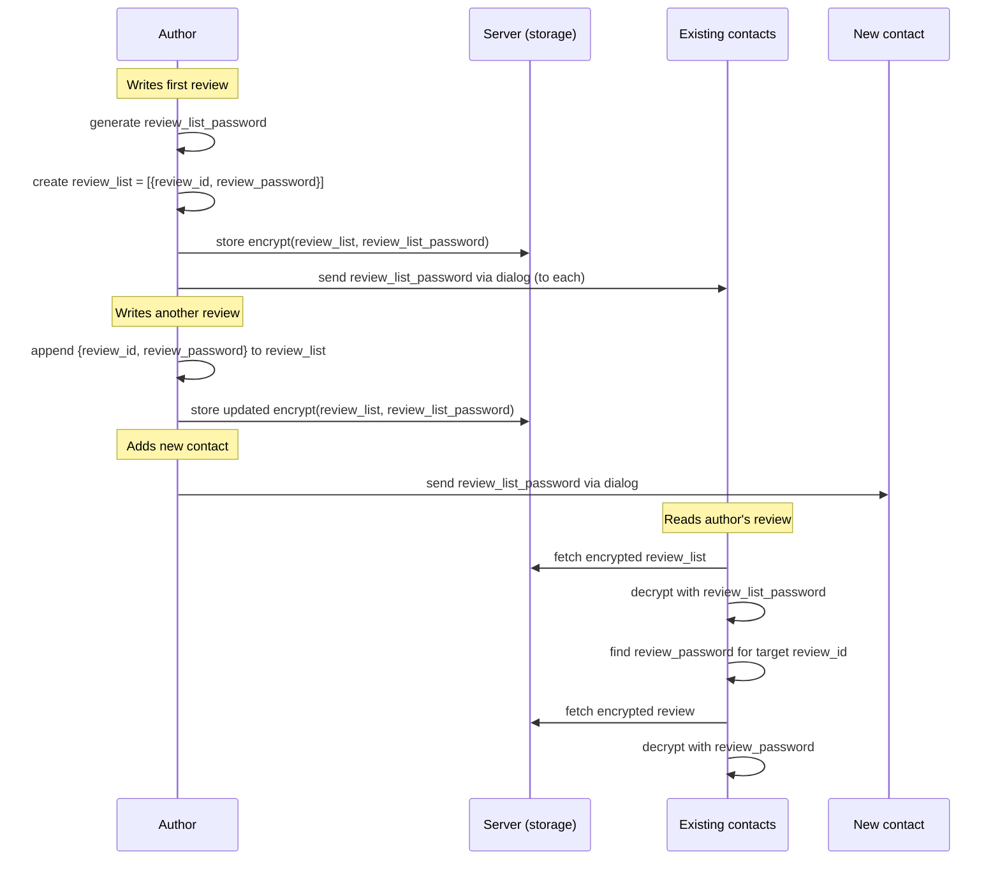
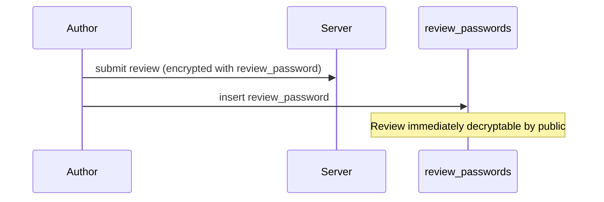
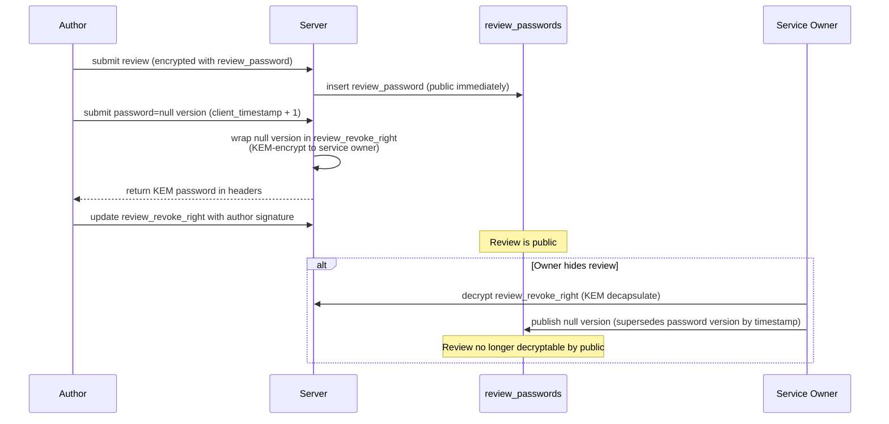
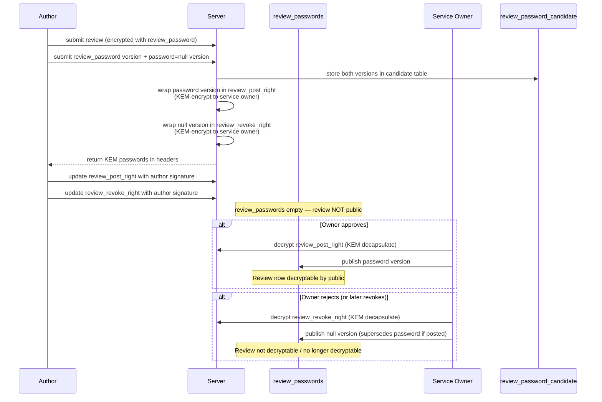

# Service Reviews Proposal

## Goal

Add a review system for service entities (businesses, venues, etc.) with post-quantum cryptographic guarantees matching the rest of the platform.

A user should be able to:

- discover services (coffee shops, venues, etc.)
- write a review with chosen visibility: to_public or to_service
- comment on any review they can see
- trust that visibility guarantees are cryptographic, not server-enforced

A service owner should be able to:

- register a service with its own PQ identity
- choose a moderation mode for public reviews (pre, post, or none)
- moderate public reviews (approve, reject, hide)
- receive private feedback (to_service reviews)

## Assumptions / Open questions

- 

## Three entities

```
Service (the coffee shop)
│  subaccount identity (user_cards row), owned by a user
│
└── Review (by any user)
    ├── to_public   — encrypted with review_password, signed by author
    │                 public when password in review_passwords table
    │                 contacts see via review_list_password (bypasses moderation)
    ├── to_service  — dialog between author and service identity (see pq_dialogs)
    │
    └── Comment (by anyone who can see the parent review)
        └── inherits parent review's visibility envelope
```

## Service

A service is modeled as a **subaccount** — it gets its own `user_cards` row with a separate PQ identity. 

A service has:

- its own `user_cards` row (ML-DSA-87 signing keypair, ML-KEM-1024 encryption keypair)
- an owner (the user who created it)
- a moderation policy for public reviews
- public metadata (name, description — signed by service identity)

The service identity is separate from the owner's personal identity. One user can own multiple services. Because it is a `user_cards` entry, the existing dialog infrastructure (see `pq_dialogs.md`) works directly for `to_service` communication.

Two levels of control:

- **Owner** (the creating user) — performs dangerous/irreversible operations: create service, delete, transfer ownership, change moderation mode. Owner identity is never exposed to the public.
- **Service identity** — handles day-to-day operations: receive `to_service` reviews, moderate public reviews. Can be delegated to an employee without exposing the owner's personal identity or granting irreversible powers.

### Why not a room

Rooms are conversation spaces. Services are entities people review. They share crypto infrastructure but have different semantics:

- rooms have members who chat; services have reviewers who evaluate
- room membership is about participation; service visibility is about trust tiers
- rooms don't need moderation workflows; services do
- the review/comment hierarchy doesn't map to room message threading

Keeping them separate avoids overloading the room model and allows independent evolution.


## Contacts

Each user has a review list (review_id, review_password) that is encrypted with review_list_password.
On review_list creation (first review) review_list_password is sent to all the contacts.
On adding a new contact review_list_password is sent to new contact.

This way contacts are able to read review of their contacts (bypassing moderation).



## Modertion

Public visibility of a review is controlled server-side via the `review_passwords` table — not by the author. The service sets a moderation level that determines how review passwords flow into this table:

- **none** — author publishes password directly; review is immediately public
- **post-moderation** — server publishes password on submission; service owner receives a revoke right
- **pre-moderation** — server withholds password; service owner receives both post and revoke rights

The public frontend checks whether a decryption password exists in `review_passwords` for a given review. The author cannot bypass moderation because the server controls the table, not the author. The author can only submit the password — the server decides whether and when to make it available.


Review is created by author. Encrypted with a password.

review_passwords table will hold the password to public.

if service moderation level is none. Author is able to send password into a table
if service moderation level is post-moderation. Author is able to send a password with passord=null version (client_timestamp+1, which would be sent by server to the service review_revoke_right). And server posts password into review_passwords table.
if service moderation level is pre-moderation. Author sends password and password=null versions. Server do not populate review_passwords. Server envelopes both versioninto review_post_right and review_revoke_right

review_post_right and review_revoke_right should have
- review_id
- service_id
- envelope version
- KEM password
- server sign ? -> review_author sign

inserts raw version, server wraps in envelope with KEM password and stores in table (without a sign) returns KEMpassword for user in headers, user updates _right table with a sign

internal table review_password_candidate to hold user intention and check timestamps.

### No moderation flow



### Post-moderation flow



### Pre-moderation flow



## Review visibility tiers
 
### to_public

Content encrypted with a per-review `review_password` and signed by the author (ML-DSA-87 over plaintext before encryption). Public visibility is determined by whether `review_password` is available in the `review_passwords` table — see the Moderation section.

Moderation controls only **public** visibility. Even when a review is hidden or not yet approved, the author's contacts can still see it via `review_list_password` (see Contacts section). The contacts channel is the author's property and cannot be affected by the service owner's moderation decisions.

This means:
- **Password published**: visible to everyone (public + contacts)
- **Password withheld / revoked**: invisible to the general public, still visible to author's contacts
- The author's signature covers plaintext, verifiable after decryption

### to_service

Because the service is a subaccount with its own `user_cards` identity, `to_service` is simply a **dialog** between the review author and the service identity — using the standard `pq_dialogs` infrastructure.

The author and service identity each derive a `sender_msg_key` per the dialog key derivation spec. Messages (reviews, comments, follow-ups) are encrypted exactly like dialog messages: AES-256-GCM under the sender's `sender_msg_key`, with the key wrapped for the peer via ML-KEM-1024.

This means:
- No new crypto machinery needed — reuses dialog encryption, key wrapping, and versioning
- The service owner reads `to_service` reviews by decapsulating with the service identity's `kem_skey`
- Multi-device works: any owner device re-derives the service's keys from the owner's private material
- Not subject to moderation (private feedback between author and service)

## Comments

Comments inherit the parent review's visibility envelope.
Comments likely become a room (own room type)

### On a public review

Encrypted with the parent review's `review_password` + ML-DSA-87 signed by commenter. Readable by anyone who can decrypt the review.

### On a to_service review

Comments on `to_service` reviews are dialog messages in the author↔service dialog. They use the standard `pq_dialogs` infrastructure — no separate comment schema needed for this case.

## Data model

### service

The service identity lives in `user_cards` (its own `user_hash`, `sign_pkey`, `crypt_pkey`). The `service` table holds service-specific metadata that doesn't belong in `user_cards`.

```
service
├── service_hash          — the service's user_hash (from its user_cards row)
├── owner_hash            — user_hash of the owner
├── name_b64              — service name (signed by service identity)
├── moderation_mode       — :pre / :post / :none
├── sign_b64              — service identity's ML-DSA-87 signature over all fields
└── owner_timestamp       — causal ordering
```

Note: `sign_pkey` and `crypt_pkey` are on the service's `user_cards` row, not duplicated here.

### review

Only `to_public` reviews live in this table. `to_service` reviews are standard dialog messages (see `pq_dialogs`) between the author and the service identity — no separate schema needed.

```
review
├── review_hash           — SHA3-512 of content
├── service_hash          — which service (service's user_hash)
├── author_hash           — who wrote it
├── content_b64           — encrypted with review_password
├── sign_b64              — author's ML-DSA-87 signature (over plaintext)
├── owner_timestamp
└── parent_sign_hash      — for edits (version chain)
```

Public visibility is controlled by the `review_passwords` table, not by fields on the review row — see the Moderation section. Author's contacts see the review via `review_list_password` regardless of moderation state.

Supporting tables (from Moderation section):

- `review_passwords` — holds `review_password` when review is public
- `review_password_candidate` — author's submitted password versions during moderation
- `review_post_right` — KEM-encrypted approval right for service owner (pre-moderation)
- `review_revoke_right` — KEM-encrypted revocation right for service owner (post/pre-moderation)

### comment

```
comment
├── comment_hash          — SHA3-512 of content
├── review_hash           — which review
├── author_hash           — who commented
├── content_b64           — encrypted with same key as parent review
├── sign_b64              — commenter's ML-DSA-87 signature
├── owner_timestamp
└── parent_comment_hash   — for threading (nil for top-level comments)
```

## Electric shapes

### service shape

Synced to everyone — public directory of services.

Access control: only the service identity (authenticated via its `sign_pkey` from `user_cards`) can write or update.

### review shape

Synced by `service_hash` — client requests reviews for a specific service. Client decrypts what it can based on visibility and available keys.

Access control: author authenticated via `sign_pkey`. Owner can write moderation fields (`moderation_status`, `moderation_sign_b64`, `published_content_b64`).

### comment shape

Synced by `review_hash` — client requests comments for a specific review.

Access control: commenter authenticated via `sign_pkey`. For to_service reviews, only the review author and service owner can comment.

## Signature coverage

### Service

Service identity signs: `service_hash || owner_hash || name_b64 || moderation_mode || owner_timestamp`

(The service's `sign_pkey` and `crypt_pkey` live on its `user_cards` row, signed there.)

### Review

Author signs: `review_hash || service_hash || author_hash || content_plaintext || owner_timestamp`

The signature covers plaintext content, not the encrypted blob. This allows:

- public reviews: after decrypting with `review_password`, anyone can verify authorship
- contacts: after decrypting via `review_list_password`, contacts verify authorship
- to_service: service owner decrypts via dialog, then verifies

### Moderation action

Service identity signs: `review_hash || moderation_status || owner_timestamp`

### Comment

Commenter signs: `comment_hash || review_hash || author_hash || content_plaintext || owner_timestamp`

## Security properties

### Non-repudiation

All reviews and comments are ML-DSA-87 signed. Authors cannot deny having written a review. Owners cannot deny having approved or hidden one.

### Visibility guarantees

- **to_service**: fully cryptographic — server stores ciphertext and cannot read content
- **to_public**: content is encrypted; the server controls public visibility via the `review_passwords` table (whether the decryption password is available), but cannot read the content itself
- **contacts**: cryptographic — contacts access `review_password` via the author's encrypted `review_list`, independent of server-controlled `review_passwords`

### Moderation transparency

Moderation rights (`review_post_right`, `review_revoke_right`) carry the author's ML-DSA-87 signature, creating an auditable trail. The `review_passwords` table provides a public record of publication and revocation.

### Forward secrecy

Same as the rest of the system: none. Key compromise enables retroactive decryption. This is a known trade-off for deterministic multi-device sync.

## Open questions

### 1. Service discovery

How are services discovered? Options:

- global directory (all services listed, like public rooms)
- location-based discovery (requires geolocation metadata on services)
- search/category browsing
- shared via links

### 2. Service metadata

What metadata should a service carry beyond name? Address, hours, category, images — these are product decisions that don't affect the crypto architecture but need schema space.

### 3. Rating system

Should reviews include a structured rating (1-5 stars, thumbs up/down) separate from free-text content? If so, is the rating always public (aggregatable) or follows the review's visibility?

### 4. Comment threading

Flat comments (all top-level) or threaded (via `parent_comment_hash`)? Flat is simpler. Threading adds depth but complexity.

### 5. Review editing

The `parent_sign_hash` field supports edit chains (like dialog messages). Should edits be:

- visible as a chain (all versions readable)
- latest-only (old versions hidden but cryptographically preserved)
- disallowed (reviews are immutable once posted)

### 6. SaaS model

How does the SaaS aspect work? Possible angles:

- service creation requires a subscription
- moderation features are premium
- analytics/aggregation is the paid tier
- the review infrastructure itself is the product

## Future: to_contacts visibility

`to_public` reviews are already visible to author's contacts regardless of moderation status. A standalone `to_contacts` tier (reviews visible only to contacts, never submitted for public moderation) is a future extension.

Crypto approach: author generates a symmetric `contacts_key`, wraps it for each dialog partner using existing dialog `sender_msg_key`. All contacts-only reviews use this key. Key rotates when contacts change.

This is a separate concern involving the broader contacts/trust model and will be designed independently.

## Implementation phases

### Phase 1 — Service entity

- `service` Ecto schema and migration
- `service` Electric shape with owner access control
- service creation UI (name, moderation mode)
- service directory / listing

### Phase 2 — Public reviews and comments

- `review` Ecto schema and migration
- `review` Electric shape
- public review submission and display
- ML-DSA-87 signing and verification
- `comment` schema and shape
- comment submission and display

### Phase 3 — To-service reviews and moderation

- to_service as dialog: service subaccount identity + dialog key derivation
- pre-moderation flow (submit, approve/reject, publish)
- post-moderation flow (hide/unhide)
- moderation UI for service owners
- contacts-visible hidden reviews (author's contacts see moderation-hidden reviews)

### Phase 4 — Contacts visibility (future)

- contacts key infrastructure
- contacts-only review encryption/decryption
- depends on broader contacts/trust model design
