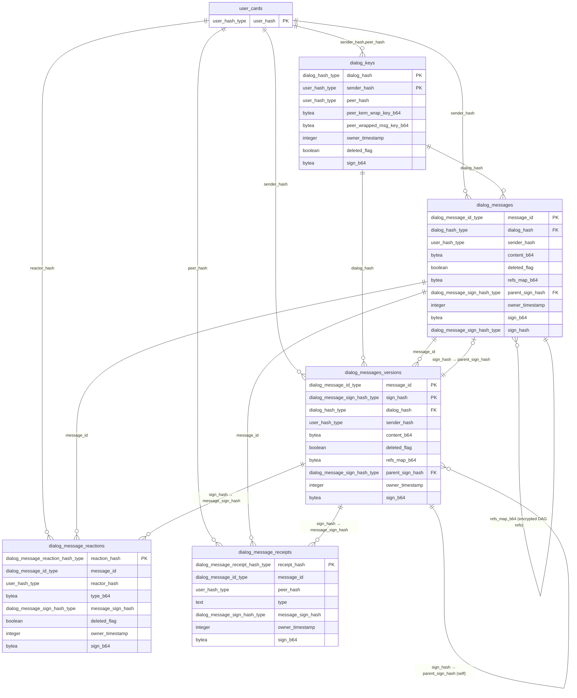
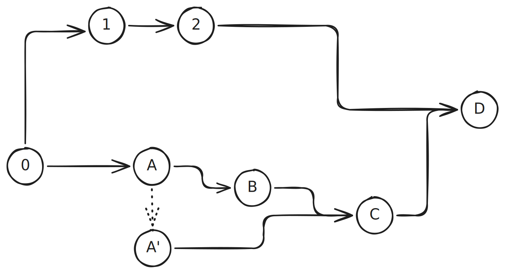

# Post-Quantum Dialog

A dialog is a two-party conversation between users identified by `user_hash` (see `pq_user.md`). Each side independently authors messages encrypted under a per-author message key. The key is derived deterministically from the author's private material plus the peer's identity, so any of the author's devices can re-derive it without a device registry and without re-running a handshake.

## Goals

- **Symmetric read access** — the author and the peer can both read every message.
- **Either side can initiate** — both sides may independently create their half of the dialog on different devices; state converges to the same `dialog_hash`.
- **Multi-device by derivation, not tracking** — any device holding the author's secret keys re-derives the same `sender_msg_key`. No `user_devices` table, no re-wrap gossip.

## Accepted trade-off

Deterministic derivation means **no forward secrecy at the dialog level**. If any of an author's long-term private keys (`sign_skey`, `kem_skey`, `contact_skey`) leak, every dialog that user authored becomes decryptable retroactively. Rotating these keys means rotating identity.

---

## Schema at a glance

All five dialog tables are self-authenticating via the integrity triad (`sign_b64`, `owner_timestamp`, `deleted_flag`) defined in [02_integrity.md](../electric/pq_data_layer/02_integrity.md), with one exception: `dialog_message_receipts` omits `deleted_flag` because delivery and read events are irreversible. `user_cards` is shown because every verification path starts there — fetch the author's `sign_pkey` / `crypt_pkey` from `user_cards`, then check the dialog row's signature. No database-level foreign keys to `user_cards` exist (PQ rows are self-verifying), but the logical dependency is real.



Key relationships in words:

- `dialog_keys` has a composite PK `(dialog_hash, sender_hash)`. In the steady state there are two rows per `dialog_hash` — one per direction.
- `dialog_messages.parent_sign_hash` → `dialog_messages_versions.sign_hash` (nullable; NULL for the first version of a message).
- `dialog_messages_versions.parent_sign_hash` → `dialog_messages_versions.sign_hash` (self-referential; append-only chain).
- `dialog_messages.refs_map_b64` — encrypted map of `{message_id: sign_hash}` capturing the DAG tail set the sender observed at authoring time (see §References). Opaque to the server; the causal graph is a frontend concern. Orthogonal to `parent_sign_hash` (edit chain by the same author).
- `dialog_message_reactions.message_sign_hash` **logically** targets a specific version in `dialog_messages` *or* `dialog_messages_versions` — there is no database FK, because the referenced row can live in either table, and reactions may arrive before the message.
- `dialog_message_receipts.message_sign_hash` — same logical targeting as reactions; no database FK for the same reasons.

---

## Identifiers

### `dialog_hash`

```
sorted       = sort([user_a_hash, user_b_hash])     # lexicographic on user_hash strings
dialog_hash  = "di_" + hex(SHA3-512(sorted[0] || sorted[1]))
```

- `user_a_hash` = `min(sender_hash, peer_hash)`
- `user_b_hash` = `max(sender_hash, peer_hash)`

Same on both sides ⇒ independent initiation converges.

PostgreSQL domain:

```sql
CREATE DOMAIN dialog_hash_type AS TEXT
  CHECK (VALUE ~ '^di_[a-f0-9]{128}$');
```

---

## Key derivation

Each author derives one `sender_msg_key` per peer. It is the symmetric key for every message that author writes in that dialog. Derivation uses HKDF (RFC 5869) with HMAC-SHA3-256 as the underlying PRF — see [09_symmetric_keys.md](../electric/pq_data_layer/09_symmetric_keys.md) for the full rationale and reference implementation.

```
IKM  = sign_skey || kem_skey || contact_skey || peer_user_hash
salt = "buckitup/dialog-mk/v1"

PRK            = HMAC-SHA3-256(key = salt, data = IKM)                    # Extract
sender_msg_key = HMAC-SHA3-256(key = PRK,  data = "dialog-mk" || 0x01)   # Expand
```

Output: 256-bit key used for all AES-256-GCM encryption and HMAC-SHA3-512 MAC operations in this dialog direction.

Rationale:

- **Formal KDF** — HKDF has a security proof in the standard model (Krawczyk, 2010). Raw `SHA3(secrets)` does not.
- **Explicit output length** — `L=32` means exactly 256 bits. No ambiguous truncation of a 512-bit hash.
- **Hybrid posture** (per `HYBRID.md`): `kem_skey` is ML-KEM-1024, `contact_skey` is secp256k1. A break in either family alone does not compromise the secret.
- **`sign_skey` is folded in** to bind derivation to the full identity. `sign_skey` never leaves the frontend, same as the other skeys.
- **Domain separation salt** `"buckitup/dialog-mk/v1"` prevents collisions with future derivations (rooms, groups, subchannels).
- **Peer binding by `peer_user_hash`** — itself `SHA3-512(peer_sign_pkey)`, so transitively bound to peer's signing identity.

Symmetric encryption uses AES-256-GCM with `sender_msg_key`; per-message nonce is fresh random 12 bytes prepended to the ciphertext in the single `content_b64` blob.

### Reaction encryption

Emoji reactions use `sender_msg_key` directly — no subkey derivation. Receipts (`delivered` / `read`) are split into a separate unencrypted table (`dialog_message_receipts`), so the encrypted reaction table only handles user-initiated emoji with a richer plaintext space.

`reaction_hash` is a **keyed MAC** under `sender_msg_key`. Because only participants know the key, an observer cannot brute-force `type_plaintext` by recomputing hashes over a small enumerable set. `type_b64` is encrypted under the same `sender_msg_key` with a fresh random 12-byte AES-GCM nonce.

```
REACTION ENCRYPTION & HASHING
─────────────────────────────────────────────────────────────
  inputs:  sender_msg_key        (derived, see §Key derivation)
           message_id            (reacted message)
           reactor_hash          (who reacts)
           type_plaintext        (emoji)

          ┌────────────────────────┐
          │                        │
          ▼                        ▼
  ┌───────────────────────┐ ┌───────────────────────────────┐
  │  step 1a — HMAC hash  │ │  step 1b — encrypt type       │
  │  (PK / uniqueness)    │ │  (confidentiality)             │
  │                       │ │                               │
  │  reaction_hash =      │ │  nonce = random 12 bytes      │
  │    "dmr_" + hex(      │ │                               │
  │      HMAC-SHA3-512(   │ │  type_b64 =                   │
  │        key  = sender  │ │    nonce ‖ AES-256-GCM(       │
  │               _msg_key│ │      key       = sender       │
  │        data =         │ │                  _msg_key,    │
  │          message_id   │ │      plaintext = type         │
  │       ‖ reactor_hash  │ │                  _plaintext   │
  │       ‖ type_plaintext│ │    )                          │
  │      )                │ │                               │
  │    )                  │ │  (only participants can       │
  │                       │ │   decrypt — key required)     │
  │  keyed MAC ⇒ observer │ │                               │
  │  cannot brute-force   │ │                               │
  │  the emoji space      │ │                               │
  └───────────┬───────────┘ └──────────────┬────────────────┘
              │                            │
              ▼                            ▼
        ┌──────────────────────────────────────────────┐
        │  publish: one row in `dialog_message_reactions`│
        │     reaction_hash       (PK)                 │
        │     type_b64            (encrypted)          │
        │     message_sign_hash   (version ref)        │
        │     (+ identity & signature fields)          │
        └──────────────────────────────────────────────┘


PEER (verify & decrypt reaction)
─────────────────────────────────────────────────────────────
  inputs:  sender_msg_key of the reactor  (unwrapped or re-derived)
           dialog_message_reactions row

          ┌────────────────────────┐
          │                        │
          ▼                        ▼
  ┌───────────────────────┐ ┌───────────────────────────────┐
  │  step 1a — decrypt    │ │  step 1b — verify hash        │
  │                       │ │  (optional)                    │
  │  split type_b64 into  │ │                               │
  │    nonce (12 bytes)   │ │  recompute HMAC-SHA3-512 with │
  │    ciphertext (rest)  │ │  recovered type_plaintext     │
  │                       │ │                               │
  │  type_plaintext =     │ │  compare against reaction_hash│
  │    AES-256-GCM.decrypt│ │  from the row                 │
  │      (sender_msg_key, │ │                               │
  │       nonce,          │ │  mismatch ⇒ reject            │
  │       ciphertext)     │ │                               │
  └───────────────────────┘ └───────────────────────────────┘
```

Compact form:

```
hash:     reaction_hash      = "dmr_" + hex(HMAC-SHA3-512(sender_msg_key,
                                 message_id || reactor_hash || type_plaintext))

encrypt:  type_b64           = nonce || AES-256-GCM.encrypt(sender_msg_key, type_plaintext)
                               nonce = fresh random 12 bytes

decrypt:  type_plaintext     = AES-256-GCM.decrypt(sender_msg_key, nonce, ciphertext)
verify:   recompute reaction_hash from decrypted type_plaintext, compare with row PK
```

---

## Key wrapping

Both the author and the peer need to read messages. `sender_msg_key` is wrapped for the peer and published in `dialog_keys`:

- **Peer-wrap** — KEM-encapsulated to the peer's `crypt_pkey`. Lets the peer read.
- **Author reads own messages** by re-deriving `sender_msg_key` deterministically from private keys (no self-wrap column needed).

```
SENDER (wrap, once per dialog)
─────────────────────────────────────────────────────────────
  inputs:  sender_msg_key        (derived, see §Key derivation)
           peer.crypt_pkey       (from peer's user_cards row)

  ┌─────────────────────────────────────────────────────────┐
  │  step 1 — KEM encapsulation                             │
  │     ML-KEM-1024.Encap(peer.crypt_pkey)                  │
  │            │                                            │
  │            └──►  ( peer_kem_wrap_key , shared_secret )  │
  │                    KEM ciphertext     32-byte SS        │
  └────────────────────┬──────────────────────────┬─────────┘
                       │                          │
                       │           ┌──────────────┘
                       │           ▼
                       │   ┌─────────────────────────────────┐
                       │   │  step 2 — KDF                   │
                       │   │     wrap_key = HKDF-SHA3-256(   │
                       │   │        IKM  = shared_secret,    │
                       │   │        salt = "buckitup/dialog  │
                       │   │               -wrap/v1",        │
                       │   │        info = "wrap",           │
                       │   │        L    = 32)               │
                       │   └────────────────────┬────────────┘
                       │                        │
                       │           ┌────────────┘
                       │           ▼
                       │   ┌─────────────────────────────────┐
                       │   │  step 3 — wrap                  │
                       │   │     AES-256-GCM.encrypt(        │
                       │   │        key       = wrap_key,    │
                       │   │        plaintext = sender_msg_key) │
                       │   │            │                    │
                       │   │            └──► peer_wrapped_msg_key │
                       │   └────────────────────┬────────────┘
                       │                        │
                       ▼                        ▼
                 ┌────────────────────────────────────────┐
                 │  publish: one row in `dialog_keys`     │
                 │     peer_kem_wrap_key_b64              │
                 │     peer_wrapped_msg_key_b64           │
                 │     (+ identity & signature fields)    │
                 └────────────────────────────────────────┘


PEER (unwrap, on first read)
─────────────────────────────────────────────────────────────
  inputs:  peer_kem_wrap_key      (from dialog_keys)
           peer_wrapped_msg_key   (from dialog_keys)
           own.crypt_skey         (peer's private KEM key, never leaves device)

  ┌─────────────────────────────────────────────────────────┐
  │  step 1 — KEM decapsulation                             │
  │     ML-KEM-1024.Decap(own.crypt_skey, peer_kem_wrap_key)│
  │            │                                            │
  │            └──►  shared_secret    (same 32-byte SS)     │
  └────────────────────┬────────────────────────────────────┘
                       │
                       ▼
  ┌─────────────────────────────────────────────────────────┐
  │  step 2 — KDF                                           │
  │     wrap_key = HKDF-SHA3-256(                           │
  │        IKM  = shared_secret,                            │
  │        salt = "buckitup/dialog-wrap/v1",                │
  │        info = "wrap",                                   │
  │        L    = 32)                                       │
  │            │                                            │
  │            └──►  wrap_key       (same key sender used)  │
  └────────────────────┬────────────────────────────────────┘
                       │
                       ▼
  ┌─────────────────────────────────────────────────────────┐
  │  step 3 — unwrap                                        │
  │     AES-256-GCM.decrypt(                                │
  │        key        = wrap_key,                           │
  │        ciphertext = peer_wrapped_msg_key)               │
  │            │                                            │
  │            └──►  sender_msg_key                         │
  │                  (now usable for every message authored │
  │                   by sender in this dialog)             │
  └─────────────────────────────────────────────────────────┘
```

Compact form:

```
wrap:    (peer_kem_wrap_key, shared_secret) = ML-KEM-1024.Encap(peer.crypt_pkey)
         wrap_key                           = HKDF-SHA3-256(shared_secret,
                                                salt = "buckitup/dialog-wrap/v1",
                                                info = "wrap", L = 32)
         peer_wrapped_msg_key               = AES-256-GCM.encrypt(wrap_key, sender_msg_key)
         publish (peer_kem_wrap_key_b64, peer_wrapped_msg_key_b64)

unwrap:  shared_secret  = ML-KEM-1024.Decap(own.crypt_skey, peer_kem_wrap_key)
         wrap_key       = HKDF-SHA3-256(shared_secret,
                              salt = "buckitup/dialog-wrap/v1",
                              info = "wrap", L = 32)
         sender_msg_key = AES-256-GCM.decrypt(wrap_key, peer_wrapped_msg_key)
```

Note that `sender_msg_key` is **never** an input to Encap — Encap operates only on the peer's KEM public key. The KEM produces an ephemeral shared secret; that secret is run through HKDF to derive `wrap_key`, which actually encrypts `sender_msg_key`.

### AES / construction limitations

The wrap is hand-rolled rather than a standardized AEAD-with-KEM construction (HPKE, KEM-DEM). Known trade-offs to acknowledge explicitly:

- **AES-GCM nonce is catastrophic under key reuse.** GCM loses both confidentiality *and* authenticity if a `(key, nonce)` pair is ever reused. Two separate risks apply here:
  - **Wrap step (`peer_wrapped_msg_key`).** `wrap_key` is derived from an ephemeral shared secret — one fresh value per Encap call — so a fixed nonce (e.g., all-zero 12 bytes) is safe for the single wrap operation under it. A second encryption under the same `wrap_key`, even with a different nonce, is out of scope by construction and MUST NOT be introduced later.
  - **Content step (`content_b64`).** `sender_msg_key` is deterministic across every device the author holds and across the lifetime of the dialog. Nonces MUST be fresh-random 96-bit values; counter-based nonces are forbidden because two offline devices would collide. The birthday bound gives ≈2⁻³² collision probability after ≈2⁴⁰ messages authored by one user in one dialog — well above realistic traffic, but documented so that any future "compress the nonce" optimization is rejected.
- **No KEM-DEM authentication tag over the ciphertext pair.** `peer_kem_wrap_key_b64` and `peer_wrapped_msg_key_b64` are bound together only by the row's `sign_b64`. An attacker who could strip the signature would be able to substitute either ciphertext independently; the signature is load-bearing for ciphertext integrity, not just authorship.

Trade-off accepted: simplicity and auditability of the composition vs. the stronger guarantees of HPKE. See `HYBRID.md` for the broader hybrid-PQ rationale.

---

## References (`refs_map_b64`)



Each message carries an encrypted snapshot of the dialog's DAG state at the moment the sender authored it. This replaces a single-predecessor pointer with a full frontier, giving the ordering layer a true DAG rather than a linear chain.

### What it is

`refs_map_b64` is an AES-256-GCM-encrypted JSON map of `{message_id: sign_hash}` pairs — every **tail** (DAG leaf) the sender observed at send time. A tail is a `(message_id, sign_hash)` pair that does not appear in the `refs_map` of any other message the sender has loaded. Only leaves, not their transitive predecessors. Each entry pins both the message identity and the exact version the sender saw — an edit produces a new `sign_hash` and therefore a new tail even if an older version of the same message is already referenced.

### Encryption

Same scheme as `content_b64`: 12-byte fresh-random AES-GCM nonce prepended to ciphertext, encrypted under `sender_msg_key`. The signature (`sign_b64`) covers the ciphertext blob, not the plaintext — the server sees opaque bytes and cannot inspect or validate causal references. All causal validation is a frontend responsibility.

### Tail calculation

Tails are computed from the messages the user has loaded into the viewport. The unit of tracking is a `(message_id, sign_hash)` pair — a specific version of a specific message. The algorithm:

1. Collect all messages the sender has loaded for this `dialog_hash`.
2. For each loaded message, decrypt its `refs_map_b64` to obtain the set of `(message_id, sign_hash)` pairs it references.
3. Build the set of all referenced pairs across every loaded message's refs_map.
4. For each loaded message, take its current `(message_id, sign_hash)` from the tip row. If that exact pair does **not** appear in the referenced set from step 3, it is a **tail**.

The resulting `{message_id: sign_hash}` map of all tails is the `refs_map` plaintext.

Because matching is on the full pair, an edit (which produces a new `sign_hash`) turns the edited message into a new tail — the old `(message_id, old_sign_hash)` may be referenced elsewhere, but the new `(message_id, new_sign_hash)` is not. This is intentional: the sender's refs_map records exactly which versions they observed.

### Special cases

- **Genesis message** — the first message in a dialog. `refs_map` plaintext is an empty map `{}`. Encrypted as usual (the ciphertext is non-empty even though the plaintext is `{}`).
- **Linear conversation** — when both parties take strict turns, refs_map typically contains a single entry: the last message from the other party.
- **Concurrent sends (fork)** — both parties send without seeing each other's message. Each message's refs_map points to the same predecessor. The next message from either party that has loaded both fork tips will carry both in its refs_map, merging the fork.
- **Offline burst** — one party sends 50 messages while the other is offline. When the offline party reconnects and loads all 50, only the latest (the single tail) appears in their next refs_map — transitive reduction keeps the map small.

### Behavior on edit

`refs_map_b64` is **not** immutable across edits. When a message is edited, the new tip's `refs_map_b64` is recomputed from the sender's current viewport tails, which may have changed since the original authoring. The original `refs_map_b64` is preserved verbatim in the `dialog_messages_versions` row for the superseded version. This means the edit chain records the causal context as it actually was at each point in time.

### Privacy properties

Because `refs_map_b64` is encrypted under `sender_msg_key`:

- The server cannot see which messages a given message references — the dialog's causal graph is hidden.
- An observer with database access sees only ciphertext; they cannot reconstruct conversation flow, detect forks, or infer who replied to whom.
- Only the two dialog participants (who hold or can derive `sender_msg_key`) can decrypt and validate the causal structure.

---

## Tables

There is no `dialogs` table. Participation is derived from `dialog_keys` via `sender_hash = me OR peer_hash = me`, which is also the sync filter. Dialog existence is advisory; trust is in the signed rows below.

### 1. `dialog_keys`

Wrapped `sender_msg_key` published by one author for one dialog. Two rows per dialog in the common case (one per direction). An author republishes the same row idempotently from any of their devices (deterministic `sender_msg_key` ⇒ same plaintext, different KEM randomness ⇒ compatible).

| Column                     | Type               | Notes                                                                                           |
| -------------------------- | ------------------ | ----------------------------------------------------------------------------------------------- |
| `dialog_hash`              | `dialog_hash_type` | PK part                                                                                         |
| `sender_hash`              | `user_hash_type`   | PK part; author of this `sender_msg_key`                                                        |
| `peer_hash`                | `user_hash_type`   | the other participant; enables sync filter and inbox listing without a separate `dialogs` table |
| `peer_kem_wrap_key_b64`    | `bytea`            | ML-KEM ciphertext to peer's `crypt_pkey`                                                        |
| `peer_wrapped_msg_key_b64` | `bytea`            | AES-GCM(sender_msg_key) with wrap_key = HKDF-SHA3-256(KEM shared secret)                        |
| `owner_timestamp`          | `integer`          | Monotonic counter; must increase on updates; prevents replay attacks                            |
| `deleted_flag`             | `boolean`          | Soft delete marker; `true` indicates deleted                                                    |
| `sign_b64`                 | `bytea`            | ML-DSA-87 signature by `sender_hash` over canonical serialization of all preceding columns      |

PK: `(dialog_hash, sender_hash)`.

Self-authenticating per [02_integrity.md](../electric/pq_data_layer/02_integrity.md), same bootstrap as `user_cards`: fetch `user_cards` for `sender_hash`, verify its self-signature, then verify this row's `sign_b64` under that `sign_pkey`. A row with invalid `sign_b64` is rejected on ingest and re-verified on peer-sync receive. Because `dialog_hash`, `peer_hash`, and both KEM ciphertexts are all covered by the signature, no field can be rewritten, retargeted to a different peer, or lifted into a different dialog without detection.

Flooding: an attacker can still publish a row naming an uninvolved `peer_hash` (PoP proves submitter identity, not peer consent). Clients mitigate by hiding a dialog until the local user has either authored a message in it or the peer has published their own `dialog_keys` row for the same `dialog_hash`.

### 2. `dialog_messages`

Current tip of each message's version chain. Each message is identified by `message_id = "dmsg_" + UUID v7` — globally unique and time-ordered within a dialog. Messages follow the integrity triad in [02_integrity.md](../electric/pq_data_layer/02_integrity.md) (`sign_b64`, `owner_timestamp`, `deleted_flag`) and the hash-linked versioning model in [03_data_versioning.md](../electric/pq_data_layer/03_data_versioning.md), mirroring `user_storage` / `user_storage_versions` (see `Chat.Data.Schemas.UserStorage`).

Content is a single opaque blob: the first 12 bytes are the per-message AES-GCM nonce, the remainder is AES-256-GCM ciphertext under `sender_msg_key`. Plaintext shape — bare-string text vs. `{"<type>": <value>}` envelopes for media, plus inline-vs-out-of-band rules — lives in [07_content_polymorphism.md](../electric/pq_data_layer/07_content_polymorphism.md). Keeping the type *inside* the ciphertext means the database never reveals whether a message is text, image, or attachment.

`refs_map_b64` carries the **causal context** a message was authored against — a map of every DAG tail the sender observed at send time, encrypted under `sender_msg_key` (see §References). Required because Electric sync offers no delivery-order guarantee and `parent_sign_hash` only chains revisions *by the same author*. The map is opaque to the server; causal validation is a frontend responsibility.

| Column             | Type                            | Notes                                                                                                       |
| ------------------ | ------------------------------- | ----------------------------------------------------------------------------------------------------------- |
| `message_id`       | `dialog_message_id_type`        | PK; `dmsg_<UUID7>`                                                                                          |
| `dialog_hash`      | `dialog_hash_type`              | dialog this message belongs to                                                                              |
| `sender_hash`      | `user_hash_type`                | author                                                                                                      |
| `content_b64`          | `bytea`                         | 12-byte AES-GCM nonce ‖ AES-256-GCM ciphertext of the JSON payload — see [07_content_polymorphism.md](../electric/pq_data_layer/07_content_polymorphism.md). Empty when `deleted_flag = true` |
| `deleted_flag`     | `boolean`                       | Signed tombstone marker; retractions are a new tip with empty `content_b64` and `deleted_flag: true`        |
| `refs_map_b64`     | `bytea`                         | Encrypted causal-context map — see §References. 12-byte AES-GCM nonce ‖ AES-256-GCM ciphertext under `sender_msg_key`. Plaintext is a JSON map `{message_id: sign_hash}` of all DAG tails the sender observed. Empty map `{}` for the genesis message. Updated on edit (may reference new tails observed since original authoring). |
| `parent_sign_hash` | `dialog_message_sign_hash_type` | FK → `dialog_messages_versions.sign_hash`; NULL for the first version                                       |
| `owner_timestamp`  | `integer`                       | Monotonic per `message_id`; strictly increases on edit; prevents replay                                     |
| `sign_b64`         | `bytea`                         | ML-DSA-87 signature by `sender_hash` over the signable fields (everything except `sign_b64` / `sign_hash`)  |
| `sign_hash`        | `dialog_message_sign_hash_type` | `dms_` + hex(SHA3-512(`sign_b64`)) — identity of this tip version. Denormalized convenience copy per [03_data_versioning.md](../electric/pq_data_layer/03_data_versioning.md): derivable from `sign_b64`, not itself covered by the signature, nothing FK-references it; kept on the master to avoid recomputing the hash when archiving the outgoing tip and when populating the next edit's `parent_sign_hash`. |

PK: `(message_id)`. UNIQUE: `(dialog_hash, message_id)` — supports dialog-scoped sync filtering and inbox listings without a separate `dialogs` table.

Postgres domains:

```sql
CREATE DOMAIN dialog_message_id_type AS TEXT
  CHECK (VALUE ~ '^dmsg_[0-9a-f]{8}-[0-9a-f]{4}-7[0-9a-f]{3}-[89ab][0-9a-f]{3}-[0-9a-f]{12}$');

CREATE DOMAIN dialog_message_sign_hash_type AS TEXT
  CHECK (VALUE ~ '^dms_[a-f0-9]{128}$');
```

Self-authenticating per [02_integrity.md](../electric/pq_data_layer/02_integrity.md): verify `sign_b64` under `sender_hash`'s `sign_pkey` (from `user_cards`). An incoming update with `owner_timestamp <= existing` is rejected as a replay even if the signature verifies. Deletes are a new signed tip with `deleted_flag: true` and a higher `owner_timestamp` — there is no unsigned server-side delete.

### 2a. `dialog_messages_versions`

Append-only history for `dialog_messages`, mirroring `Chat.Data.Schemas.UserStorageVersion`. On each edit, the superseded tip row is inserted here verbatim (carrying its own `sign_hash`); the new tip's `parent_sign_hash` then points at that row's `sign_hash`. Because `sign_b64` covers `parent_sign_hash`, rewriting any historical version breaks every descendant's signature.

| Column             | Type                            | Notes                                                                                       |
| ------------------ | ------------------------------- | ------------------------------------------------------------------------------------------- |
| `message_id`       | `dialog_message_id_type`        | PK part                                                                                     |
| `sign_hash`        | `dialog_message_sign_hash_type` | PK part; `dms_` + hex(SHA3-512(`sign_b64`)) — identity of this version                      |
| `dialog_hash`      | `dialog_hash_type`              |                                                                                             |
| `sender_hash`      | `user_hash_type`                |                                                                                             |
| `content_b64`          | `bytea`                         | 12-byte AES-GCM nonce ‖ ciphertext (same shape as the tip)                                  |
| `deleted_flag`     | `boolean`                       |                                                                                             |
| `refs_map_b64`     | `bytea`                         | Encrypted causal-context map carried from the tip at the time this version was current       |
| `parent_sign_hash` | `dialog_message_sign_hash_type` | Self-referential FK into `dialog_messages_versions.sign_hash`; NULL for the root version    |
| `owner_timestamp`  | `integer`                       |                                                                                             |
| `sign_b64`         | `bytea`                         | ML-DSA-87 signature by `sender_hash` covering every field except `sign_b64` and `sign_hash` |

PK: `(message_id, sign_hash)`. Append-only — rows are never mutated. A version cannot be inserted unless its `parent_sign_hash` is already known locally (or NULL for the root).

### 3. `dialog_message_reactions`

Encrypted emoji reactions. Each reaction binds to a specific message **version** via `message_sign_hash` — the `sign_hash` (SHA3-512 of `sign_b64`) of the reacted-to version in the message's chain (tip or historical). Reacting to an edited message does not automatically carry over.

The reaction emoji (`type`) is **encrypted** under `sender_msg_key` (see §Key derivation). The stored column is `type_b64 = nonce ‖ AES-256-GCM(sender_msg_key, type_plaintext)` with a fresh random 12-byte nonce per row. Only the author and peer can decrypt; the database sees opaque ciphertext.

`reaction_hash` is a **keyed MAC** under `sender_msg_key`, not a plain hash. Because only participants know the key, an observer cannot brute-force `type_plaintext` by recomputing hashes over the emoji set. Participants still reproduce `reaction_hash` deterministically from their own copy of `sender_msg_key`, so PK-level idempotency and uniqueness continue to work.

| Column              | Type                                | Notes                                                                                               |
| ------------------- | ----------------------------------- | --------------------------------------------------------------------------------------------------- |
| `reaction_hash`     | `dialog_message_reaction_hash_type` | PK; `dmr_` + hex(HMAC-SHA3-512(`sender_msg_key`, `message_id` ‖ `reactor_hash` ‖ `type_plaintext`)) — keyed, so only participants can recompute or verify |
| `message_id`        | `dialog_message_id_type`            | reacted message; `dmsg_<UUID7>`                                                                     |
| `message_sign_hash` | `dialog_message_sign_hash_type`     | `sign_hash` of the reacted version in `dialog_messages(_versions)`                                  |
| `reactor_hash`      | `user_hash_type`                    | who reacted                                                                                         |
| `type_b64`          | `bytea`                             | 12-byte AES-GCM nonce ‖ AES-256-GCM ciphertext of the UTF-8 emoji string, under `sender_msg_key`   |
| `deleted_flag`      | `boolean`                           | Signed un-react marker; toggling a reaction is a new row with `true` and a higher `owner_timestamp` |
| `owner_timestamp`   | `integer`                           | Monotonic per `reaction_hash`; prevents replay                                                      |
| `sign_b64`          | `bytea`                             | ML-DSA-87 signature by `reactor_hash` over all preceding columns (including `type_b64`)             |

PK: `(reaction_hash)`. Uniqueness of "one reaction per `(message, reactor, emoji)`" is enforced by `reaction_hash` alone — the MAC is deterministic given the key, so two signed rows for the same `(message_id, reactor_hash, type_plaintext)` collide on PK regardless of which random AES-GCM nonce each encryption used. No separate plaintext UNIQUE constraint is needed (the database cannot see `type` plaintext and has no key to recompute the MAC).

Postgres domain:

```sql
CREATE DOMAIN dialog_message_reaction_hash_type AS TEXT
  CHECK (VALUE ~ '^dmr_[a-f0-9]{128}$');
```

Carries the full integrity triad per [02_integrity.md](../electric/pq_data_layer/02_integrity.md): `sign_b64` over all other fields, `owner_timestamp` strictly monotonic per `reaction_hash`, `deleted_flag` as a signed un-react. Reactions are not versioned (no chain) — the row is overwritten on each new signed update. Because `reaction_hash` is a MAC over the `(message_id, reactor_hash, type)` tuple, an attacker cannot forge a `reaction_hash` pointing at a different tuple without the key; and because `type_b64` is covered by `sign_b64`, it cannot be swapped independently of the hash.

### 4. `dialog_message_receipts`

Unencrypted delivery and read receipts. Each receipt binds to a specific message **version** via `message_sign_hash`, same as reactions. Receipts are irreversible — once delivered or read, the event cannot be retracted — so `deleted_flag` is omitted.

The `type` column is plaintext, enabling server-side queries for unread counts, push notification badges, and inbox state without requiring decryption keys.

| Column              | Type                                | Notes                                                                                               |
| ------------------- | ----------------------------------- | --------------------------------------------------------------------------------------------------- |
| `receipt_hash`      | `dialog_message_receipt_hash_type`  | PK; `dmrc_` + hex(SHA3-512(`message_id` ‖ `message_sign_hash` ‖ `peer_hash` ‖ `type`)) — plain hash, not keyed (type is already plaintext) |
| `message_id`        | `dialog_message_id_type`            | receipted message; `dmsg_<UUID7>`                                                                   |
| `peer_hash`         | `user_hash_type`                    | who generated the receipt (the peer, not the message author)                                        |
| `type`              | `text`                              | `delivered` or `read` — plaintext, not encrypted                                                    |
| `message_sign_hash` | `dialog_message_sign_hash_type`     | `sign_hash` of the received/read version in `dialog_messages(_versions)`                            |
| `owner_timestamp`   | `integer`                           | Monotonic per `receipt_hash`; prevents replay                                                       |
| `sign_b64`          | `bytea`                             | ML-DSA-87 signature by `peer_hash` over all preceding columns                                       |

PK: `(receipt_hash)`. Uniqueness of "one receipt per `(message version, peer, type)`" is enforced by `receipt_hash` alone — the hash is deterministic, so two signed rows for the same `(message_id, message_sign_hash, peer_hash, type)` collide on PK. An edited message (new `sign_hash`) can receive its own independent receipt.

Postgres domains:

```sql
CREATE DOMAIN dialog_message_receipt_hash_type AS TEXT
  CHECK (VALUE ~ '^dmrc_[a-f0-9]{128}$');
```

Self-authenticating per [02_integrity.md](../electric/pq_data_layer/02_integrity.md): `sign_b64` over all other fields, `owner_timestamp` strictly monotonic per `receipt_hash`. No `deleted_flag` — delivery and read events are append-only facts. Receipts are not versioned (no chain) — the row is overwritten on each new signed update.

**`type` values:**

- `delivered` — published by the peer's device when the message lands locally. Bound to the version actually received via `message_sign_hash`.
- `read` — published by the peer when their UI displays the message.

---

## Flows

### Author sends a message

1. Compute `dialog_hash` from `(sender_hash, peer_hash)`.
2. Derive `sender_msg_key` via HKDF-SHA3-256 (see §Key derivation).
3. If no `dialog_keys` row exists for `(dialog_hash, sender_hash)`: KEM-encapsulate to peer's `crypt_pkey`, derive `wrap_key` via HKDF-SHA3-256, wrap `sender_msg_key`, sign, insert (row carries `peer_hash`).
4. Build message: fresh `message_id = "dmsg_" + UUID v7`, `parent_sign_hash = NULL`, `deleted_flag = false`, fresh `owner_timestamp`. Compute `refs_map` — collect all DAG tails currently in the sender's viewport (see §References), build the `{message_id: sign_hash}` map, JSON-encode, AES-GCM encrypt under `sender_msg_key` with a fresh 12-byte nonce, store as `refs_map_b64 = nonce ‖ ciphertext` (empty map `{}` for the genesis message). Encode payload as JSON (bare string for text, `{"<type>": <value>}` for compound), AES-GCM encrypt under `sender_msg_key` with a fresh 12-byte nonce, store as `content_b64 = nonce ‖ ciphertext`. Sign, set `sign_hash = "dms_" + hex(SHA3-512(sign_b64))`, insert into `dialog_messages`. Edits append the prior tip to `dialog_messages_versions` and rewrite the tip with `parent_sign_hash` set to the superseded row's `sign_hash` and a higher `owner_timestamp`; `refs_map_b64` is recomputed from the current viewport tails (may differ from the original).

### Peer reads

1. Fetch `dialog_keys` rows for `dialog_hash`.
2. For each row authored by a counterparty: verify `sign_b64` against `sender_hash`'s `sign_pkey`, then decapsulate `peer_kem_wrap_key_b64` with own `crypt_skey`, derive `wrap_key` via HKDF-SHA3-256, decrypt `peer_wrapped_msg_key_b64` ⇒ their `sender_msg_key`.
3. For messages authored by self: re-derive `sender_msg_key` from own private keys (deterministic derivation). (Or unwrap from a counterparty's `dialog_keys` row where self is the peer.)
4. For each `dialog_messages` row: verify `sign_b64`, split `content_b64` into the 12-byte nonce and ciphertext, AES-GCM decrypt under the matching author's `sender_msg_key`, then JSON-decode the plaintext to discover the content shape.
5. For each `dialog_message_reactions` row: verify `sign_b64`, split `type_b64` into nonce and ciphertext, AES-GCM decrypt under the reactor's `sender_msg_key` to recover the emoji. Optionally verify `reaction_hash` by recomputing `dmr_` + hex(HMAC-SHA3-512(`sender_msg_key`, `message_id` ‖ `reactor_hash` ‖ `type_plaintext`)) and comparing.
6. For each `dialog_message_receipts` row: verify `sign_b64` against `peer_hash`'s `sign_pkey`. The `type` column is plaintext (`delivered` / `read`) — no decryption needed.

### Author on a new device

1. Device has the author's `sign_skey`, `kem_skey`, `contact_skey` (from User Identity, per `pq_user.md`).
2. Re-derive `sender_msg_key` — same value as on any other device.
3. Can read own past messages by re-deriving `sender_msg_key` from private keys (deterministic derivation).
4. To write: no new `dialog_keys` row needed (one already exists for `(dialog_hash, sender_hash)`); proceed to insert `dialog_messages`.

### Either side initiates independently

Both sides compute the same `dialog_hash`. Each inserts its own `dialog_keys` row keyed on its own `sender_hash`, naming the other as `peer_hash`. No coordination needed. A client listing inbox dialogs queries `dialog_keys WHERE sender_hash = me OR peer_hash = me`.

---

## Out of scope

- **Group conversations** — covered by `pq_rooms.md` (TBD); this doc covers two-party dialogs only.
- **Cross-author message ordering rendering** — `refs_map_b64` (column present on `dialog_messages` / `dialog_messages_versions`) provides the encrypted DAG-aware causal context per dialog, but the rendering semantics (ingest rules, pending-queue behavior, fork surfacing, catch-up) are owned by [04_ordering.md](../electric/pq_data_layer/04_ordering.md). Until that spec lands, clients may linearize by UUIDv7 timestamp as a best-effort display order.
- **Replies and concurrent forks** — reply targeting will be handled via the `{"quote": ...}` content envelope in [07_content_polymorphism.md](../electric/pq_data_layer/07_content_polymorphism.md). Concurrent forks (two peers sending without seeing each other's messages) are captured naturally by `refs_map_b64` and resolved at the UI level.
- **Sync filtering** — which rows propagate to which peer is a frontend / sync-layer choice, not part of the dialog data contract.

