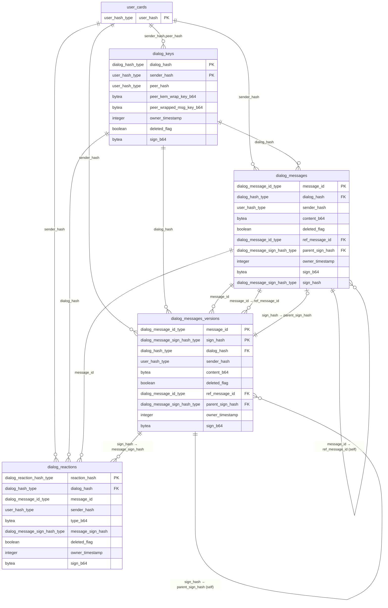

# Post-Quantum Dialog

A dialog is a two-party conversation between users identified by `user_hash` (see `pq_user.md`). Each side independently authors messages encrypted under a per-author message key. The key is derived deterministically from the author's private material plus the peer's identity, so any of the author's devices can re-derive it without a device registry and without re-running a handshake.

## Goals

- **Symmetric read access** — the author and the peer can both read every message.
- **Either side can initiate** — both sides may independently create their half of the dialog on different devices; state converges to the same `dialog_hash`.
- **Multi-device by derivation, not tracking** — any device holding the author's secret keys re-derives the same `sender_msg_key`. No `user_devices` table, no re-wrap gossip.

## Accepted trade-off

Deterministic derivation means **no forward secrecy at the dialog level**. If any of an author's long-term private keys (`sign_skey`, `kem_skey`, `contact_skey`) leak, every dialog that user authored becomes decryptable retroactively. Rotating these keys means rotating identity.

---

## Schema at a glance

All four dialog tables are self-authenticating via the integrity triad (`sign_b64`, `owner_timestamp`, `deleted_flag`) defined in [02_integrity.md](../electric/pq_data_layer/02_integrity.md). `user_cards` is shown because every verification path starts there — fetch the author's `sign_pkey` / `crypt_pkey` from `user_cards`, then check the dialog row's signature. No database-level foreign keys to `user_cards` exist (PQ rows are self-verifying), but the logical dependency is real.



Key relationships in words:

- `dialog_keys` has a composite PK `(dialog_hash, sender_hash)`. In the steady state there are two rows per `dialog_hash` — one per direction.
- `dialog_messages.parent_sign_hash` → `dialog_messages_versions.sign_hash` (nullable; NULL for the first version of a message).
- `dialog_messages_versions.parent_sign_hash` → `dialog_messages_versions.sign_hash` (self-referential; append-only chain).
- `dialog_messages.ref_message_id` → `dialog_messages.message_id` (self-referential; nullable — NULL only for the genesis message of the dialog). Forms the per-dialog causal chain across authors; owned by [04_ordering.md](../electric/pq_data_layer/04_ordering.md). Orthogonal to `parent_sign_hash` (edit chain by the same author).
- `dialog_reactions.message_sign_hash` **logically** targets a specific version in `dialog_messages` *or* `dialog_messages_versions` — there is no database FK, because the referenced row can live in either table, and reactions may arrive before the message.

---

## Identifiers

### `dialog_hash`

```
sorted       = sort([user_a_hash, user_b_hash])     # lexicographic on user_hash strings
dialog_hash  = "di_" + hex(SHA3-512(sorted[0] || sorted[1]))
```

- `user_a_hash` = `min(sender_hash, peer_hash)`
- `user_b_hash` = `max(sender_hash, peer_hash)`

Same on both sides ⇒ independent initiation converges.

PostgreSQL domain:

```sql
CREATE DOMAIN dialog_hash_type AS TEXT
  CHECK (VALUE ~ '^di_[a-f0-9]{128}$');
```

---

## Key derivation

Each author derives one `sender_msg_key` per peer. It is the symmetric key for every message that author writes in that dialog.

```
sender_msg_key = SHA3-512(
    "buckitup/dialog-mk/v1"
 || sign_skey
 || kem_skey
 || contact_skey
 || peer_user_hash
)
```

Rationale:

- **Hybrid posture** (per `HYBRID.md`): `kem_skey` is ML-KEM-1024, `contact_skey` is secp256k1. A break in either family alone does not compromise the secret.
- **`sign_skey` is folded in** to bind derivation to the full identity. `sign_skey` never leaves the frontend, same as the other skeys.
- **Domain separation tag** `"buckitup/dialog-mk/v1"` prevents collisions with future derivations (rooms, groups, subchannels).
- **Peer binding by `peer_user_hash`** — itself `SHA3-512(peer_sign_pkey)`, so transitively bound to peer's signing identity.

Symmetric encryption uses AES-256-GCM with `sender_msg_key`; per-message nonce is fresh random 12 bytes prepended to the ciphertext in the single `content_b64` blob.

### Reaction subkey

Reactions (including receipts) are numerous and have a small, partially predictable plaintext space (`delivered`, `read`, a handful of common emoji). Rather than draw on `sender_msg_key` directly — which would crowd its nonce space and tie the reaction-hash oracle to the content key — a derived subkey is used:

```
reaction_subkey = SHA3-256(
    "buckitup/dialog-reaction/v1"
 || sender_msg_key
)
```

- **One-way derivation.** Compromising `reaction_subkey` reveals nothing about `sender_msg_key`; the reverse is not true, but both keys share the same identity trust boundary anyway. The goal is isolation of the *crypto surface* (independent nonce space, independent oracle), not an independent trust domain.
- **Domain separation tag** `"buckitup/dialog-reaction/v1"` keeps the subkey disjoint from any future per-dialog derivations.
- **Same derivation on every device.** Like `sender_msg_key`, `reaction_subkey` is deterministic — multi-device authors produce identical reaction subkeys without coordination.
- **Two operations, one key.** `reaction_subkey` is used both as the HMAC key for `reaction_hash` and as the AES-256-GCM key for `type_b64`. HMAC-SHA3-512 and AES-GCM are standard, independently-analyzed primitives; using the same key under both does not leak key material between them. If stronger separation is ever required, split into `reaction_mac_key` / `reaction_enc_key` via two tagged derivations.

---

## Key wrapping

Both the author and the peer need to read messages. `sender_msg_key` is wrapped for the peer and published in `dialog_keys`:

- **Peer-wrap** — KEM-encapsulated to the peer's `crypt_pkey`. Lets the peer read.
- **Author reads own messages** by re-deriving `sender_msg_key` deterministically from private keys (no self-wrap column needed).

```
SENDER (wrap, once per dialog)
─────────────────────────────────────────────────────────────
  inputs:  sender_msg_key        (derived, see §Key derivation)
           peer.crypt_pkey       (from peer's user_cards row)

  ┌─────────────────────────────────────────────────────────┐
  │  step 1                                                 │
  │     ML-KEM-1024.Encap(peer.crypt_pkey)                  │
  │            │                                            │
  │            └──►  ( peer_kem_wrap_key , wrap_key )       │
  │                    KEM ciphertext     ephemeral AES key │
  └────────────────────┬──────────────────────────┬─────────┘
                       │                          │
                       │           ┌──────────────┘
                       │           │
                       │           ▼
                       │   ┌─────────────────────────────────┐
                       │   │  step 2                         │
                       │   │     AES-256-GCM.encrypt(        │
                       │   │        key       = wrap_key,    │
                       │   │        plaintext = sender_msg_key) │
                       │   │            │                    │
                       │   │            └──► peer_wrapped_msg_key │
                       │   └────────────────────┬────────────┘
                       │                        │
                       ▼                        ▼
                 ┌────────────────────────────────────────┐
                 │  publish: one row in `dialog_keys`     │
                 │     peer_kem_wrap_key_b64              │
                 │     peer_wrapped_msg_key_b64           │
                 │     (+ identity & signature fields)    │
                 └────────────────────────────────────────┘


PEER (unwrap, on first read)
─────────────────────────────────────────────────────────────
  inputs:  peer_kem_wrap_key      (from dialog_keys)
           peer_wrapped_msg_key   (from dialog_keys)
           own.crypt_skey         (peer's private KEM key, never leaves device)

  ┌─────────────────────────────────────────────────────────┐
  │  step 1                                                 │
  │     ML-KEM-1024.Decap(own.crypt_skey, peer_kem_wrap_key)│
  │            │                                            │
  │            └──►  wrap_key       (same AES key sender used) │
  └────────────────────┬────────────────────────────────────┘
                       │
                       ▼
  ┌─────────────────────────────────────────────────────────┐
  │  step 2                                                 │
  │     AES-256-GCM.decrypt(                                │
  │        key        = wrap_key,                           │
  │        ciphertext = peer_wrapped_msg_key)               │
  │            │                                            │
  │            └──►  sender_msg_key                         │
  │                  (now usable for every message authored │
  │                   by sender in this dialog)             │
  └─────────────────────────────────────────────────────────┘
```

Compact form:

```
wrap:    (peer_kem_wrap_key, wrap_key) = ML-KEM-1024.Encap(peer.crypt_pkey)
         peer_wrapped_msg_key          = AES-256-GCM.encrypt(wrap_key, sender_msg_key)
         publish (peer_kem_wrap_key_b64, peer_wrapped_msg_key_b64)

unwrap:  wrap_key       = ML-KEM-1024.Decap(own.crypt_skey, peer_kem_wrap_key)
         sender_msg_key = AES-256-GCM.decrypt(wrap_key, peer_wrapped_msg_key)
```

Note that `sender_msg_key` is **never** an input to Encap — Encap operates only on the peer's KEM public key. The KEM produces an ephemeral `wrap_key`; that ephemeral key is what actually encrypts `sender_msg_key`.

### AES / construction limitations

The wrap is hand-rolled rather than a standardized AEAD-with-KEM construction (HPKE, KEM-DEM). Known trade-offs to acknowledge explicitly:

- **No KDF separation.** The ML-KEM-1024 shared secret is used **directly** as the AES-256-GCM `wrap_key`. A proper construction (HPKE-style) would run the shared secret through HKDF with a context string to derive independent keys for encryption, authentication, and any future uses. Absent that, the KEM output is single-purpose by convention only; any future reuse of the same `wrap_key` for a second purpose would break the security argument.
- **AES-GCM nonce is catastrophic under key reuse.** GCM loses both confidentiality *and* authenticity if a `(key, nonce)` pair is ever reused. Two separate risks apply here:
  - **Wrap step (`peer_wrapped_msg_key`).** `wrap_key` is ephemeral — one fresh value per Encap call — so a fixed nonce (e.g., all-zero 12 bytes) is safe for the single wrap operation under it. A second encryption under the same `wrap_key`, even with a different nonce, is out of scope by construction and MUST NOT be introduced later.
  - **Content step (`content_b64`).** `sender_msg_key` is deterministic across every device the author holds and across the lifetime of the dialog. Nonces MUST be fresh-random 96-bit values; counter-based nonces are forbidden because two offline devices would collide. The birthday bound gives ≈2⁻³² collision probability after ≈2⁴⁰ messages authored by one user in one dialog — well above realistic traffic, but documented so that any future "compress the nonce" optimization is rejected.
- **No KEM-DEM authentication tag over the ciphertext pair.** `peer_kem_wrap_key_b64` and `peer_wrapped_msg_key_b64` are bound together only by the row's `sign_b64`. An attacker who could strip the signature would be able to substitute either ciphertext independently; the signature is load-bearing for ciphertext integrity, not just authorship.
- **AES-256 key size vs. ML-KEM-1024 shared-secret size.** ML-KEM-1024 outputs 32 bytes, which is consumed whole as the AES-256 key. No truncation or expansion, but also no domain separation, so any future change to either primitive's output length requires revisiting this mapping.

Trade-off accepted for now: simplicity and auditability of the composition vs. the stronger guarantees of HPKE. See `HYBRID.md` for the broader hybrid-PQ rationale. Revisiting this is tracked as problem #13 in the list below.

---

## Tables

There is no `dialogs` table. Participation is derived from `dialog_keys` via `sender_hash = me OR peer_hash = me`, which is also the sync filter. Dialog existence is advisory; trust is in the signed rows below.

### 1. `dialog_keys`

Wrapped `sender_msg_key` published by one author for one dialog. Two rows per dialog in the common case (one per direction). An author republishes the same row idempotently from any of their devices (deterministic `sender_msg_key` ⇒ same plaintext, different KEM randomness ⇒ compatible).

| Column                     | Type               | Notes                                                                                           |
| -------------------------- | ------------------ | ----------------------------------------------------------------------------------------------- |
| `dialog_hash`              | `dialog_hash_type` | PK part                                                                                         |
| `sender_hash`              | `user_hash_type`   | PK part; author of this `sender_msg_key`                                                        |
| `peer_hash`                | `user_hash_type`   | the other participant; enables sync filter and inbox listing without a separate `dialogs` table |
| `peer_kem_wrap_key_b64`    | `bytea`            | ML-KEM ciphertext to peer's `crypt_pkey`                                                        |
| `peer_wrapped_msg_key_b64` | `bytea`            | AES-GCM(sender_msg_key) with ss from `peer_kem_wrap_key_b64`                                    |
| `owner_timestamp`          | `integer`          | Monotonic counter; must increase on updates; prevents replay attacks                            |
| `deleted_flag`             | `boolean`          | Soft delete marker; `true` indicates deleted                                                    |
| `sign_b64`                 | `bytea`            | ML-DSA-87 signature by `sender_hash` over canonical serialization of all preceding columns      |

PK: `(dialog_hash, sender_hash)`.

Self-authenticating per [02_integrity.md](../electric/pq_data_layer/02_integrity.md), same bootstrap as `user_cards`: fetch `user_cards` for `sender_hash`, verify its self-signature, then verify this row's `sign_b64` under that `sign_pkey`. A row with invalid `sign_b64` is rejected on ingest and re-verified on peer-sync receive. Because `dialog_hash`, `peer_hash`, and both KEM ciphertexts are all covered by the signature, no field can be rewritten, retargeted to a different peer, or lifted into a different dialog without detection.

Flooding: an attacker can still publish a row naming an uninvolved `peer_hash` (PoP proves submitter identity, not peer consent). Clients mitigate by hiding a dialog until the local user has either authored a message in it or the peer has published their own `dialog_keys` row for the same `dialog_hash`.

### 2. `dialog_messages`

Current tip of each message's version chain. Each message is identified by `message_id = "dmsg_" + UUID v7` — globally unique and time-ordered within a dialog. Messages follow the integrity triad in [02_integrity.md](../electric/pq_data_layer/02_integrity.md) (`sign_b64`, `owner_timestamp`, `deleted_flag`) and the hash-linked versioning model in [03_data_versioning.md](../electric/pq_data_layer/03_data_versioning.md), mirroring `user_storage` / `user_storage_versions` (see `Chat.Data.Schemas.UserStorage`).

Content is a single opaque blob: the first 12 bytes are the per-message AES-GCM nonce, the remainder is AES-256-GCM ciphertext under `sender_msg_key`. Plaintext shape — bare-string text vs. `{"<type>": <value>}` envelopes for media, plus inline-vs-out-of-band rules — lives in [07_content_polymorphism.md](../electric/pq_data_layer/07_content_polymorphism.md). Keeping the type *inside* the ciphertext means the database never reveals whether a message is text, image, or attachment.

`ref_message_id` carries the **causal context** a message was authored against — the `message_id` of the tip the author had observed at send time. It is the cross-author hash-linked chain owned by [04_ordering.md](../electric/pq_data_layer/04_ordering.md), required because Electric sync offers no delivery-order guarantee and `parent_sign_hash` only chains revisions *by the same author*. Distinct from `reply_to_message_id` (explicit reply target, owned by [05_branching.md](../electric/pq_data_layer/05_branching.md) and still deferred), which names a semantic ancestor rather than the most-recent observed predecessor. Because `ref_message_id` is covered by `sign_b64`, ingest can reject forged or cross-dialog links without decrypting.

| Column             | Type                            | Notes                                                                                                       |
| ------------------ | ------------------------------- | ----------------------------------------------------------------------------------------------------------- |
| `message_id`       | `dialog_message_id_type`        | PK; `dmsg_<UUID7>`                                                                                          |
| `dialog_hash`      | `dialog_hash_type`              | dialog this message belongs to                                                                              |
| `sender_hash`      | `user_hash_type`                | author                                                                                                      |
| `content_b64`          | `bytea`                         | 12-byte AES-GCM nonce ‖ AES-256-GCM ciphertext of the JSON payload — see [07_content_polymorphism.md](../electric/pq_data_layer/07_content_polymorphism.md). Empty when `deleted_flag = true` |
| `deleted_flag`     | `boolean`                       | Signed tombstone marker; retractions are a new tip with empty `content_b64` and `deleted_flag: true`        |
| `ref_message_id`   | `dialog_message_id_type`        | Self-referential FK → `dialog_messages.message_id` in the same `dialog_hash`; causal-context pointer owned by [04_ordering.md](../electric/pq_data_layer/04_ordering.md). NULL only for the genesis message of the dialog. Fixed at first authoring — does **not** change on edit. |
| `parent_sign_hash` | `dialog_message_sign_hash_type` | FK → `dialog_messages_versions.sign_hash`; NULL for the first version                                       |
| `owner_timestamp`  | `integer`                       | Monotonic per `message_id`; strictly increases on edit; prevents replay                                     |
| `sign_b64`         | `bytea`                         | ML-DSA-87 signature by `sender_hash` over the signable fields (everything except `sign_b64` / `sign_hash`)  |
| `sign_hash`        | `dialog_message_sign_hash_type` | `dms_` + hex(SHA3-512(`sign_b64`)) — identity of this tip version. Denormalized convenience copy per [03_data_versioning.md](../electric/pq_data_layer/03_data_versioning.md): derivable from `sign_b64`, not itself covered by the signature, nothing FK-references it; kept on the master to avoid recomputing the hash when archiving the outgoing tip and when populating the next edit's `parent_sign_hash`. |

PK: `(message_id)`. UNIQUE: `(dialog_hash, message_id)` — supports dialog-scoped sync filtering and inbox listings without a separate `dialogs` table.

Postgres domains:

```sql
CREATE DOMAIN dialog_message_id_type AS TEXT
  CHECK (VALUE ~ '^dmsg_[0-9a-f]{8}-[0-9a-f]{4}-7[0-9a-f]{3}-[89ab][0-9a-f]{3}-[0-9a-f]{12}$');

CREATE DOMAIN dialog_message_sign_hash_type AS TEXT
  CHECK (VALUE ~ '^dms_[a-f0-9]{128}$');
```

Self-authenticating per [02_integrity.md](../electric/pq_data_layer/02_integrity.md): verify `sign_b64` under `sender_hash`'s `sign_pkey` (from `user_cards`). An incoming update with `owner_timestamp <= existing` is rejected as a replay even if the signature verifies. Deletes are a new signed tip with `deleted_flag: true` and a higher `owner_timestamp` — there is no unsigned server-side delete.

### 2a. `dialog_messages_versions`

Append-only history for `dialog_messages`, mirroring `Chat.Data.Schemas.UserStorageVersion`. On each edit, the superseded tip row is inserted here verbatim (carrying its own `sign_hash`); the new tip's `parent_sign_hash` then points at that row's `sign_hash`. Because `sign_b64` covers `parent_sign_hash`, rewriting any historical version breaks every descendant's signature.

| Column             | Type                            | Notes                                                                                       |
| ------------------ | ------------------------------- | ------------------------------------------------------------------------------------------- |
| `message_id`       | `dialog_message_id_type`        | PK part                                                                                     |
| `sign_hash`        | `dialog_message_sign_hash_type` | PK part; `dms_` + hex(SHA3-512(`sign_b64`)) — identity of this version                      |
| `dialog_hash`      | `dialog_hash_type`              |                                                                                             |
| `sender_hash`      | `user_hash_type`                |                                                                                             |
| `content_b64`          | `bytea`                         | 12-byte AES-GCM nonce ‖ ciphertext (same shape as the tip)                                  |
| `deleted_flag`     | `boolean`                       |                                                                                             |
| `ref_message_id`   | `dialog_message_id_type`        | Carried verbatim from the tip at first authoring; immutable across the version chain        |
| `parent_sign_hash` | `dialog_message_sign_hash_type` | Self-referential FK into `dialog_messages_versions.sign_hash`; NULL for the root version    |
| `owner_timestamp`  | `integer`                       |                                                                                             |
| `sign_b64`         | `bytea`                         | ML-DSA-87 signature by `sender_hash` covering every field except `sign_b64` and `sign_hash` |

PK: `(message_id, sign_hash)`. Append-only — rows are never mutated. A version cannot be inserted unless its `parent_sign_hash` is already known locally (or NULL for the root).

### 3. `dialog_reactions`

Reactions bind to a specific message **version** via `message_sign_hash` — the `sign_hash` (SHA3-512 of `sign_b64`) of the reacted-to version in the message's chain (tip or historical). Reacting to an edited message does not automatically carry over.

The reaction kind (`type`) — emoji for user reactions, or the well-known strings `delivered` / `read` for receipts — is **encrypted** under `reaction_subkey` (derived from `sender_msg_key`, see §Key derivation → Reaction subkey). The stored column is `type_b64 = nonce ‖ AES-256-GCM(reaction_subkey, type_plaintext)` with a fresh random 12-byte nonce per row. Only the author and peer can decrypt; the database sees opaque ciphertext and cannot tell emoji reactions apart from receipts or from each other.

`reaction_hash` is a **keyed MAC** under `reaction_subkey`, not a plain hash. Because only participants know the key, an observer cannot brute-force `type_plaintext` by recomputing hashes over a small enumerable set — the fundamental oracle that would leak emoji / receipt choice from a plain `SHA3-512(tuple)` is eliminated. Participants still reproduce `reaction_hash` deterministically from their own copy of `reaction_subkey`, so PK-level idempotency and uniqueness continue to work.

| Column              | Type                            | Notes                                                                                               |
| ------------------- | ------------------------------- | --------------------------------------------------------------------------------------------------- |
| `reaction_hash`     | `dialog_reaction_hash_type`     | PK; `dr_` + hex(HMAC-SHA3-512(`reaction_subkey`, `dialog_hash` ‖ `message_id` ‖ `sender_hash` ‖ `type_plaintext`)) — keyed, so only participants can recompute or verify |
| `dialog_hash`       | `dialog_hash_type`              | scope                                                                                               |
| `message_id`        | `dialog_message_id_type`        | reacted message; `dmsg_<UUID7>`                                                                     |
| `sender_hash`       | `user_hash_type`                | who reacted                                                                                         |
| `type_b64`          | `bytea`                         | 12-byte AES-GCM nonce ‖ AES-256-GCM ciphertext of the UTF-8 `type` string, under `reaction_subkey`  |
| `message_sign_hash` | `dialog_message_sign_hash_type` | `sign_hash` of the reacted version in `dialog_messages(_versions)`                                  |
| `deleted_flag`      | `boolean`                       | Signed un-react marker; toggling a reaction is a new row with `true` and a higher `owner_timestamp` |
| `owner_timestamp`   | `integer`                       | Monotonic per `reaction_hash`; prevents replay                                                      |
| `sign_b64`          | `bytea`                         | ML-DSA-87 signature by `sender_hash` over all preceding columns (including `type_b64`)              |

PK: `(reaction_hash)`. Uniqueness of "one reaction per `(message, reactor, type)`" is enforced by `reaction_hash` alone — the MAC is deterministic given the key, so two signed rows for the same `(dialog_hash, message_id, sender_hash, type_plaintext)` collide on PK regardless of which random AES-GCM nonce each encryption used. No separate plaintext UNIQUE constraint is needed (the database cannot see `type` plaintext and has no key to recompute the MAC).

Postgres domain:

```sql
CREATE DOMAIN dialog_reaction_hash_type AS TEXT
  CHECK (VALUE ~ '^dr_[a-f0-9]{128}$');
```

Carries the full integrity triad per [02_integrity.md](../electric/pq_data_layer/02_integrity.md): `sign_b64` over all other fields, `owner_timestamp` strictly monotonic per `reaction_hash`, `deleted_flag` as a signed un-react. Reactions are not versioned (no chain) — the row is overwritten on each new signed update. Because `reaction_hash` is a MAC over the `(dialog_hash, message_id, sender_hash, type)` tuple, an attacker cannot forge a `reaction_hash` pointing at a different tuple without the key; and because `type_b64` is covered by `sign_b64`, it cannot be swapped independently of the hash.

**Reserved `type` plaintext values for receipts:**

- `delivered` — published by the peer's device when the message lands locally. Bound to the version actually received via `message_sign_hash`.
- `read` — published by the peer when their UI displays the message.

Receipts use the same row shape and integrity contract as emoji reactions; the only difference is that the decrypted plaintext is a well-known string, and the convention that they are not user-toggled (`deleted_flag` stays `false` in normal use). This avoids a separate receipts table.

---

## Flows

### Author sends a message

1. Compute `dialog_hash` from `(sender_hash, peer_hash)`.
2. Derive `sender_msg_key` (formula above).
3. If no `dialog_keys` row exists for `(dialog_hash, sender_hash)`: wrap `sender_msg_key` self + peer, sign, insert (row carries `peer_hash`).
4. Build message: fresh `message_id = "dmsg_" + UUID v7`, `parent_sign_hash = NULL`, `deleted_flag = false`, fresh `owner_timestamp`. Set `ref_message_id` to the `message_id` of the currently-observed tip in this `dialog_hash` (or `NULL` for the genesis message). Encode payload as JSON (bare string for text, `{"<type>": <value>}` for compound), AES-GCM encrypt under `sender_msg_key` with a fresh 12-byte nonce, store as `content_b64 = nonce ‖ ciphertext`. Sign, set `sign_hash = "dms_" + hex(SHA3-512(sign_b64))`, insert into `dialog_messages`. Edits append the prior tip to `dialog_messages_versions` and rewrite the tip with `parent_sign_hash` set to the superseded row's `sign_hash` and a higher `owner_timestamp`; `ref_message_id` is carried over unchanged.

### Peer reads

1. Fetch `dialog_keys` rows for `dialog_hash`.
2. For each row authored by a counterparty: verify `sign_b64` against `sender_hash`'s `sign_pkey`, then unwrap via `peer_kem_wrap_key_b64` / `peer_wrapped_msg_key_b64` using own `crypt_skey` ⇒ their `sender_msg_key`.
3. For messages authored by self: re-derive `sender_msg_key` from own private keys (deterministic derivation). (Or unwrap from a counterparty's `dialog_keys` row where self is the peer.)
4. For each `dialog_messages` row: verify `sign_b64`, split `content_b64` into the 12-byte nonce and ciphertext, AES-GCM decrypt under the matching author's `sender_msg_key`, then JSON-decode the plaintext to discover the content shape.
5. For each `dialog_reactions` row: verify `sign_b64`, derive the reaction author's `reaction_subkey` from their `sender_msg_key`, split `type_b64` into nonce and ciphertext, AES-GCM decrypt under `reaction_subkey` to recover the plaintext `type` (an emoji or the well-known `delivered` / `read` string). Optionally verify `reaction_hash` by recomputing `dr_` + hex(HMAC-SHA3-512(`reaction_subkey`, `dialog_hash` ‖ `message_id` ‖ `sender_hash` ‖ `type_plaintext`)) and comparing.

### Author on a new device

1. Device has the author's `sign_skey`, `kem_skey`, `contact_skey` (from User Identity, per `pq_user.md`).
2. Re-derive `sender_msg_key` — same value as on any other device.
3. Can read own past messages by re-deriving `sender_msg_key` from private keys (deterministic derivation).
4. To write: no new `dialog_keys` row needed (one already exists for `(dialog_hash, sender_hash)`); proceed to insert `dialog_messages`.

### Either side initiates independently

Both sides compute the same `dialog_hash`. Each inserts its own `dialog_keys` row keyed on its own `sender_hash`, naming the other as `peer_hash`. No coordination needed. A client listing inbox dialogs queries `dialog_keys WHERE sender_hash = me OR peer_hash = me`.

---

## Out of scope

- **Group conversations** — covered by `pq_rooms.md` (TBD); this doc covers two-party dialogs only.
- **Cross-author message ordering rendering** — `ref_message_id` (column present on `dialog_messages` / `dialog_messages_versions`) provides the tamper-evident hash-linked chain per dialog, but the semantics (ingest rules, pending-queue behavior, fork surfacing, catch-up) are owned by [04_ordering.md](../electric/pq_data_layer/04_ordering.md). Until that spec lands, clients may linearize by UUIDv7 timestamp as a best-effort display order.
- **Replies and concurrent forks** — explicit reply targeting and sibling-branch rendering (two peers answering the same tip) are owned by [05_branching.md](../electric/pq_data_layer/05_branching.md), which adds `reply_to_message_id` on top of the ordering chain. The `{"quote": ...}` envelope in [07_content_polymorphism.md](../electric/pq_data_layer/07_content_polymorphism.md) is a UI-payload concern and does not replace the structural pointer.
- **Sync filtering** — which rows propagate to which peer is a frontend / sync-layer choice, not part of the dialog data contract.

---

## Problems to address

Open items surfaced by design review. Status tags: **[resolved]** folded into this revision, **[open]** still to decide, **[deferred]** owned by another spec.


### Message model

6. **[deferred]** Cross-author ordering — `ref_message_id` column is present on `dialog_messages` / `dialog_messages_versions`; semantics (ingest rules, pending queue, fork surfacing, catch-up) owned by [04_ordering.md](../electric/pq_data_layer/04_ordering.md).
7. **[deferred]** Replies / quotes — owned by [05_branching.md](../electric/pq_data_layer/05_branching.md) (`reply_to_message_id`). Forward-referenced in the `dialog_messages` section.

### Keys / crypto

10. **[resolved]** Random-nonce criticality — see §Key wrapping → AES / construction limitations: deterministic `sender_msg_key` makes GCM nonce reuse catastrophic, counter-based nonces are forbidden, birthday bound (~2⁻³² collision probability after ~2⁴⁰ messages) is documented.
11. **[open]** `sender_msg_key` rotation policy — currently none. Document that the only rotation is identity rotation (new `user_hash` → new dialog), so suspected compromise of any `*_skey` invalidates the whole dialog.
12. **[open]** Peer `crypt_pkey` rotation coupling — the "rotation = new identity" rule means this can't happen silently, but the coupling between peer key rotation and `dialog_keys` re-wrap should be stated.
13. **[resolved]** Ad-hoc KEM+AES vs HPKE / KEM-DEM — §Key wrapping → AES / construction limitations documents the hand-rolled composition, the absence of KDF separation (ML-KEM SS used directly as AES key), the reliance on `sign_b64` for ciphertext-pair binding, and the `HYBRID.md` rationale. Re-evaluation when HPKE-PQ profiles stabilize remains open but is tracked there rather than here.

### Metadata leakage

14. **[open]** `peer_hash` is plaintext in `dialog_keys` — server and replicating peers see the full social graph. Probably unavoidable for sync filtering; document as an accepted trade-off alongside the no-forward-secrecy note.
15. **[resolved]** `dialog_reactions.type` is encrypted as `type_b64` under a derived `reaction_subkey`, and `reaction_hash` is a keyed MAC (HMAC-SHA3-512) under the same subkey rather than a plain hash. This closes both the column-read leak *and* the recompute-the-hash oracle that a small enumerable type space would otherwise expose. `reaction_subkey = SHA3-256("buckitup/dialog-reaction/v1" ‖ sender_msg_key)` — one-way derivation, isolates the reaction crypto surface (independent nonce space, independent oracle) without an independent trust domain.
16. **[open]** Flooding mitigation is client-side only — no rate-limit or proof-of-peer-consent. Cross-ref a future abuse / rate-limiting doc when one exists.

### Sync / access control

17. **[open]** Sync filter invariant for `dialog_messages` — even if implementation lives in the sync layer, restate the invariant here: a `dialog_messages` row is only replicated to peer P if a `dialog_keys` row exists with `(sender_hash = P OR peer_hash = P)` for the same `dialog_hash`.
18. **[open]** Reaction-before-message delivery — `dialog_reactions.message_sign_hash` can point at a version not yet synced. Define deferred-verify / pending-queue semantics, in contrast to `parent_sign_hash` which requires parent-local.

### Lifecycle

19. **[open]** GC / retention — `dialog_messages_versions` is append-only forever; receipts can grow to ~2× message count. No pruning story. Cross-ref [08_snapshots.md](../electric/pq_data_layer/08_snapshots.md).
20. **[open]** Tombstone blob GC — on delete, large blobs referenced by superseded versions become orphaned. [07_content_polymorphism.md](../electric/pq_data_layer/07_content_polymorphism.md) mentions this in passing; cross-ref.
21. **[open]** Dialog-level UI state — archive / mute / pin / rename have no schema. Belongs in per-user `user_storage` keyed by `dialog_hash`; say so explicitly so readers don't expect a `dialogs` table.

### Multi-device subtleties

22. **[open]** "Author on a new device" assumes identity material transfer — cross-ref the device-onboarding flow in `pq_user.md`. Also define race resolution when two devices concurrently publish `dialog_keys` (different KEM randomness, same `sender_msg_key`, LWW by `owner_timestamp`).
23. **[open]** Multi-device peer receipts — if the peer has two devices, each `delivered` receipt collides on `(dialog_hash, message_id, sender_hash, type)`, so LWW drops "which device delivered first". Acceptable; document.
24. **[open]** Own-device read state — no way for author to broadcast "I read this on device B" to sync read cursors across their own devices (receipts are peer-authored). Either separate concern (per-user `user_storage` read cursor) or note as gap.

### Minor / editorial

25. **[open]** `dialog_hash` uses SHA3-512 (128 hex chars) — overkill, but consistent with `user_hash`. One-line ADR note.
26. **[open]** `Chat.Data.Schemas.*` target module names (`DialogKey`, `DialogMessage`, `DialogMessageVersion`, `DialogReaction`) should be called out for discoverability, matching the `UserStorage` / `UserStorageVersion` references elsewhere.
27. **[open]** Cross-refs to [04_ordering.md](../electric/pq_data_layer/04_ordering.md) and [05_branching.md](../electric/pq_data_layer/05_branching.md) — now partially present via "Out of scope"; add inline pointers where each primitive is first mentioned.
